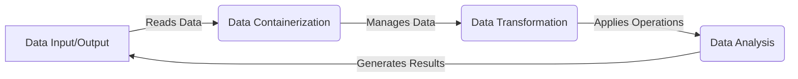

# Pandas Data Flow Overview

Pandas is a powerful Python data analysis library providing data structures like DataFrames and Series, along with tools for data manipulation, analysis, and I/O. It simplifies working with structured data, enabling tasks such as cleaning, transforming, and analyzing data from various sources.

## Component Descriptions

**A: Data Input/Output**

*   **Description**: This component handles reading data from various sources (CSV, Excel, SQL, etc.) and writing data back to these formats. It acts as the entry and exit point for data within the pandas ecosystem.
*   **Neighbouring Components**: It reads data into the `Data Containerization` component and receives processed results from the `Data Analysis` component for output.

**B: Data Containerization**

*   **Description**: This component is responsible for managing the core data structures of pandas: Series and DataFrames. It provides labeled arrays and tabular data organization, manipulation, and representation.
*   **Neighbouring Components**: It receives data from `Data Input/Output` and provides the data structures to `Data Transformation`.

**C: Data Transformation**

*   **Description**: This component provides tools for reshaping, cleaning, merging, and transforming data within the DataFrames. It enables complex data manipulations.
*   **Neighbouring Components**: It receives data from `Data Containerization` and applies transformations before passing it to `Data Analysis`.

**D: Data Analysis**

*   **Description**: This component performs statistical analysis, aggregations, and other analytical operations on the transformed data. It generates insights and results from the data.
*   **Neighbouring Components**: It receives transformed data from `Data Transformation` and sends the results back to `Data Input/Output` or other components for further processing or output.