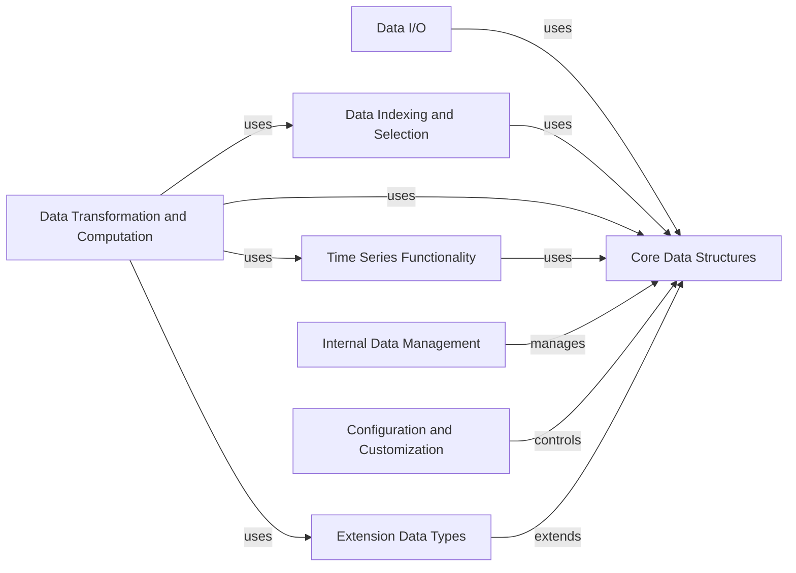

## Component Details

The pandas library provides high-performance, easy-to-use data structures and data analysis tools for Python. Its core functionality revolves around the DataFrame and Series objects, which enable efficient data manipulation, cleaning, analysis, and visualization. The library supports various data input/output formats, indexing and selection methods, data alignment techniques, and time series functionalities. Pandas also offers extensive options for configuring and customizing its behavior, as well as extending its data types.

### Core Data Structures
This component defines the fundamental data structures in pandas, including Series and DataFrame, which are the building blocks for data storage and manipulation. It also includes Index objects for labeling and aligning data, providing the foundation upon which all other components are built.
- **Related Classes/Methods**: `pandas.core.series.Series`, `pandas.core.frame.DataFrame`, `pandas.core.indexes.base.Index`, `pandas.core.indexes.multi.MultiIndex`

### Data I/O
This component handles reading and writing data from various file formats (CSV, Excel, SQL, etc.) and data sources. It provides functions for importing data into pandas data structures and exporting data for external use, enabling seamless integration with external data sources and systems.
- **Related Classes/Methods**: `pandas.io.csv.read_csv`, `pandas.io.excel.read_excel`, `pandas.io.sql.read_sql`, `pandas.io.parquet.read_parquet`, `pandas.io.common.get_handle`

### Data Indexing and Selection
This component provides mechanisms for accessing and selecting subsets of data within Series and DataFrames using label-based, integer-based, and boolean indexing. It enables users to extract specific data based on their needs, facilitating targeted data analysis and manipulation.
- **Related Classes/Methods**: `pandas.core.indexing.IndexingMixin`, `pandas.core.indexing._LocIndexer`, `pandas.core.indexing._iLocIndexer`, `pandas.core.indexing._AtIndexer`

### Data Transformation and Computation
This component includes functions for performing mathematical, statistical, and string operations on Series and DataFrames. It provides methods for data cleaning, transformation, aggregation, and applying custom functions, enabling users to derive insights and create new data representations.
- **Related Classes/Methods**: `pandas.core.nanops`, `pandas.core.algorithms`, `pandas.core.apply`, `pandas.core.groupby.groupby.GroupBy`, `pandas.core.reshape.pivot`, `pandas.core.reshape.melt`, `pandas.core.reshape.concat`, `pandas.core.reshape.reshape`, `pandas.core.strings.accessor`, `pandas.core.strings.object_array`, `pandas.core.arrays.string_`

### Time Series Functionality
This component provides specialized tools for working with time series data, including resampling, frequency conversion, and date arithmetic. It enables users to analyze and manipulate time-dependent data, extracting patterns and trends over time.
- **Related Classes/Methods**: `pandas.tseries.frequencies`, `pandas.tseries.holiday`, `pandas.core.resample`, `pandas.core.window`

### Internal Data Management
This component deals with the internal representation and management of data within pandas objects. It includes the BlockManager and related classes, which handle the storage and manipulation of data blocks, optimizing performance and memory usage, and ensuring efficient data handling.
- **Related Classes/Methods**: `pandas.core.internals.managers`, `pandas.core.internals.blocks`, `pandas.core.internals.construction`

### Configuration and Customization
This component manages the global settings and options that control the behavior of pandas. It allows users to customize the display, I/O, and computation settings of the library, tailoring it to their specific needs and preferences.
- **Related Classes/Methods**: `pandas._config.config`, `pandas._config.localization`

### Extension Data Types
This component provides a way to extend the functionality of pandas by creating custom array types. It allows developers to define new data types and operations that seamlessly integrate with pandas data structures, enhancing flexibility and expressiveness, and enabling specialized data handling.
- **Related Classes/Methods**: `pandas.core.arrays.base`, `pandas.core.arrays.numpy_`, `pandas.core.arrays.categorical`, `pandas.core.arrays.datetimes`