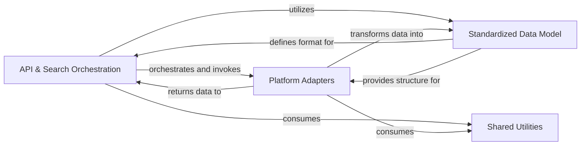

## Details

Final component overview for the API & Search Orchestration subsystem, including components and their interactions.

### API & Search Orchestration [[Expand]](./API_Search_Orchestration.md)
This is the central control component of the service, acting as the primary API endpoint. It receives incoming search queries, orchestrates the concurrent querying of various external academic platforms via their respective adapters, aggregates the results, and formats the final, standardized response for the client (e.g., an LLM tool). It embodies both the API gateway and the core aggregation logic.

**Related Classes/Methods**:

- `server`

### Platform Adapters [[Expand]](./Platform_Adapters.md)
A collection of modules, each responsible for interacting with a specific external academic platform's API. Each adapter encapsulates the platform-specific logic for making requests, parsing responses, and handling platform-specific errors, translating data into the standardized `Paper` data model.

**Related Classes/Methods**:

- `academic_platforms.arxiv`
- `academic_platforms.pubmed`

### Standardized Data Model
Defines the common data structure (`Paper`) used throughout the system to represent academic papers, ensuring consistency regardless of the source platform. This model facilitates data aggregation and standardized output.

**Related Classes/Methods**:

- `paper`

### Shared Utilities
Contains common helper functions, reusable logic, or shared data structures that are utilized across multiple components, such as common data transformations, validation routines, or utility functions for network operations.

**Related Classes/Methods**:

- `utils.common_utils` (1:1000)

### [FAQ](https://github.com/CodeBoarding/GeneratedOnBoardings/tree/main?tab=readme-ov-file#faq)