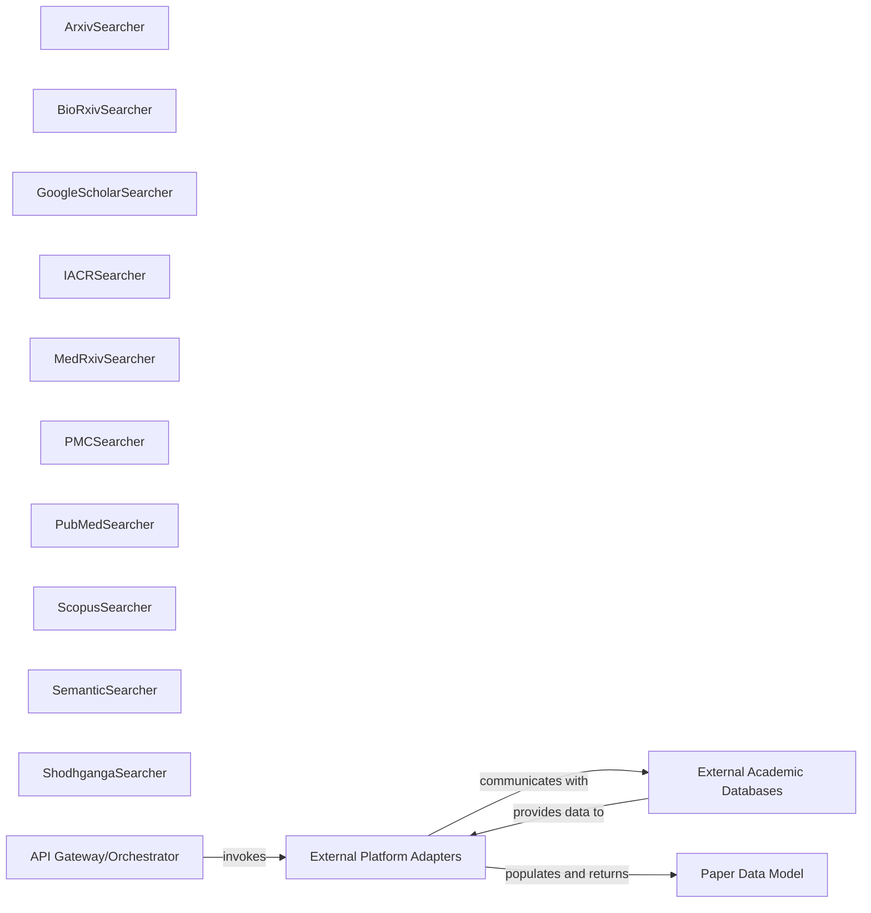

## Details

Abstract Components Overview

### External Platform Adapters [[Expand]](./External_Platform_Adapters.md)
This collection of components provides the necessary abstraction layer for interacting with diverse external academic databases (e.g., Arxiv, Google Scholar). Each adapter is specialized for a particular platform, encapsulating the unique logic for making API calls, handling platform-specific authentication, parsing raw and often heterogeneous responses into the standardized Paper Data Model, and managing platform-specific error conditions. They are crucial for the extensibility of the system to new data sources, aligning with the Adapter Pattern and the project's role as an Aggregator and Proxy.

**Related Classes/Methods**:

- <a href="https://github.com/rakshabesafe/paper-search-mcp/blob/main/paper_search_mcp/academic_platforms/arxiv.py#L20-L93" target="_blank" rel="noopener noreferrer">`paper_search_mcp.academic_platforms.arxiv.ArxivSearcher` (20:93)</a>
- <a href="https://github.com/rakshabesafe/paper-search-mcp/blob/main/paper_search_mcp/academic_platforms/biorxiv.py#L18-L153" target="_blank" rel="noopener noreferrer">`paper_search_mcp.academic_platforms.biorxiv.BioRxivSearcher` (18:153)</a>
- <a href="https://github.com/rakshabesafe/paper-search-mcp/blob/main/paper_search_mcp/academic_platforms/google_scholar.py#L23-L165" target="_blank" rel="noopener noreferrer">`paper_search_mcp.academic_platforms.google_scholar.GoogleScholarSearcher` (23:165)</a>
- <a href="https://github.com/rakshabesafe/paper-search-mcp/blob/main/paper_search_mcp/academic_platforms/iacr.py#L27-L433" target="_blank" rel="noopener noreferrer">`paper_search_mcp.academic_platforms.iacr.IACRSearcher` (27:433)</a>
- <a href="https://github.com/rakshabesafe/paper-search-mcp/blob/main/paper_search_mcp/academic_platforms/medrxiv.py#L18-L154" target="_blank" rel="noopener noreferrer">`paper_search_mcp.academic_platforms.medrxiv.MedRxivSearcher` (18:154)</a>
- <a href="https://github.com/rakshabesafe/paper-search-mcp/blob/main/paper_search_mcp/academic_platforms/pmc.py#L11-L200" target="_blank" rel="noopener noreferrer">`paper_search_mcp.academic_platforms.pmc.PMCSearcher` (11:200)</a>
- <a href="https://github.com/rakshabesafe/paper-search-mcp/blob/main/paper_search_mcp/academic_platforms/pubmed.py#L19-L102" target="_blank" rel="noopener noreferrer">`paper_search_mcp.academic_platforms.pubmed.PubMedSearcher` (19:102)</a>
- <a href="https://github.com/rakshabesafe/paper-search-mcp/blob/main/paper_search_mcp/academic_platforms/scopus.py#L25-L91" target="_blank" rel="noopener noreferrer">`paper_search_mcp.academic_platforms.scopus.ScopusSearcher` (25:91)</a>
- <a href="https://github.com/rakshabesafe/paper-search-mcp/blob/main/paper_search_mcp/academic_platforms/semantic.py#L28-L439" target="_blank" rel="noopener noreferrer">`paper_search_mcp.academic_platforms.semantic.SemanticSearcher` (28:439)</a>
- <a href="https://github.com/rakshabesafe/paper-search-mcp/blob/main/paper_search_mcp/academic_platforms/shodhganga.py#L25-L244" target="_blank" rel="noopener noreferrer">`paper_search_mcp.academic_platforms.shodhganga.ShodhgangaSearcher` (25:244)</a>

### ArxivSearcher
Adapter for Arxiv, responsible for platform-specific API interaction, data parsing, and error handling.

**Related Classes/Methods**:

- <a href="https://github.com/rakshabesafe/paper-search-mcp/blob/main/paper_search_mcp/academic_platforms/arxiv.py#L20-L93" target="_blank" rel="noopener noreferrer">`paper_search_mcp.academic_platforms.arxiv.ArxivSearcher` (20:93)</a>

### BioRxivSearcher
Adapter for BioRxiv, responsible for platform-specific API interaction, data parsing, and error handling.

**Related Classes/Methods**:

- <a href="https://github.com/rakshabesafe/paper-search-mcp/blob/main/paper_search_mcp/academic_platforms/biorxiv.py#L18-L153" target="_blank" rel="noopener noreferrer">`paper_search_mcp.academic_platforms.biorxiv.BioRxivSearcher` (18:153)</a>

### GoogleScholarSearcher
Adapter for Google Scholar, responsible for platform-specific API interaction, data parsing, and error handling.

**Related Classes/Methods**:

- <a href="https://github.com/rakshabesafe/paper-search-mcp/blob/main/paper_search_mcp/academic_platforms/google_scholar.py#L23-L165" target="_blank" rel="noopener noreferrer">`paper_search_mcp.academic_platforms.google_scholar.GoogleScholarSearcher` (23:165)</a>

### IACRSearcher
Adapter for IACR, responsible for platform-specific API interaction, data parsing, and error handling.

**Related Classes/Methods**:

- <a href="https://github.com/rakshabesafe/paper-search-mcp/blob/main/paper_search_mcp/academic_platforms/iacr.py#L27-L433" target="_blank" rel="noopener noreferrer">`paper_search_mcp.academic_platforms.iacr.IACRSearcher` (27:433)</a>

### MedRxivSearcher
Adapter for MedRxiv, responsible for platform-specific API interaction, data parsing, and error handling.

**Related Classes/Methods**:

- <a href="https://github.com/rakshabesafe/paper-search-mcp/blob/main/paper_search_mcp/academic_platforms/medrxiv.py#L18-L154" target="_blank" rel="noopener noreferrer">`paper_search_mcp.academic_platforms.medrxiv.MedRxivSearcher` (18:154)</a>

### PMCSearcher
Adapter for PMC, responsible for platform-specific API interaction, data parsing, and error handling.

**Related Classes/Methods**:

- <a href="https://github.com/rakshabesafe/paper-search-mcp/blob/main/paper_search_mcp/academic_platforms/pmc.py#L11-L200" target="_blank" rel="noopener noreferrer">`paper_search_mcp.academic_platforms.pmc.PMCSearcher` (11:200)</a>

### PubMedSearcher
Adapter for PubMed, responsible for platform-specific API interaction, data parsing, and error handling.

**Related Classes/Methods**:

- <a href="https://github.com/rakshabesafe/paper-search-mcp/blob/main/paper_search_mcp/academic_platforms/pubmed.py#L19-L102" target="_blank" rel="noopener noreferrer">`paper_search_mcp.academic_platforms.pubmed.PubMedSearcher` (19:102)</a>

### ScopusSearcher
Adapter for Scopus, responsible for platform-specific API interaction, data parsing, and error handling.

**Related Classes/Methods**:

- <a href="https://github.com/rakshabesafe/paper-search-mcp/blob/main/paper_search_mcp/academic_platforms/scopus.py#L25-L91" target="_blank" rel="noopener noreferrer">`paper_search_mcp.academic_platforms.scopus.ScopusSearcher` (25:91)</a>

### SemanticSearcher
Adapter for Semantic Scholar, responsible for platform-specific API interaction, data parsing, and error handling.

**Related Classes/Methods**:

- <a href="https://github.com/rakshabesafe/paper-search-mcp/blob/main/paper_search_mcp/academic_platforms/semantic.py#L28-L439" target="_blank" rel="noopener noreferrer">`paper_search_mcp.academic_platforms.semantic.SemanticSearcher` (28:439)</a>

### ShodhgangaSearcher
Adapter for Shodhganga, responsible for platform-specific API interaction, data parsing, and error handling.

**Related Classes/Methods**:

- <a href="https://github.com/rakshabesafe/paper-search-mcp/blob/main/paper_search_mcp/academic_platforms/shodhganga.py#L25-L244" target="_blank" rel="noopener noreferrer">`paper_search_mcp.academic_platforms.shodhganga.ShodhgangaSearcher` (25:244)</a>

### External Academic Databases
External academic databases (e.g., Arxiv, Google Scholar) that provide raw paper data.

**Related Classes/Methods**: _None_

### Paper Data Model
Standardized data model for representing paper information.

**Related Classes/Methods**: _None_

### API Gateway/Orchestrator
Higher-level orchestrating component responsible for invoking specific *Searcher instances.

**Related Classes/Methods**: _None_

### [FAQ](https://github.com/CodeBoarding/GeneratedOnBoardings/tree/main?tab=readme-ov-file#faq)