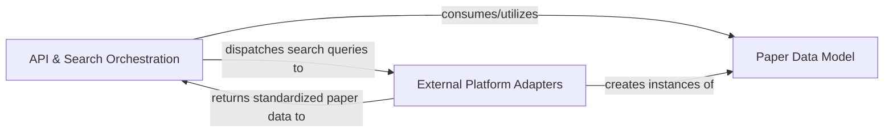

## Details

The `paper-search-mcp` project functions as a backend service and aggregator, designed to serve as an LLM tool/plugin for academic paper searches. Its architecture is primarily composed of three key components: the central `API & Search Orchestration` component, which acts as the service's entry point, handles incoming search requests, and orchestrates concurrent queries to various external academic platforms; the `External Platform Adapters`, a collection of specialized modules, each responsible for interacting with a specific academic database, parsing its unique response, and transforming it into a standardized format; and the `Paper Data Model`, which defines this consistent data structure for academic papers, ensuring uniformity across all aggregated results. The main flow involves the orchestration component receiving a query, dispatching it to relevant adapters, which then fetch and standardize the data using the `Paper Data Model`, before returning the aggregated results back to the orchestrator for final presentation to the client.

### API & Search Orchestration [[Expand]](./API_Search_Orchestration.md)
This is the central control component of the service, acting as the primary API endpoint. It receives incoming search queries, orchestrates the concurrent querying of various external academic platforms via their respective adapters, aggregates the results, and formats the final, standardized response for the client (e.g., an LLM tool). It embodies both the API gateway and the core aggregation logic.

**Related Classes/Methods**:

- `server`

### External Platform Adapters [[Expand]](./External_Platform_Adapters.md)
This collection of components provides the necessary abstraction layer for interacting with diverse external academic databases (e.g., Arxiv, Google Scholar). Each adapter is specialized for a particular platform, encapsulating the unique logic for making API calls, handling platform-specific authentication, parsing raw and often heterogeneous responses into the standardized `Paper Data Model`, and managing platform-specific error conditions. They are crucial for the extensibility of the system to new data sources.

**Related Classes/Methods**:

- <a href="https://github.com/rakshabesafe/paper-search-mcp/blob/main/paper_search_mcp/academic_platforms/arxiv.py#L20-L93" target="_blank" rel="noopener noreferrer">`paper_search_mcp.academic_platforms.arxiv.ArxivSearcher` (20:93)</a>
- <a href="https://github.com/rakshabesafe/paper-search-mcp/blob/main/paper_search_mcp/academic_platforms/biorxiv.py#L18-L153" target="_blank" rel="noopener noreferrer">`paper_search_mcp.academic_platforms.biorxiv.BioRxivSearcher` (18:153)</a>
- <a href="https://github.com/rakshabesafe/paper-search-mcp/blob/main/paper_search_mcp/academic_platforms/google_scholar.py#L23-L165" target="_blank" rel="noopener noreferrer">`paper_search_mcp.academic_platforms.google_scholar.GoogleScholarSearcher` (23:165)</a>
- <a href="https://github.com/rakshabesafe/paper-search-mcp/blob/main/paper_search_mcp/academic_platforms/iacr.py#L27-L433" target="_blank" rel="noopener noreferrer">`paper_search_mcp.academic_platforms.iacr.IACRSearcher` (27:433)</a>
- <a href="https://github.com/rakshabesafe/paper-search-mcp/blob/main/paper_search_mcp/academic_platforms/medrxiv.py#L18-L154" target="_blank" rel="noopener noreferrer">`paper_search_mcp.academic_platforms.medrxiv.MedRxivSearcher` (18:154)</a>
- <a href="https://github.com/rakshabesafe/paper-search-mcp/blob/main/paper_search_mcp/academic_platforms/pmc.py#L11-L200" target="_blank" rel="noopener noreferrer">`paper_search_mcp.academic_platforms.pmc.PMCSearcher` (11:200)</a>
- <a href="https://github.com/rakshabesafe/paper-search-mcp/blob/main/paper_search_mcp/academic_platforms/semantic.py#L28-L439" target="_blank" rel="noopener noreferrer">`paper_search_mcp.academic_platforms.semantic.SemanticSearcher` (28:439)</a>
- <a href="https://github.com/rakshabesafe/paper-search-mcp/blob/main/paper_search_mcp/academic_platforms/shodhganga.py#L25-L244" target="_blank" rel="noopener noreferrer">`paper_search_mcp.academic_platforms.shodhganga.ShodhgangaSearcher` (25:244)</a>

### Paper Data Model
This fundamental component defines the consistent, standardized data structure for representing an academic paper within the entire system. Its purpose is to ensure data uniformity, regardless of the original source platform. All external platform adapters are responsible for transforming their raw data into this common `Paper` format, which is then used by the `API & Search Orchestration` component for aggregation and final presentation.

**Related Classes/Methods**:

- `paper`

### [FAQ](https://github.com/CodeBoarding/GeneratedOnBoardings/tree/main?tab=readme-ov-file#faq)