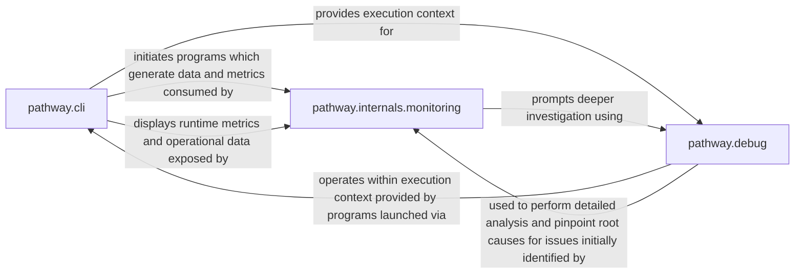

## Details

The Pathway framework's core functionality is orchestrated through three central components: `pathway.cli`, `pathway.internals.monitoring`, and `pathway.debug`. The `pathway.cli` acts as the user's primary interface, responsible for initiating and managing Pathway programs, which in turn generate operational data and metrics. This data is consumed and exposed by `pathway.internals.monitoring`, providing real-time observability into pipeline health and performance. Users can then leverage `pathway.cli` to display these metrics. When issues are identified by the monitoring system, `pathway.debug` provides granular tools for detailed data inspection and analysis, operating within the execution context established by programs launched via `pathway.cli`. This allows developers to pinpoint root causes and verify data transformations, forming a cohesive feedback loop for pipeline development and maintenance.

### pathway.cli
Serves as the primary user interface and orchestration layer for the Pathway framework. It enables users to initiate, manage, and replay Pathway programs, and handles environment setup and repository checkouts. This component is crucial for deploying and controlling data pipelines.

**Related Classes/Methods**:

### pathway.internals.monitoring
Provides real-time observability into the operational status and performance of running Pathway pipelines. It collects and exposes metrics, logs, and statistics related to data connectors, operators, and overall pipeline latency, enabling users to understand pipeline health and identify high-level issues.

**Related Classes/Methods**:

### pathway.debug
Offers granular tools for inspecting, transforming, and visualizing data within Pathway tables. This component is essential for developers to diagnose data-related issues, verify transformations, and understand the internal state of data flowing through the pipelines at a detailed level.

**Related Classes/Methods**:

### [FAQ](https://github.com/CodeBoarding/GeneratedOnBoardings/tree/main?tab=readme-ov-file#faq)