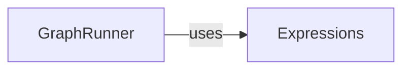

## Details

One paragraph explaining the functionality which is represented by this graph. What the main flow is and what is its purpose.

### GraphRunner
Executes the dataflow graph.

**Related Classes/Methods**:

- <a href="https://github.com/pathwaycom/pathway/blob/main/python/pathway/internals/graph_runner" target="_blank" rel="noopener noreferrer">`python.pathway.internals.graph_runner`</a>

### Expressions
Represents and manipulates dataflow expressions.

**Related Classes/Methods**:

- <a href="https://github.com/pathwaycom/pathway/blob/main/python/pathway/internals/expressions" target="_blank" rel="noopener noreferrer">`python.pathway.internals.expressions`</a>

### [FAQ](https://github.com/CodeBoarding/GeneratedOnBoardings/tree/main?tab=readme-ov-file#faq)