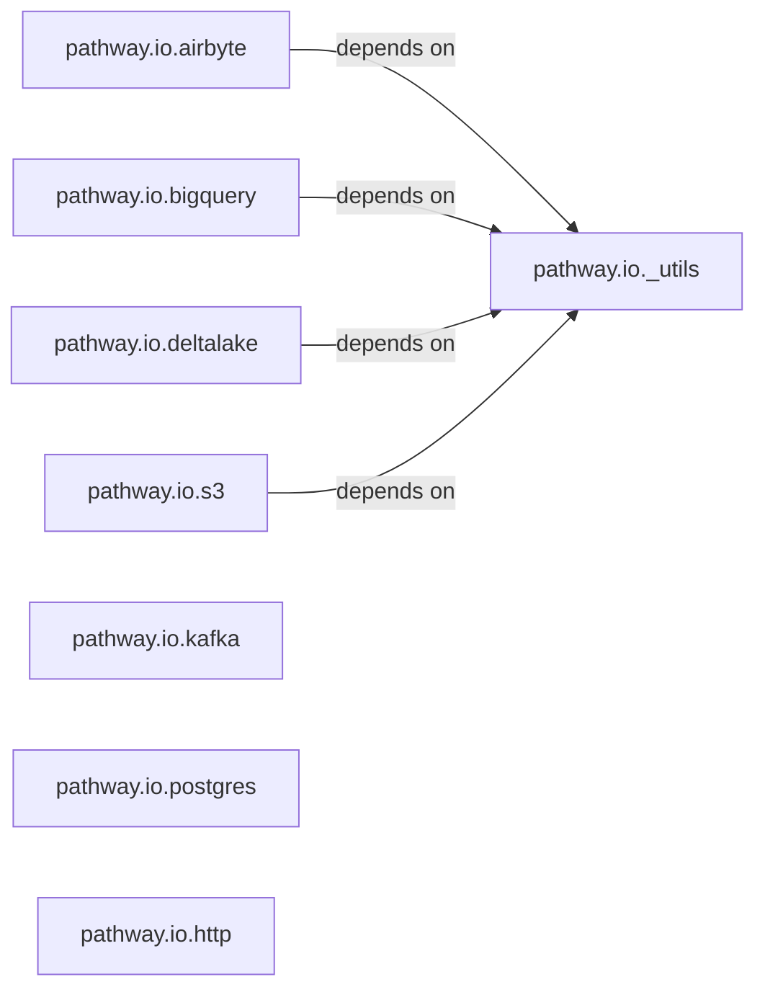

## Details

The `pathway.io` subsystem is designed to provide a unified interface for ingesting and egressing data from various external sources into the Pathway data processing framework. It achieves this through a collection of specialized connector components, each tailored to interact with a specific data source technology such as Airbyte, BigQuery, Delta Lake, S3, Kafka, PostgreSQL, and HTTP. A central `_utils` component provides common functionalities and helper methods, ensuring consistency and reducing redundancy across these diverse connectors. Each connector component typically exposes a `read` function as its primary entry point, abstracting the complexities of data source-specific protocols, authentication, and data format conversions. This modular design allows for easy extension to new data sources while maintaining a consistent interaction pattern for the Pathway core engine. The connectors primarily depend on the `_utils` component for shared functionalities, forming a clear and efficient data ingestion and egress architecture.

### pathway.io._utils
Provides foundational utilities and helper functions commonly used across multiple specific I/O connectors. This includes functionalities for schema/data format construction, connection settings preparation, and other shared helper functions that standardize connector development.

**Related Classes/Methods**:

- <a href="https://github.com/pathwaycom/pathway/blob/main/python/pathway/io/_utils.py#L1-L1000" target="_blank" rel="noopener noreferrer">`pathway.io._utils`:1-1000</a>

### pathway.io.airbyte
Manages connections to Airbyte data sources, handling data ingestion and egress, protocol specifics, authentication, error handling, and data serialization/deserialization for Airbyte-compatible data streams.

**Related Classes/Methods**:

- <a href="https://github.com/pathwaycom/pathway/blob/main/python/pathway/io/airbyte/__init__.py#L108-L295" target="_blank" rel="noopener noreferrer">`pathway.io.airbyte.read`:108-295</a>
- <a href="https://github.com/pathwaycom/pathway/blob/main/python/pathway/io/airbyte/logic.py#L133-L234" target="_blank" rel="noopener noreferrer">`pathway.io.airbyte.logic._PathwayAirbyteSubject`:133-234</a>

### pathway.io.bigquery
Facilitates data exchange with Google BigQuery, managing connection establishment, data ingestion and egress, BigQuery-specific protocol handling, authentication, error management, and data format conversions.

**Related Classes/Methods**:

- <a href="https://github.com/pathwaycom/pathway/blob/main/python/pathway/io/bigquery/__init__.py#L1-L1000" target="_blank" rel="noopener noreferrer">`pathway.io.bigquery.read`:1-1000</a>

### pathway.io.deltalake
Provides capabilities for reading from and writing to Delta Lake tables, including managing connections, handling Delta Lake protocol specifics, ensuring data consistency, and performing serialization/deserialization.

**Related Classes/Methods**:

- <a href="https://github.com/pathwaycom/pathway/blob/main/python/pathway/io/deltalake/__init__.py#L1-L1000" target="_blank" rel="noopener noreferrer">`pathway.io.deltalake.read`:1-1000</a>

### pathway.io.s3
Handles interactions with Amazon S3 (and compatible object storage services), managing file-based data ingestion and egress, S3 protocol specifics, authentication, error handling, and data serialization/deserialization for various file formats.

**Related Classes/Methods**:

- <a href="https://github.com/pathwaycom/pathway/blob/main/python/pathway/io/s3/__init__.py#L1-L1000" target="_blank" rel="noopener noreferrer">`pathway.io.s3.read`:1-1000</a>

### pathway.io.kafka
Manages real-time data streaming with Apache Kafka, responsible for establishing and maintaining connections, handling message production and consumption, Kafka protocol specifics, and serialization/deserialization of stream data.

**Related Classes/Methods**:

- <a href="https://github.com/pathwaycom/pathway/blob/main/python/pathway/io/kafka/__init__.py#L1-L1000" target="_blank" rel="noopener noreferrer">`pathway.io.kafka.read`:1-1000</a>

### pathway.io.postgres
Provides connectivity to PostgreSQL databases, handling data ingestion from and egress to tables, managing SQL protocol specifics, authentication, error handling, and data type mapping between Python and PostgreSQL.

**Related Classes/Methods**:

- <a href="https://github.com/pathwaycom/pathway/blob/main/python/pathway/io/postgres/__init__.py#L1-L1000" target="_blank" rel="noopener noreferrer">`pathway.io.postgres.read`:1-1000</a>

### pathway.io.http
Enables data exchange over HTTP/HTTPS, managing requests and responses for data ingestion (e.g., from REST APIs) and egress, handling HTTP protocol specifics, authentication, and serialization/deserialization of data payloads (e.g., JSON, XML).

**Related Classes/Methods**:

- <a href="https://github.com/pathwaycom/pathway/blob/main/python/pathway/io/http/__init__.py#L1-L1000" target="_blank" rel="noopener noreferrer">`pathway.io.http.read`:1-1000</a>

### [FAQ](https://github.com/CodeBoarding/GeneratedOnBoardings/tree/main?tab=readme-ov-file#faq)