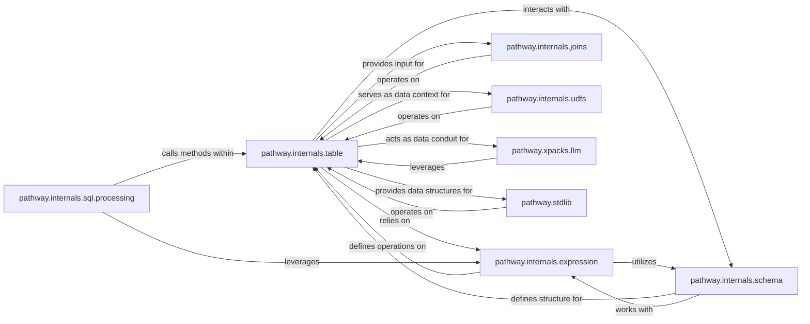

## Details

The `Pathway Python API (Core & Extensions)` subsystem serves as the user-facing layer for defining data pipelines within the Pathway framework. It provides core dataflow operations, schema management, and specialized extensions for AI/ML processing and standard library functions, along with a SQL interface for query definition.

### pathway.internals.table
The fundamental data structure representing a collection of data, providing the primary API for users to define data transformations (e.g., `select`, `filter`, `groupby`). It is the central hub for data manipulation within the Python API.

**Related Classes/Methods**:

- <a href="https://github.com/pathwaycom/pathway/blob/main/python/pathway/internals/table.py" target="_blank" rel="noopener noreferrer">`pathway.internals.table`</a>

### pathway.internals.expression
Provides the foundational mechanism for constructing and evaluating complex expressions on data, enabling rich transformations and computations within the dataflow graph.

**Related Classes/Methods**:

- <a href="https://github.com/pathwaycom/pathway/blob/main/python/pathway/internals/expression.py" target="_blank" rel="noopener noreferrer">`pathway.internals.expression`</a>

### pathway.internals.schema
Manages the structural metadata of data, including column names and types, ensuring data consistency and integrity throughout the pipeline definition.

**Related Classes/Methods**:

- <a href="https://github.com/pathwaycom/pathway/blob/main/python/pathway/internals/schema.py" target="_blank" rel="noopener noreferrer">`pathway.internals.schema`</a>

### pathway.internals.joins
Implements various relational join operations (e.g., inner, left, right, outer) to combine data from multiple `pathway.internals.table` instances based on specified conditions.

**Related Classes/Methods**:

- <a href="https://github.com/pathwaycom/pathway/blob/main/python/pathway/internals/joins.py" target="_blank" rel="noopener noreferrer">`pathway.internals.joins`</a>

### pathway.internals.udfs
Provides the framework for integrating User-Defined Functions (UDFs) written in Python into data pipelines, allowing users to extend Pathway's functionality with custom logic.

**Related Classes/Methods**:

- <a href="https://github.com/pathwaycom/pathway/blob/main/python/pathway/internals/udfs/__init__.py" target="_blank" rel="noopener noreferrer">`pathway.internals.udfs`</a>

### pathway.internals.sql.processing
Interprets SQL queries provided by users and translates them into Pathway's internal dataflow operations, offering a declarative SQL interface for pipeline definition.

**Related Classes/Methods**:

- <a href="https://github.com/pathwaycom/pathway/blob/main/python/pathway/internals/sql/__init__.py" target="_blank" rel="noopener noreferrer">`pathway.internals.sql.processing`</a>

### pathway.xpacks.llm
Extends Pathway with specialized components and functions tailored for Large Language Model (LLM) and AI-specific data processing, including functionalities like embedders, LLM wrappers, and document stores.

**Related Classes/Methods**:

- <a href="https://github.com/pathwaycom/pathway/blob/main/python/pathway/xpacks/llm/__init__.py" target="_blank" rel="noopener noreferrer">`pathway.xpacks.llm`</a>

### pathway.stdlib
Offers a standard library of pre-built functions for common data processing tasks, including graph algorithms, indexing, machine learning utilities, and temporal operations, simplifying pipeline development.

**Related Classes/Methods**:

- <a href="https://github.com/pathwaycom/pathway/blob/main/python/pathway/stdlib/__init__.py" target="_blank" rel="noopener noreferrer">`pathway.stdlib`</a>

### [FAQ](https://github.com/CodeBoarding/GeneratedOnBoardings/tree/main?tab=readme-ov-file#faq)