```mermaid
graph LR
    External_Data_Systems["External Data Systems"]
    Pathway_I_O_Connectors["Pathway I/O Connectors"]
    Pathway_Python_API_Core_Extensions_["Pathway Python API (Core & Extensions)"]
    Pathway_Graph_Execution_Engine_Python_["Pathway Graph Execution Engine (Python)"]
    Pathway_Rust_Execution_Engine["Pathway Rust Execution Engine"]
    Pathway_Control_Observability["Pathway Control & Observability"]
    External_Data_Systems -- "data flows to" --> Pathway_I_O_Connectors
    Pathway_I_O_Connectors -- "data flows to" --> External_Data_Systems
    Pathway_I_O_Connectors -- "provides ingested data streams to" --> Pathway_Python_API_Core_Extensions_
    Pathway_Python_API_Core_Extensions_ -- "passes logical dataflow graph to" --> Pathway_Graph_Execution_Engine_Python_
    Pathway_Graph_Execution_Engine_Python_ -- "sends compiled execution plans to" --> Pathway_Rust_Execution_Engine
    Pathway_Rust_Execution_Engine -- "sends execution results/status to" --> Pathway_Graph_Execution_Engine_Python_
    Pathway_Graph_Execution_Engine_Python_ -- "sends runtime metrics and logs to" --> Pathway_Control_Observability
    Pathway_Python_API_Core_Extensions_ -- "sends debug requests and information to" --> Pathway_Control_Observability
    Pathway_Control_Observability -- "issues control commands to" --> Pathway_Graph_Execution_Engine_Python_
    click Pathway_I_O_Connectors href "https://github.com/CodeBoarding/GeneratedOnBoardings/blob/main/pathway/Pathway_I_O_Connectors.md" "Details"
    click Pathway_Python_API_Core_Extensions_ href "https://github.com/CodeBoarding/GeneratedOnBoardings/blob/main/pathway/Pathway_Python_API_Core_Extensions_.md" "Details"
    click Pathway_Graph_Execution_Engine_Python_ href "https://github.com/CodeBoarding/GeneratedOnBoardings/blob/main/pathway/Pathway_Graph_Execution_Engine_Python_.md" "Details"
    click Pathway_Control_Observability href "https://github.com/CodeBoarding/GeneratedOnBoardings/blob/main/pathway/Pathway_Control_Observability.md" "Details"
```

## Details

Pathway is a high-performance data processing framework designed for real-time data pipelines. It comprises a user-friendly Python API for defining data transformations, which are then compiled and executed by an optimized Rust-based engine. Data ingress and egress are managed by dedicated I/O connectors, interacting with various external data systems. A Python-based graph execution engine orchestrates the interaction between the Python API and the Rust core, while a control and observability layer provides tools for managing and monitoring pipelines. This architecture ensures a clear separation of concerns, allowing for flexible pipeline definition in Python and efficient, incremental execution in Rust.

### External Data Systems
Represents all external data sources (e.g., Kafka, S3, Postgres, GDrive, Airbyte, HTTP, SharePoint) and sinks (e.g., Postgres, Delta Lake, HTTP). This is a conceptual component representing external systems that Pathway interacts with, and thus does not have direct source code within the Pathway project. Its interaction is facilitated by the `Pathway I/O Connectors`.

**Related Classes/Methods**: _None_

### Pathway I/O Connectors [[Expand]](./Pathway_I_O_Connectors.md)
Handles data ingestion from and egress to External Data Systems. Responsible for serialization/deserialization and protocol specifics.

**Related Classes/Methods**:

- <a href="https://github.com/pathwaycom/pathway/blob/main/python/pathway/io/__init__.py" target="_blank" rel="noopener noreferrer">`pathway.io`</a>

### Pathway Python API (Core & Extensions) [[Expand]](./Pathway_Python_API_Core_Extensions_.md)
The user-facing layer for defining data pipelines. Includes core dataflow operations (transformations, joins, UDFs), schema management, and specialized extensions for LLM/AI processing and standard library functions. Also includes the SQL interface for query definition.

**Related Classes/Methods**:

- <a href="https://github.com/pathwaycom/pathway/blob/main/python/pathway/internals/table.py" target="_blank" rel="noopener noreferrer">`pathway.internals.table`</a>
- <a href="https://github.com/pathwaycom/pathway/blob/main/python/pathway/internals/joins.py" target="_blank" rel="noopener noreferrer">`pathway.internals.joins`</a>
- <a href="https://github.com/pathwaycom/pathway/blob/main/python/pathway/internals/udfs/__init__.py" target="_blank" rel="noopener noreferrer">`pathway.internals.udfs`</a>
- <a href="https://github.com/pathwaycom/pathway/blob/main/python/pathway/internals/expression.py" target="_blank" rel="noopener noreferrer">`pathway.internals.expression`</a>
- <a href="https://github.com/pathwaycom/pathway/blob/main/python/pathway/internals/schema.py" target="_blank" rel="noopener noreferrer">`pathway.internals.schema`</a>
- <a href="https://github.com/pathwaycom/pathway/blob/main/python/pathway/internals/dtype.py" target="_blank" rel="noopener noreferrer">`pathway.internals.dtype`</a>
- <a href="https://github.com/pathwaycom/pathway/blob/main/python/pathway/xpacks/llm/__init__.py" target="_blank" rel="noopener noreferrer">`pathway.xpacks.llm`</a>
- <a href="https://github.com/pathwaycom/pathway/blob/main/python/pathway/stdlib/__init__.py" target="_blank" rel="noopener noreferrer">`pathway.stdlib`</a>
- <a href="https://github.com/pathwaycom/pathway/blob/main/python/pathway/internals/sql/__init__.py" target="_blank" rel="noopener noreferrer">`pathway.internals.sql`</a>

### Pathway Graph Execution Engine (Python) [[Expand]](./Pathway_Graph_Execution_Engine_Python_.md)
Compiles the logical dataflow graph defined by the Pathway Python API into an executable plan and orchestrates its execution on the Pathway Rust Execution Engine. This component acts as the primary interface to the Rust engine.

**Related Classes/Methods**:

- <a href="https://github.com/pathwaycom/pathway/blob/main/python/pathway/internals/graph_runner/__init__.py" target="_blank" rel="noopener noreferrer">`pathway.internals.graph_runner`</a>

### Pathway Rust Execution Engine
The high-performance, incremental computation engine written in Rust. It executes the compiled dataflow graph received from the `Pathway Graph Execution Engine (Python)`. As this component is written in Rust, its source code is external to the Python project.

**Related Classes/Methods**: _None_

### Pathway Control & Observability [[Expand]](./Pathway_Control_Observability.md)
Provides command-line tools for project management and deployment, and monitoring/debugging capabilities for pipeline runtime.

**Related Classes/Methods**:

- <a href="https://github.com/pathwaycom/pathway/blob/main/python/pathway/cli.py" target="_blank" rel="noopener noreferrer">`pathway.cli`</a>
- <a href="https://github.com/pathwaycom/pathway/blob/main/python/pathway/internals/monitoring.py" target="_blank" rel="noopener noreferrer">`pathway.internals.monitoring`</a>
- <a href="https://github.com/pathwaycom/pathway/blob/main/python/pathway/debug/__init__.py" target="_blank" rel="noopener noreferrer">`pathway.debug`</a>

### [FAQ](https://github.com/CodeBoarding/GeneratedOnBoardings/tree/main?tab=readme-ov-file#faq)