```mermaid
graph LR
    API_Data_Ingestion_Layer["API & Data Ingestion Layer"]
    Core_CMS_Logic["Core CMS Logic"]
    Authentication_and_Authorization["Authentication and Authorization"]
    Database_Abstraction_Layer["Database Abstraction Layer"]
    Plugin_Module_System["Plugin/Module System"]
    Admin_Panel_UI["Admin Panel/UI"]
    Content_Schema_Management["Content Schema Management"]
    API_Data_Ingestion_Layer -- "forwards requests to" --> Core_CMS_Logic
    API_Data_Ingestion_Layer -- "utilizes" --> Authentication_and_Authorization
    API_Data_Ingestion_Layer -- "integrated with" --> Plugin_Module_System
    Core_CMS_Logic -- "interacts with" --> Database_Abstraction_Layer
    Authentication_and_Authorization -- "provides security services to" --> API_Data_Ingestion_Layer
    Plugin_Module_System -- "integrates with" --> API_Data_Ingestion_Layer
    Plugin_Module_System -- "extends/modifies behaviors within" --> Core_CMS_Logic
    Admin_Panel_UI -- "communicates with" --> API_Data_Ingestion_Layer
    Admin_Panel_UI -- "relies on" --> Authentication_and_Authorization
    Content_Schema_Management -- "provides definitions to" --> Core_CMS_Logic
    Content_Schema_Management -- "configured/managed through" --> Admin_Panel_UI
    click API_Data_Ingestion_Layer href "https://github.com/CodeBoarding/GeneratedOnBoardings/blob/main/payload/API_Data_Ingestion_Layer.md" "Details"
```

## Details

Revised analysis of project components and their relationships, with source code references pointing to probable package/directory locations due to the project's TypeScript/JavaScript nature.

### API & Data Ingestion Layer [[Expand]](./API_Data_Ingestion_Layer.md)
Serves as the primary interface for external systems and clients, handling all incoming requests (content creation, retrieval, updates, deletions). It performs request routing, payload parsing, data validation, and initial data transformation. This layer is crucial for the "API-First/Headless" pattern, providing the external contract for the CMS.

**Related Classes/Methods**:

- `payload` (1:1)

### Core CMS Logic
Encapsulates the fundamental business logic of the CMS, including content processing, workflow management, versioning, and content delivery mechanisms. It orchestrates operations between other components, representing the "stable core CMS" as per the architectural bias.

**Related Classes/Methods**:

- `payload` (1:1)

### Authentication and Authorization
Manages user authentication, role-based access control, and permission enforcement across the CMS. Ensures secure access to content and administrative functions, vital for any multi-user system.

**Related Classes/Methods**:

- `payload` (1:1)

### Database Abstraction Layer
Provides a unified interface for interacting with various database systems (MongoDB, PostgreSQL, SQLite), abstracting away database-specific complexities. This component is key to the "Database Abstraction Layer" pattern, ensuring flexibility in data storage.

**Related Classes/Methods**:

- `db-mongodb` (1:1)

### Plugin/Module System
Enables extensibility of the CMS by allowing developers to add custom functionalities, content types, or integrations without modifying the core system. This embodies the "Modular Architecture" and "Extensible Architecture" patterns.

**Related Classes/Methods**:

- `payload` (1:1)

### Admin Panel/UI
A component-driven user interface (built with React/Next.js) for administrators and content editors to manage content, users, settings, and plugins. It represents the "Admin Panel/UI" component.

**Related Classes/Methods**:

- `admin-bar` (1:1)

### Content Schema Management
Defines and manages the structure and types of content within the CMS, allowing for flexible and custom content models. This is fundamental for a "Headless CMS" to provide structured content.

**Related Classes/Methods**:

- `payload` (1:1)

### [FAQ](https://github.com/CodeBoarding/GeneratedOnBoardings/tree/main?tab=readme-ov-file#faq)