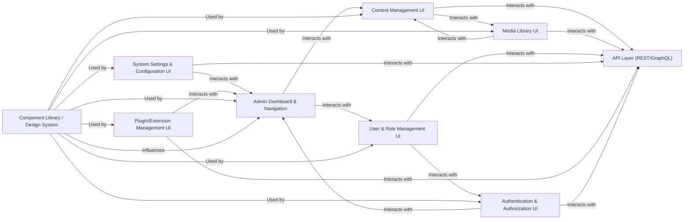

## Details

One paragraph explaining the functionality which is represented by this graph. What the main flow is and what is its purpose.

### Admin Dashboard & Navigation
The central entry point and navigational hub for the entire admin interface. It provides an overview of system status, quick access links, and the primary navigation structure to various management sections.

**Related Classes/Methods**:

- `repos/admin/src/components/layout/` (1:1)
- `repos/admin/src/pages/dashboard/` (1:1)

### Content Management UI
Encompasses all interfaces related to content lifecycle management, including creating, editing, publishing, and organizing various content types. This includes rich-text editing capabilities and content listing/filtering.

**Related Classes/Methods**:

- `repos/admin/src/components/content/` (1:1)
- `repos/admin/src/pages/content/` (1:1)

### Media Library UI
Provides a dedicated interface for uploading, organizing, browsing, and managing digital assets such as images, videos, and documents, which are used across the CMS content.

**Related Classes/Methods**:

- `repos/admin/src/components/media/` (1:1)
- `repos/admin/src/pages/media/` (1:1)

### User & Role Management UI
Offers an administrative interface for managing user accounts, defining roles, assigning permissions, and controlling access levels within the CMS.

**Related Classes/Methods**:

- `repos/admin/src/components/users/` (1:1)
- `repos/admin/src/pages/users/` (1:1)

### System Settings & Configuration UI
Provides an interface for administrators to configure global CMS settings, including site name, language, integrations, email settings, and other system-wide parameters.

**Related Classes/Methods**:

- `repos/admin/src/components/settings/` (1:1)
- `repos/admin/src/pages/settings/` (1:1)

### Plugin/Extension Management UI
Offers an interface for discovering, installing, activating, deactivating, and configuring various plugins and extensions to expand the CMS's core functionality.

**Related Classes/Methods**:

- `repos/admin/src/components/plugins/` (1:1)
- `repos/admin/src/pages/extensions/` (1:1)

### Authentication & Authorization UI
Handles user authentication flows, including login, logout, password recovery, and displays user-specific permissions and access levels within the admin interface.

**Related Classes/Methods**:

- `repos/admin/src/components/auth/` (1:1)
- `repos/admin/src/pages/auth/` (1:1)

### Component Library / Design System
A foundational layer providing a consistent set of reusable UI components (e.g., buttons, forms, tables, modals, typography) and design guidelines, ensuring a cohesive and branded user experience across the entire admin interface.

**Related Classes/Methods**:

- `repos/admin/src/components/ui/` (1:1)
- `repos/admin/src/design-system/` (1:1)

### API Layer (REST/GraphQL)
External API layer for data interaction.

**Related Classes/Methods**:

- `app/(payload)/api/graphql` (1:1)
- `app/(payload)/api/[...slug]` (1:1)

### [FAQ](https://github.com/CodeBoarding/GeneratedOnBoardings/tree/main?tab=readme-ov-file#faq)