```mermaid
graph LR
    Content_Schema_Model_Management["Content Schema & Model Management"]
    Core_CMS_Logic["Core CMS Logic"]
    Admin_Panel_UI["Admin Panel/UI"]
    API_Layer_REST_GraphQL_["API Layer (REST/GraphQL)"]
    Database_Abstraction_Layer["Database Abstraction Layer"]
    Authentication_and_Authorization["Authentication and Authorization"]
    Plugin_Module_System["Plugin/Module System"]
    CLI_Tooling["CLI Tooling"]
    Content_Schema_Model_Management -- "defines data structures and validation rules for" --> Core_CMS_Logic
    Content_Schema_Model_Management -- "persists schema definitions via" --> Database_Abstraction_Layer
    Content_Schema_Model_Management -- "managed through" --> Admin_Panel_UI
    Core_CMS_Logic -- "utilizes" --> Content_Schema_Model_Management
    Core_CMS_Logic -- "interacts with" --> Database_Abstraction_Layer
    Core_CMS_Logic -- "exposes functionality via" --> API_Layer_REST_GraphQL_
    Admin_Panel_UI -- "interacts with" --> API_Layer_REST_GraphQL_
    Admin_Panel_UI -- "provides interface for" --> Content_Schema_Model_Management
    Admin_Panel_UI -- "manages" --> Authentication_and_Authorization
    API_Layer_REST_GraphQL_ -- "interfaces with" --> Core_CMS_Logic
    API_Layer_REST_GraphQL_ -- "serves data to" --> Admin_Panel_UI
    API_Layer_REST_GraphQL_ -- "enforces policies from" --> Authentication_and_Authorization
    Database_Abstraction_Layer -- "persists data for" --> Core_CMS_Logic
    Database_Abstraction_Layer -- "stores schema definitions from" --> Content_Schema_Model_Management
    Database_Abstraction_Layer -- "accessed by" --> Plugin_Module_System
    Authentication_and_Authorization -- "secures access for" --> API_Layer_REST_GraphQL_
    Authentication_and_Authorization -- "managed by" --> Admin_Panel_UI
    Authentication_and_Authorization -- "integrates with" --> Core_CMS_Logic
    Plugin_Module_System -- "extends capabilities of" --> Core_CMS_Logic
    Plugin_Module_System -- "can introduce new" --> Content_Schema_Model_Management
    Plugin_Module_System -- "interacts with" --> API_Layer_REST_GraphQL_
    CLI_Tooling -- "performs migrations on" --> Database_Abstraction_Layer
    CLI_Tooling -- "manages" --> Content_Schema_Model_Management
    CLI_Tooling -- "interacts with" --> Core_CMS_Logic
    click Content_Schema_Model_Management href "https://github.com/CodeBoarding/GeneratedOnBoardings/blob/main/payload/Content_Schema_Model_Management.md" "Details"
```

## Details

This detailed analysis focuses on the Content Schema & Model Management subsystem within the Headless Content Management System (CMS), identifying its boundaries, central components, responsibilities, and interactions. The chosen components are fundamental to a Headless CMS architecture, particularly in how they relate to defining and managing content structures.

### Content Schema & Model Management [[Expand]](./Content_Schema_Model_Management.md)
Defines, validates, and manages the structure of all content types (collections, globals) within the CMS. It encompasses the creation, modification, and versioning of content models, including fields, relationships, and validation rules, ensuring data consistency and flexibility across the system. This component provides the foundational data structures and validation logic for the Core CMS Logic.

**Related Classes/Methods**:

- `src/collections/**/*.ts` (1:1)
- `src/globals/**/*.ts` (1:1)
- `src/fields/**/*.ts` (1:1)
- `src/admin/components/forms/field-types/**/*.tsx` (1:1)
- `src/config/schema.ts` (1:1)

### Core CMS Logic
The central processing unit of the CMS, handling content operations (CRUD), business logic, content versioning, and orchestrating interactions between other components. It interprets and applies the content schemas defined by the Content Schema & Model Management component.

**Related Classes/Methods**:

- `src/core/**/*.ts` (1:1)
- `src/server/payload.ts` (1:1)
- `src/server/routes/**/*.ts` (1:1)
- `src/server/collections/**/*.ts` (1:1)
- `src/server/globals/**/*.ts` (1:1)

### Admin Panel/UI
The user interface for administrators to manage content, define and modify content schemas, configure system settings, and manage users. Built with React/Next.js, it provides a visual interface for interacting with the CMS backend.

**Related Classes/Methods**:

- `admin/**/*.tsx` (1:1)
- `src/admin/**/*.tsx` (1:1)
- `packages/admin/**/*.tsx` (1:1)
- `app/admin/**/*.tsx` (1:1)

### API Layer (REST/GraphQL)
Exposes CMS functionalities and content data through well-defined RESTful and GraphQL APIs. It acts as the primary interface for external applications, the Admin Panel/UI, and other services to interact with the Core CMS Logic.

**Related Classes/Methods**:

- `src/api/**/*.ts` (1:1)
- `src/graphql/**/*.ts` (1:1)
- `src/rest/**/*.ts` (1:1)
- `server/api/**/*.ts` (1:1)

### Database Abstraction Layer
Provides a unified interface for interacting with various database systems (MongoDB, PostgreSQL, SQLite), abstracting away database-specific complexities. It handles data persistence, retrieval, and schema migrations, ensuring data consistency across different database backends.

**Related Classes/Methods**:

- `src/db/**/*.ts` (1:1)
- `src/database/**/*.ts` (1:1)
- `src/adapters/db/**/*.ts` (1:1)
- `src/migrations/**/*.ts` (1:1)

### Authentication and Authorization
Manages user authentication (login, session management) and authorization (role-based access control, permissions) for accessing CMS resources, content, and schema definitions. It ensures secure access to the CMS and its data.

**Related Classes/Methods**:

- `src/auth/**/*.ts` (1:1)
- `src/security/**/*.ts` (1:1)
- `src/middleware/auth.ts` (1:1)
- `src/access/**/*.ts` (1:1)

### Plugin/Module System
Provides a robust mechanism for extending CMS functionality through custom plugins and modules. It allows developers to add new features, custom fields, integrations, or modify existing behaviors without altering the core CMS codebase, promoting modularity and extensibility.

**Related Classes/Methods**:

- `src/plugins/**/*.ts` (1:1)
- `src/modules/**/*.ts` (1:1)
- `packages/plugins/**/*.ts` (1:1)
- `payload.config.ts` (1:1)

### CLI Tooling
Command-line interface tools for developers and administrators to perform various tasks such as project setup, database migrations, user creation, content import/export, and schema synchronization. It streamlines development workflows and deployment processes.

**Related Classes/Methods**:

- `cli/**/*.ts` (1:1)
- `src/cli/**/*.ts` (1:1)
- `packages/cli/**/*.ts` (1:1)
- `bin/payload.js` (1:1)

### [FAQ](https://github.com/CodeBoarding/GeneratedOnBoardings/tree/main?tab=readme-ov-file#faq)