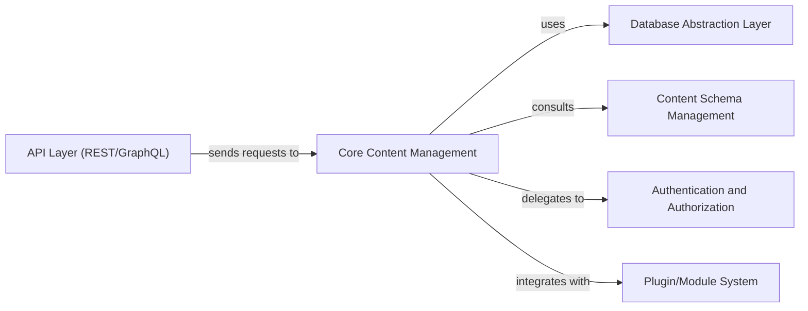

## Details

One paragraph explaining the functionality which is represented by this graph. What the main flow is and what is its purpose.

### Core Content Management [[Expand]](./Core_Content_Management.md)
The central component responsible for managing the entire content lifecycle, including content storage, versioning, publishing workflows, content relationships, and media asset management. It performs full CRUD operations on content and orchestrates interactions with other core services.

**Related Classes/Methods**: _None_

### API Layer (REST/GraphQL)
Serves as the external interface for the CMS, handling incoming requests (REST and GraphQL) from client applications. It translates these requests into internal commands and forwards them to the Core Content Management component for processing.

**Related Classes/Methods**: _None_

### Database Abstraction Layer
Provides a unified interface for persistence operations, abstracting away the complexities and specific implementations of underlying databases (MongoDB, PostgreSQL, SQLite). It is utilized by the Core Content Management component for all data storage and retrieval.

**Related Classes/Methods**: _None_

### Content Schema Management
Manages the definition, validation, and evolution of content structures (schemas). It ensures content consistency and integrity by providing validation rules and definitions that the Core Content Management component adheres to during content creation and modification.

**Related Classes/Methods**: _None_

### Authentication and Authorization
Handles user authentication (verifying identities) and authorization (determining access rights) for all content-related operations. The Core Content Management component delegates security checks to this component before processing sensitive requests.

**Related Classes/Methods**: _None_

### Plugin/Module System
Provides the framework for extending the CMS's core functionalities through pluggable modules or plugins. It allows developers to add custom content types, workflows, integrations, or other features without modifying the core codebase.

**Related Classes/Methods**: _None_

### [FAQ](https://github.com/CodeBoarding/GeneratedOnBoardings/tree/main?tab=readme-ov-file#faq)