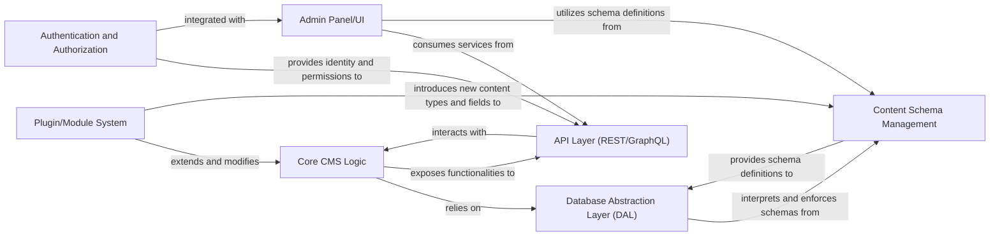

## Details

One paragraph explaining the functionality which is represented by this graph. What the main flow is and what is its purpose.

### Core CMS Logic
The central processing unit of the CMS, responsible for managing the content lifecycle, applying business rules, orchestrating operations between other components, and ensuring data integrity. It acts as the primary consumer of services from the DAL and interacts with the API Layer to fulfill requests.

**Related Classes/Methods**: _None_

### API Layer (REST/GraphQL)
Provides the external interface for the CMS, exposing content and management functionalities through RESTful and GraphQL APIs. It handles request parsing, routing, and delegates operations to the Core CMS Logic, ensuring secure and efficient data exchange with clients.

**Related Classes/Methods**: _None_

### Database Abstraction Layer (DAL) [[Expand]](./Database_Abstraction_Layer_DAL_.md)
Provides a unified and consistent interface for the CMS to interact with various underlying databases (e.g., MongoDB, PostgreSQL, SQLite). It abstracts away database-specific operations, allowing the core CMS logic to remain database-agnostic. The DAL translates the CMS's internal data models and schema definitions into database-specific structures and queries, ensuring data consistency and validation at the persistence layer.

**Related Classes/Methods**: _None_

### Content Schema Management
Defines, stores, and manages the structure and validation rules for all content types within the CMS. It provides the blueprints for how content is organized and persisted, ensuring data consistency and enabling dynamic content modeling.

**Related Classes/Methods**: _None_

### Admin Panel/UI
The user interface for administrators and content editors to manage content, users, settings, and extensions. It interacts with the API Layer to perform operations and provides a visual representation of the CMS data and functionalities.

**Related Classes/Methods**: _None_

### Plugin/Module System
Enables the extensibility of the CMS by allowing developers to add custom functionalities, content types, or integrations without modifying the core system. It provides hooks and APIs for modules to interact with the Core CMS Logic and other components.

**Related Classes/Methods**: _None_

### Authentication and Authorization
Manages user identities, authentication processes (e.g., login, logout), and authorization rules (e.g., role-based access control). It secures access to CMS functionalities and content, ensuring that only authorized users can perform specific actions.

**Related Classes/Methods**: _None_

### [FAQ](https://github.com/CodeBoarding/GeneratedOnBoardings/tree/main?tab=readme-ov-file#faq)