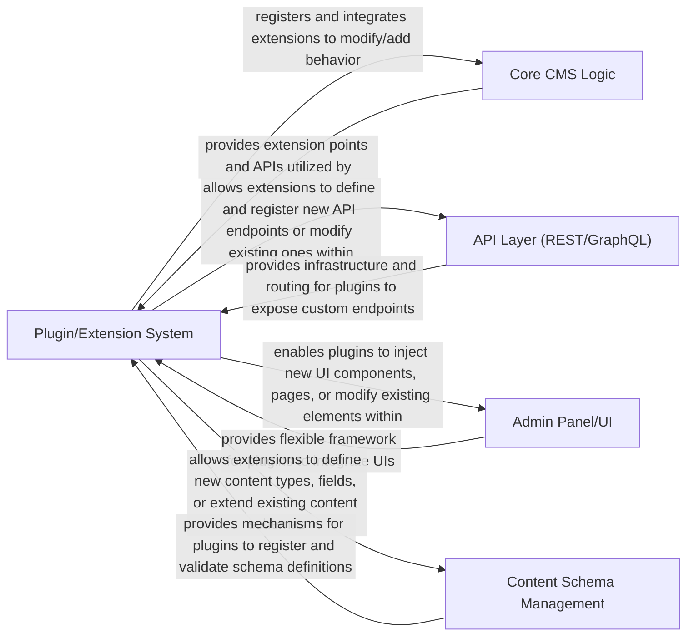

## Details

Abstract Components Overview of a CMS architecture.

### Plugin/Extension System [[Expand]](./Plugin_Extension_System.md)
Enables the extensibility of the CMS by providing a robust framework for developing and integrating custom plugins or modules. This allows developers to add new functionalities or customize existing behaviors without modifying the core CMS code. It manages the lifecycle of extensions, including registration, loading, and execution.

**Related Classes/Methods**: _None_

### Core CMS Logic
This component encapsulates the fundamental business logic and core functionalities of the CMS. It handles content storage, retrieval, and manipulation, user authentication and authorization, and overall system orchestration. It acts as the central hub, coordinating interactions between other components and ensuring data integrity and consistency.

**Related Classes/Methods**: _None_

### API Layer (REST/GraphQL)
Provides programmatic access to the CMS functionalities and content. It exposes a set of well-defined endpoints (either RESTful or GraphQL) that allow external applications, front-end clients, or other services to interact with the CMS. This layer handles request parsing, data serialization/deserialization, authentication, and authorization for API calls, acting as the gateway to the CMS's data and operations.

**Related Classes/Methods**: _None_

### Admin Panel/UI
Offers a user-friendly graphical interface for administrators and content editors to manage the CMS. This includes creating, editing, and publishing content, managing users and permissions, configuring system settings, and overseeing the overall health and performance of the CMS. It provides a visual representation of the underlying data and functionalities, simplifying content management workflows.

**Related Classes/Methods**: _None_

### Content Schema Management
Responsible for defining, storing, and validating the structure and types of content within the CMS. It allows administrators to create custom content models (schemas) with various fields (e.g., text, images, dates, relationships), ensuring data consistency and enabling flexible content organization. This component manages content type definitions, field validations, and potentially content migration or versioning related to schema changes.

**Related Classes/Methods**: _None_

### [FAQ](https://github.com/CodeBoarding/GeneratedOnBoardings/tree/main?tab=readme-ov-file#faq)