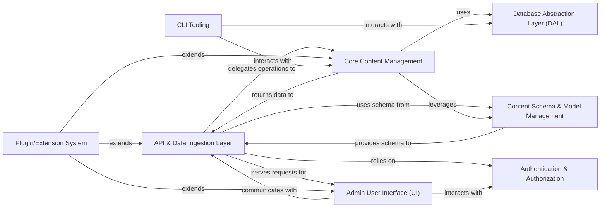

## Details

One paragraph explaining the functionality which is represented by this graph. What the main flow is and what is its purpose.

### API & Data Ingestion Layer [[Expand]](./API_Data_Ingestion_Layer.md)
Serves as the primary interface for external systems and clients, handling all incoming requests (content creation, retrieval, updates, deletions). It performs request routing, payload parsing, data validation, and initial data transformation.

**Related Classes/Methods**: _None_

### Core Content Management [[Expand]](./Core_Content_Management.md)
The central component responsible for managing the entire content lifecycle, including content storage, versioning, publishing workflows, content relationships, and media asset management. It orchestrates all content-related operations.

**Related Classes/Methods**: _None_

### Content Schema & Model Management [[Expand]](./Content_Schema_Model_Management.md)
Defines and manages the structure of all content types (collections, globals) within the CMS. It allows administrators to create, modify, and version content models, including fields, relationships, and validation rules, ensuring data consistency.

**Related Classes/Methods**: _None_

### Database Abstraction Layer (DAL) [[Expand]](./Database_Abstraction_Layer_DAL_.md)
Provides a unified and consistent interface for the CMS to interact with various underlying databases (e.g., MongoDB, PostgreSQL, SQLite). It abstracts away database-specific operations, allowing the core CMS logic to remain database-agnostic.

**Related Classes/Methods**: _None_

### Authentication & Authorization
Manages user authentication, role-based access control (RBAC), and permissions across the entire CMS. It ensures that only authorized users can access specific content, features, or API endpoints.

**Related Classes/Methods**: _None_

### Admin User Interface (UI) [[Expand]](./Admin_User_Interface_UI_.md)
Provides a rich, component-based web interface for content creators, editors, and administrators to manage content, users, settings, and extensions. It offers a user-friendly experience for content creation, media management, and system configuration.

**Related Classes/Methods**: _None_

### Plugin/Extension System [[Expand]](./Plugin_Extension_System.md)
Enables the extensibility of the CMS by providing a robust framework for developing and integrating custom plugins or modules. This allows developers to add new functionalities or customize existing behaviors without modifying the core CMS code.

**Related Classes/Methods**: _None_

### CLI Tooling
Offers a command-line interface for developers to perform various administrative and development tasks, such as database migrations, data seeding, environment setup, and plugin management.

**Related Classes/Methods**: _None_

### [FAQ](https://github.com/CodeBoarding/GeneratedOnBoardings/tree/main?tab=readme-ov-file#faq)