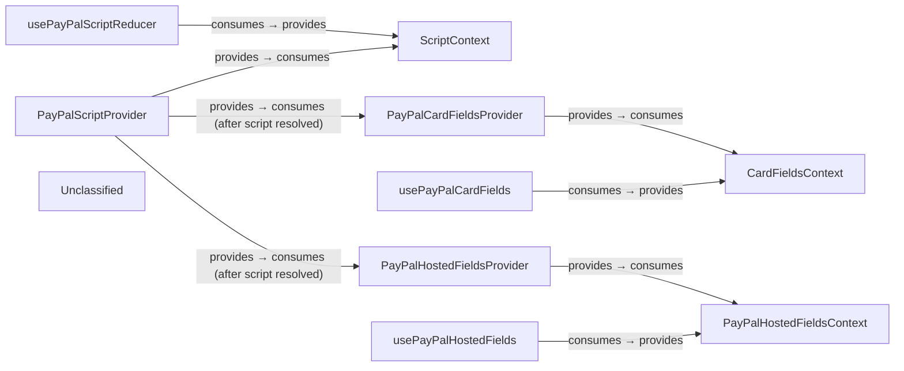

## Details

React‑PayPal‑JS is a thin React integration layer that abstracts the PayPal JavaScript SDK behind three focused context‑provider pairs. The PayPalScriptProvider loads the SDK script once and publishes a ScriptContext containing the loading status and a reducer dispatch. Consumer hooks expose derived state flags so UI components can react to script readiness. After the script resolves, PayPalCardFieldsProvider and PayPalHostedFieldsProvider each create their respective SDK objects (Card‑Fields and Hosted‑Fields) and publish dedicated contexts. Corresponding hooks give field components a stable API for registration, lifecycle management, and data submission. All public symbols are re‑exported from a single barrel (src/index.ts), keeping the external contract stable while the internal implementation remains encapsulated.

### PayPalScriptProvider [[Expand]](./PayPalScriptProvider.md)
Loads the PayPal SDK script, manages loading state, and provides ScriptContext to the component tree.

**Related Classes/Methods**:

- `PayPalScriptProvider`:21-87

### ScriptContext
Holds {options, loadingStatus, error, dispatch} – the shared state for the script‑loading layer.

**Related Classes/Methods**:

- `ScriptContext`

### usePayPalScriptReducer
Consumes ScriptContext and returns derived state flags (isInitial, isPending, isResolved, isRejected) plus a dispatch function for the script reducer.

**Related Classes/Methods**:

- `usePayPalScriptReducer`:23-43

### PayPalCardFieldsProvider
Creates the Card‑Fields SDK instance after the script resolves and supplies CardFieldsContext to children.

**Related Classes/Methods**:

- `PayPalCardFieldsProvider`:32-117

### CardFieldsContext
Stores the Card‑Fields instance and a registration map for individual field components.

**Related Classes/Methods**:

- `CardFieldsContext`:12-18

### usePayPalCardFields
Consumes CardFieldsContext and exposes the registration API (registerField, unregisterField) as well as the Card‑Fields instance.

**Related Classes/Methods**:

- `usePayPalCardFields`:17-18

### PayPalHostedFieldsProvider
Creates the Hosted‑Fields SDK instance after the script resolves and supplies PayPalHostedFieldsContext to children.

**Related Classes/Methods**:

- `PayPalHostedFieldsProvider`:33-114

### usePayPalHostedFields
Consumes PayPalHostedFieldsContext and returns the hosted‑fields instance with helper callbacks (submit, getState).

**Related Classes/Methods**:

- `usePayPalHostedFields`:14-16

### Unclassified
Component for all unclassified files and utility functions (Utility functions/External Libraries/Dependencies)

**Related Classes/Methods**: _None_

### [FAQ](https://github.com/CodeBoarding/GeneratedOnBoardings/tree/main?tab=readme-ov-file#faq)