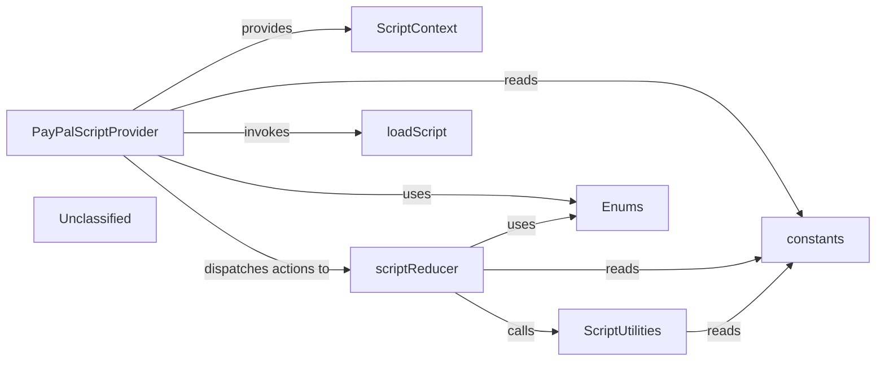

## Details

The graph models the PayPal JavaScript SDK integration flow in a React application. The PayPalScriptProvider component initializes a reducer‑based state machine (scriptReducer) to track the SDK script loading lifecycle, invokes the low‑level loadScript helper to inject the PayPal SDK script, and supplies the resulting state and dispatch via a React context (ScriptContext) to the component tree. When options change or a reset is requested, the reducer uses utility functions (getScriptID, destroySDKScript) to manage the script element, while shared literals and enums (constants, SCRIPT_LOADING_STATE, DISPATCH_ACTION) provide type‑safe identifiers and state values. This separation of concerns ensures clear orchestration of script loading, state management, and context provisioning for downstream PayPal components.

### PayPalScriptProvider [[Expand]](./PayPalScriptProvider.md)
React component that creates a useReducer with scriptReducer, triggers loadScript on mount or options change, dispatches loading status actions, handles errors, and provides ScriptContext to its children.

**Related Classes/Methods**:

- `components/PayPalScriptProvider.tsx:PayPalScriptProvider`:21-87

### ScriptContext
React context created with createContext that holds the script state and dispatch function, supplied by PayPalScriptProvider.

**Related Classes/Methods**:

- `context/scriptProviderContext.ts:ScriptContext`

### scriptReducer
Pure reducer handling LOADING_STATUS, RESET_OPTIONS, and SET_BRAINTREE_INSTANCE actions to update loading status, reset SDK options, and store Braintree instance.

**Related Classes/Methods**:

- `context/scriptProviderContext.ts:scriptReducer`:49-91

### loadScript
Async helper that builds the PayPal SDK URL, injects a script tag with deduplication, and resolves when the global paypal object becomes available.

**Related Classes/Methods**:

- `paypal-js/src/load-script.ts:loadScript`:12-51

### ScriptUtilities
Utility functions getScriptID (hashes options to produce a deterministic script element ID) and destroySDKScript (removes the script element by ID).

**Related Classes/Methods**:

- `context/scriptProviderContext.ts:getScriptID`:19-25
- `context/scriptProviderContext.ts:destroySDKScript`:32-40

### constants
Module containing literal values such as SCRIPT_ID, SDK_SETTINGS, and LOAD_SCRIPT_ERROR used throughout the provider and reducer.

**Related Classes/Methods**:

- `constants.ts:SCRIPT_ID`
- `constants.ts:SDK_SETTINGS`:8-15
- `constants.ts:LOAD_SCRIPT_ERROR`

### Enums
Enumerations defining SCRIPT_LOADING_STATE and DISPATCH_ACTION values for the loading state machine and reducer actions.

**Related Classes/Methods**:

- `types/enums.ts:SCRIPT_LOADING_STATE`:6-11
- `types/enums.ts:DISPATCH_ACTION`:18-22

### Unclassified
Component for all unclassified files and utility functions (Utility functions/External Libraries/Dependencies)

**Related Classes/Methods**: _None_

### [FAQ](https://github.com/CodeBoarding/GeneratedOnBoardings/tree/main?tab=readme-ov-file#faq)