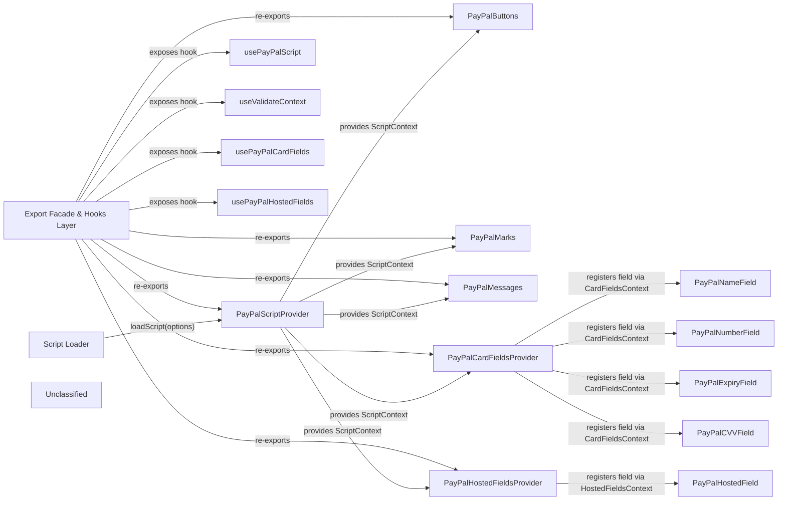

## Details

The react-paypal-js library orchestrates loading the PayPal JavaScript SDK and exposing it through a hierarchy of React contexts and thin wrapper components. A low‑level Script Loader builds the SDK URL, injects a script tag, and resolves the global `paypal` namespace. The top‑level PayPalScriptProvider invokes this loader, tracks its promise state, and stores the resolved namespace in a ScriptContext that is consumed by all downstream UI components. UI primitives (PayPalButtons, PayPalMarks, PayPalMessages) read the context to instantiate their respective SDK widgets. Two field‑management suites – Card‑Fields and Hosted‑Fields – each provide a provider that creates a dedicated SDK field instance, registers individual field components via a shared context, and renders the specific input elements. An export façade (index.ts) re‑exports all public symbols and supplies ergonomic hooks (usePayPalScript, useValidateContext, usePayPalCardFields, usePayPalHostedFields) so library consumers can interact with the underlying contexts without coupling to implementation details. The overall data‑flow is: loader → script provider → UI / field providers → field components, with the façade and hooks acting as the external entry points.

### Script Loader
Low‑level utility that builds the PayPal SDK URL, injects a <script> element, guarantees idempotent loading and resolves the global `paypal` namespace.

**Related Classes/Methods**:

- <a href="https://github.com/paypal/paypal-js/blob/main/packages/paypal-js/src/load-script.ts" target="_blank" rel="noopener noreferrer">`loadScript`</a>
- <a href="https://github.com/paypal/paypal-js/blob/main/packages/paypal-js/src/load-script.ts" target="_blank" rel="noopener noreferrer">`loadCustomScript`</a>

### PayPalScriptProvider [[Expand]](./PayPalScriptProvider.md)
React context provider that calls the Script Loader, tracks loading state (PENDING / RESOLVED / REJECTED), stores the resolved `paypal` namespace in ScriptContext and makes it available to the whole React tree.

**Related Classes/Methods**:

- <a href="https://github.com/paypal/paypal-js/blob/main/packages/react-paypal-js/src/components/PayPalScriptProvider.tsx" target="_blank" rel="noopener noreferrer">`PayPalScriptProvider`</a>

### PayPalButtons
Thin wrapper that reads ScriptContext via usePayPalScriptReducer, validates SDK presence, creates the Buttons SDK instance and forwards props via useProxyProps.

**Related Classes/Methods**:

- <a href="https://github.com/paypal/paypal-js/blob/main/packages/react-paypal-js/src/components/PayPalButtons.tsx" target="_blank" rel="noopener noreferrer">`PayPalButtons`</a>

### PayPalMarks
Thin wrapper that reads ScriptContext, validates SDK presence, creates the Marks SDK instance and forwards props via useProxyProps.

**Related Classes/Methods**:

- <a href="https://github.com/paypal/paypal-js/blob/main/packages/react-paypal-js/src/components/PayPalMarks.tsx" target="_blank" rel="noopener noreferrer">`PayPalMarks`</a>

### PayPalMessages
Thin wrapper that reads ScriptContext, validates SDK presence, creates the Messages SDK instance and forwards props via useProxyProps.

**Related Classes/Methods**:

- <a href="https://github.com/paypal/paypal-js/blob/main/packages/react-paypal-js/src/components/PayPalMessages.tsx" target="_blank" rel="noopener noreferrer">`PayPalMessages`</a>

### PayPalCardFieldsProvider
Provider that creates the SDK CardFields instance (via loadScript → ScriptProvider), checks eligibility, and registers each field in a shared CardFieldsContext.

**Related Classes/Methods**:

- <a href="https://github.com/paypal/paypal-js/blob/main/packages/react-paypal-js/src/components/cardFields/PayPalCardFieldsProvider.tsx" target="_blank" rel="noopener noreferrer">`PayPalCardFieldsProvider`</a>

### PayPalNameField
Renders the CardFields NameField UI element using the shared CardFieldsContext.

**Related Classes/Methods**:

- <a href="https://github.com/paypal/paypal-js/blob/main/packages/react-paypal-js/src/components/cardFields/PayPalNameField.tsx" target="_blank" rel="noopener noreferrer">`PayPalNameField`</a>

### PayPalNumberField
Renders the CardFields NumberField UI element using the shared CardFieldsContext.

**Related Classes/Methods**:

- <a href="https://github.com/paypal/paypal-js/blob/main/packages/react-paypal-js/src/components/cardFields/PayPalNumberField.tsx" target="_blank" rel="noopener noreferrer">`PayPalNumberField`</a>

### PayPalExpiryField
Renders the CardFields ExpiryField UI element using the shared CardFieldsContext.

**Related Classes/Methods**:

- <a href="https://github.com/paypal/paypal-js/blob/main/packages/react-paypal-js/src/components/cardFields/PayPalExpiryField.tsx" target="_blank" rel="noopener noreferrer">`PayPalExpiryField`</a>

### PayPalCVVField
Renders the CardFields CVVField UI element using the shared CardFieldsContext.

**Related Classes/Methods**:

- <a href="https://github.com/paypal/paypal-js/blob/main/packages/react-paypal-js/src/components/cardFields/PayPalCVVField.tsx" target="_blank" rel="noopener noreferrer">`PayPalCVVField`</a>

### PayPalHostedFieldsProvider
Provider that creates the SDK HostedFields instance, exposes it via HostedFieldsContext, and registers the hosted field components.

**Related Classes/Methods**:

- <a href="https://github.com/paypal/paypal-js/blob/main/packages/react-paypal-js/src/components/hostedFields/PayPalHostedFieldsProvider.tsx" target="_blank" rel="noopener noreferrer">`PayPalHostedFieldsProvider`</a>

### PayPalHostedField
Renders a specific hosted input (e.g., card number) using the shared HostedFieldsContext.

**Related Classes/Methods**:

- <a href="https://github.com/paypal/paypal-js/blob/main/packages/react-paypal-js/src/components/hostedFields/PayPalHostedField.tsx" target="_blank" rel="noopener noreferrer">`PayPalHostedField`</a>

### Export Facade & Hooks Layer [[Expand]](./Export_Facade_Hooks_Layer.md)
Re‑exports all public symbols (components, providers, fields) and supplies custom hooks (usePayPalScript, useValidateContext, usePayPalCardFields, usePayPalHostedFields) that give ergonomic access to the underlying contexts without exposing internal implementation details.

**Related Classes/Methods**:

- <a href="https://github.com/paypal/paypal-js/blob/main/packages/react-paypal-js/src/index.ts" target="_blank" rel="noopener noreferrer">`index`</a>
- <a href="https://github.com/paypal/paypal-js/blob/main/packages/react-paypal-js/src/hooks/scriptProviderHooks.ts" target="_blank" rel="noopener noreferrer">`usePayPalScript`</a>
- <a href="https://github.com/paypal/paypal-js/blob/main/packages/react-paypal-js/src/hooks/useProxyProps.ts" target="_blank" rel="noopener noreferrer">`useProxyProps`</a>
- <a href="https://github.com/paypal/paypal-js/blob/main/packages/react-paypal-js/src/hooks/payPalHostedFieldsHooks.ts" target="_blank" rel="noopener noreferrer">`usePayPalHostedFields`</a>
- <a href="https://github.com/paypal/paypal-js/blob/main/packages/react-paypal-js/src/components/cardFields/hooks.ts" target="_blank" rel="noopener noreferrer">`usePayPalCardFields`</a>

### Unclassified
Component for all unclassified files and utility functions (Utility functions/External Libraries/Dependencies)

**Related Classes/Methods**: _None_

### [FAQ](https://github.com/CodeBoarding/GeneratedOnBoardings/tree/main?tab=readme-ov-file#faq)