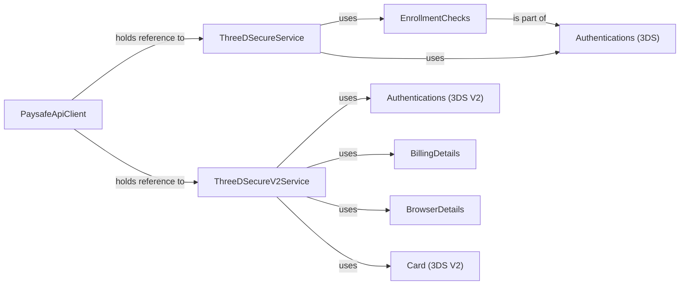

## Component Details

The 3D Secure Authentication subsystem provides the functionality to perform 3D Secure (both v1 and v2) authentication for online card payments. It includes components for initiating enrollment checks, submitting authentication requests, and handling the responses from the Paysafe API. The subsystem supports secure transactions by verifying the cardholder's identity during the payment process, reducing the risk of fraudulent activities. The main flow involves first checking if a card is enrolled in the 3D Secure program, and if so, proceeding with the authentication process. The results of these processes are then used to authorize or reject the payment.

### PaysafeApiClient
The PaysafeApiClient serves as the main entry point for interacting with the Paysafe API. It initializes and holds references to the service handlers for both 3D Secure and 3D Secure V2, providing a unified interface for accessing 3D Secure functionalities. It is responsible for setting up the necessary configurations and dependencies for the 3D Secure services.
- **Related Classes/Methods**: `paysafe_sdk_python.src.PythonPaysafeSDK.PaysafeApiClient.PaysafeApiClient`

### ThreeDSecureService
This service handles the core logic for 3D Secure version 1 transactions. It provides methods for submitting purchase enrollments and authentications, looking up enrollment and authentication details, and processing responses from the Paysafe API. It interacts with the Paysafe API to perform 3D Secure operations.
- **Related Classes/Methods**: `paysafe_sdk_python.src.PythonPaysafeSDK.ThreeDSecure.ThreeDSecureService.ThreeDSecureService`

### ThreeDSecureV2Service
This service handles the core logic for 3D Secure version 2 transactions. It includes methods for submitting authentications, looking up authentication details, and processing responses from the Paysafe API. It likely handles the newer features and data structures introduced in 3DS V2. It interacts with the Paysafe API to perform 3D Secure V2 operations.
- **Related Classes/Methods**: `paysafe_sdk_python.src.PythonPaysafeSDK.ThreeDSecureV2.ThreeDSecureV2Service.ThreeDSecureV2Service`

### EnrollmentChecks
This class represents the result of an enrollment check, containing information about the card's enrollment status in the 3D Secure program. It includes attributes for the card, links, and any errors encountered. It is used by the ThreeDSecureService to represent the enrollment check result.
- **Related Classes/Methods**: `paysafe_sdk_python.src.PythonPaysafeSDK.ThreeDSecure.EnrollmentChecks.EnrollmentChecks`

### Authentications (3DS)
This class represents the result of an authentication request in the original 3DS version. It contains information about the authentication, including enrollment checks, links, and any errors encountered. It is used by the ThreeDSecureService to represent the authentication result.
- **Related Classes/Methods**: `paysafe_sdk_python.src.PythonPaysafeSDK.ThreeDSecure.Authentications.Authentications`

### Authentications (3DS V2)
This class represents the result of an authentication request in the 3DS V2 version. It contains various details related to the authentication, including card details, electronic delivery information, order item details, and more. It reflects the richer data model of 3DS V2. It is used by the ThreeDSecureV2Service to represent the authentication result.
- **Related Classes/Methods**: `paysafe_sdk_python.src.PythonPaysafeSDK.ThreeDSecureV2.Authentications.Authentications`

### BillingDetails
This class encapsulates billing-related information for 3DS V2 authentications. It is used by the ThreeDSecureV2Service to provide billing details for the authentication request.
- **Related Classes/Methods**: `paysafe_sdk_python.src.PythonPaysafeSDK.ThreeDSecureV2.BillingDetails.BillingDetails`

### BrowserDetails
This class encapsulates browser-related information for 3DS V2 authentications. It is used by the ThreeDSecureV2Service to provide browser details for the authentication request.
- **Related Classes/Methods**: `paysafe_sdk_python.src.PythonPaysafeSDK.ThreeDSecureV2.BrowserDetails.BrowserDetails`

### Card (3DS V2)
This class encapsulates card-related information for 3DS V2 authentications. It is used by the ThreeDSecureV2Service to provide card details for the authentication request.
- **Related Classes/Methods**: `paysafe_sdk_python.src.PythonPaysafeSDK.ThreeDSecureV2.Card.Card`
