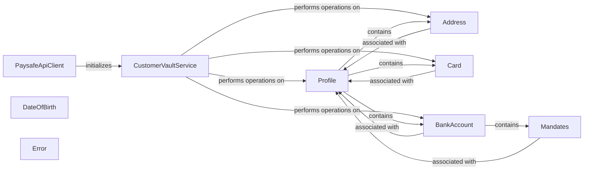

## Component Details

The Customer Vault Management component provides a secure and convenient way to store customer payment information for future transactions. It encompasses the creation, retrieval, updating, and deletion of customer profiles, along with their associated payment methods like cards, addresses, and bank accounts. The PaysafeApiClient initiates the CustomerVaultService, which then orchestrates operations on profiles and their related entities. The component ensures data integrity and security while simplifying payment processing.

### PaysafeApiClient
The PaysafeApiClient is responsible for handling the communication with the Paysafe API. It initializes the CustomerVaultService handler, which is used to interact with the Customer Vault API endpoints.
- **Related Classes/Methods**: `paysafe_sdk_python.src.PythonPaysafeSDK.PaysafeApiClient.PaysafeApiClient`

### CustomerVaultService
The CustomerVaultService provides methods for performing various operations on customer profiles, addresses, cards, and bank accounts. It interacts with the Paysafe API to create, retrieve, update, and delete customer data. It also handles error processing and response monitoring.
- **Related Classes/Methods**: `paysafe_sdk_python.src.PythonPaysafeSDK.CustomerVault.CustomerVaultService.CustomerVaultService`

### Profile
The Profile class represents a customer profile and holds information such as date of birth, addresses, cards, and bank accounts. It also contains error and link information related to the profile.
- **Related Classes/Methods**: `paysafe_sdk_python.src.PythonPaysafeSDK.CustomerVault.Profile.Profile`

### Address
The Address class represents a customer's address and is associated with a specific profile. It also contains error information related to the address.
- **Related Classes/Methods**: `paysafe_sdk_python.src.PythonPaysafeSDK.CustomerVault.Addresses.Address`

### Card
The Card class represents a customer's card and includes information such as card expiry and billing address. It is associated with a specific profile and contains error and link information related to the card.
- **Related Classes/Methods**: `paysafe_sdk_python.src.PythonPaysafeSDK.CustomerVault.Card.Card`

### BankAccount
This abstract component represents a customer's bank account and is associated with a specific profile. It is the parent class for different types of bank accounts like ACH, BACS, EFT, and SEPA. It also contains error information related to the bank account.
- **Related Classes/Methods**: `paysafe_sdk_python.src.PythonPaysafeSDK.CustomerVault.ACHBankAccount.ACHBankAccount`, `paysafe_sdk_python.src.PythonPaysafeSDK.CustomerVault.BACSBankAccount.BACSBankAccount`, `paysafe_sdk_python.src.PythonPaysafeSDK.CustomerVault.EFTBankAccount.EFTBankAccount`, `paysafe_sdk_python.src.PythonPaysafeSDK.CustomerVault.SEPABankAccount.SEPABankAccount`

### Mandates
The Mandates class represents mandates associated with a SEPA bank account and is associated with a specific profile. It also contains BACS and SEPA mandate details, as well as error information.
- **Related Classes/Methods**: `paysafe_sdk_python.src.PythonPaysafeSDK.CustomerVault.Mandates.Mandates`

### DateOfBirth
The DateOfBirth class represents a customer's date of birth.
- **Related Classes/Methods**: `paysafe_sdk_python.src.PythonPaysafeSDK.CustomerVault.DateOfBirth.DateOfBirth`

### Error
The Error class represents an error that occurred during an operation. It contains error details, links, and field errors.
- **Related Classes/Methods**: `paysafe_sdk_python.src.PythonPaysafeSDK.common.Error.Error`
