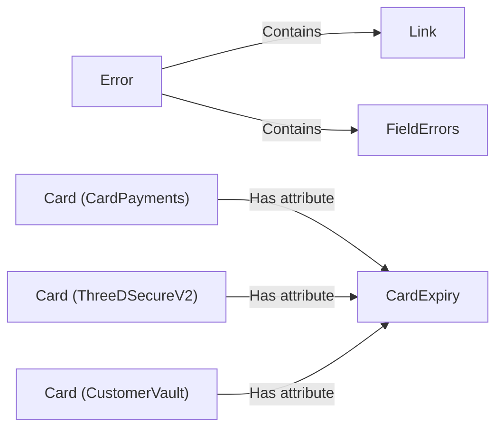

## Component Details

The Data Models component provides a set of common data structures used throughout the Paysafe SDK. These models ensure consistency in representing data exchanged with the Paysafe API. The core data models include Error, Link, FieldErrors, and CardExpiry, which are used to represent errors, hyperlinks, field-specific errors, and card expiration dates, respectively. These models are utilized by other components such as Card in CardPayments, ThreeDSecureV2, and CustomerVault modules to represent card-related information and handle errors.

### Error
Represents an error object, containing information about the error, including links and field-specific errors. It is initialized with error details and can contain `Link` and `FieldErrors` objects.
- **Related Classes/Methods**: `paysafe_sdk_python.src.PythonPaysafeSDK.common.Error.Error`

### Link
Represents a hyperlink, likely used for API navigation or error reporting. It is initialized with relevant link information.
- **Related Classes/Methods**: `paysafe_sdk_python.src.PythonPaysafeSDK.common.Link.Link`

### FieldErrors
Represents a collection of errors associated with specific fields. It is initialized as a container for field-specific error information.
- **Related Classes/Methods**: `paysafe_sdk_python.src.PythonPaysafeSDK.common.FieldErrors.FieldErrors`

### CardExpiry
Represents the expiration date of a card, containing month and year. It is initialized with the card's expiration month and year.
- **Related Classes/Methods**: `paysafe_sdk_python.src.PythonPaysafeSDK.common.CardExpiry.CardExpiry`

### Card (CardPayments)
Represents a card in the CardPayments module. It has a `cardExpiry` attribute, which is an instance of the `CardExpiry` class.
- **Related Classes/Methods**: `paysafe_sdk_python.src.PythonPaysafeSDK.CardPayments.Card.Card`

### Card (ThreeDSecureV2)
Represents a card in the ThreeDSecureV2 module. It has a `cardExpiry` attribute, which is an instance of the `CardExpiry` class.
- **Related Classes/Methods**: `paysafe_sdk_python.src.PythonPaysafeSDK.ThreeDSecureV2.Card.Card`

### Card (CustomerVault)
Represents a card in the CustomerVault module. It has a `cardExpiry` attribute, which is an instance of the `CardExpiry` class.
- **Related Classes/Methods**: `paysafe_sdk_python.src.PythonPaysafeSDK.CustomerVault.Card.Card`
