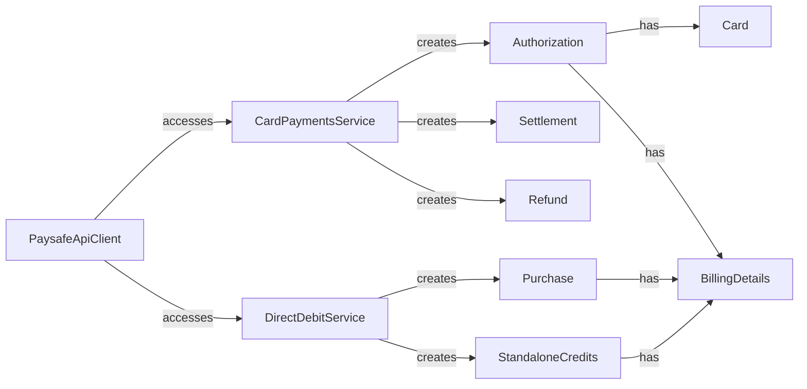

## Component Details

The Payment Processing component provides a comprehensive suite of functionalities for handling both card payments and direct debit transactions. It serves as the primary interface for processing financial transactions through the Paysafe API. The component encapsulates services for managing the entire payment lifecycle, including authorizations, settlements, refunds, and verifications for card payments, as well as purchases and standalone credits for direct debit transactions. It leverages dedicated service classes and data structures to interact with the Paysafe API and manage transaction details.

### PaysafeApiClient
The PaysafeApiClient serves as the main entry point for interacting with the Paysafe API. It initializes and holds instances of the CardPaymentsService and DirectDebitService, providing access to their respective functionalities. It acts as a central hub for payment processing operations.
- **Related Classes/Methods**: `paysafe_sdk_python.src.PythonPaysafeSDK.PaysafeApiClient.PaysafeApiClient`

### CardPaymentsService
The CardPaymentsService provides methods for managing card payments, including creating authorizations, settlements, refunds, and verifications. It encapsulates the logic for interacting with the Paysafe API for card-related transactions, handling request construction, response parsing, and error handling.
- **Related Classes/Methods**: `paysafe_sdk_python.src.PythonPaysafeSDK.CardPayments.CardPaymentsService.CardPaymentsService`

### DirectDebitService
The DirectDebitService offers methods for processing direct debit transactions, such as submitting purchases and standalone credits, as well as cancelling and looking them up. It manages the interaction with the Paysafe API for direct debit operations, handling request construction, response parsing, and error handling.
- **Related Classes/Methods**: `paysafe_sdk_python.src.PythonPaysafeSDK.DirectDebit.DirectDebitService.DirectDebitService`

### Authorization
The Authorization class represents a card authorization object, containing details such as card information, billing details, and merchant descriptor. It serves as a data structure for creating and managing authorization requests and responses.
- **Related Classes/Methods**: `paysafe_sdk_python.src.PythonPaysafeSDK.CardPayments.Authorization.Authorization`

### Settlement
The Settlement class represents a settlement object, containing information about the settlement of an authorization. It includes details like acquirer response and links. It serves as a data structure for creating and managing settlement requests and responses.
- **Related Classes/Methods**: `paysafe_sdk_python.src.PythonPaysafeSDK.CardPayments.Settlement.Settlement`

### Refund
The Refund class represents a refund object, containing details about a refund transaction, such as acquirer response and links. It serves as a data structure for creating and managing refund requests and responses.
- **Related Classes/Methods**: `paysafe_sdk_python.src.PythonPaysafeSDK.CardPayments.Refund.Refund`

### Purchase
The Purchase class represents a direct debit purchase object, containing details such as ACH, EFT, or BACS information, as well as billing details. It serves as a data structure for creating and managing direct debit purchase requests and responses.
- **Related Classes/Methods**: `paysafe_sdk_python.src.PythonPaysafeSDK.DirectDebit.Purchase.Purchase`

### StandaloneCredits
The StandaloneCredits class represents a direct debit standalone credit object, containing details such as ACH, EFT, or BACS information, as well as billing details. It serves as a data structure for creating and managing standalone credit requests and responses.
- **Related Classes/Methods**: `paysafe_sdk_python.src.PythonPaysafeSDK.DirectDebit.StandaloneCredits.StandaloneCredits`

### Card
The Card class represents card details used in card payments. It encapsulates information such as card number, expiry date, and CVV.
- **Related Classes/Methods**: `paysafe_sdk_python.src.PythonPaysafeSDK.CardPayments.Card.Card`

### BillingDetails
The BillingDetails class represents billing information used in card payments and direct debit transactions. It encapsulates details such as first name, last name, address, and country.
- **Related Classes/Methods**: `paysafe_sdk_python.src.PythonPaysafeSDK.CardPayments.BillingDetails.BillingDetails`
