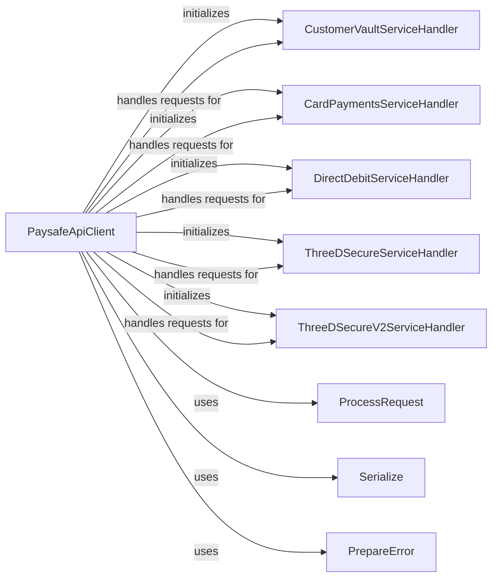

## Component Details

The Paysafe API Client serves as the central hub for interacting with Paysafe's various payment processing services. It encapsulates the complexities of authentication, environment configuration, and request handling, providing a simplified interface for developers. The client initializes and manages service-specific handlers, such as those for Customer Vault, Card Payments, and Direct Debit, allowing for easy access to their respective functionalities. It streamlines the process of sending requests to the Paysafe API, serializing data, and handling responses, including error processing. By abstracting away the underlying details of API communication, the Paysafe API Client enables developers to focus on implementing payment processing logic within their applications.

### PaysafeApiClient
The main class responsible for handling communication with the Paysafe API. It initializes and manages service-specific handlers and provides methods for request processing, serialization, and error handling.
- **Related Classes/Methods**: `paysafe_sdk_python.src.PythonPaysafeSDK.PaysafeApiClient.PaysafeApiClient`

### CustomerVaultServiceHandler
Handles interactions with the Customer Vault service for managing customer payment information, such as creating, retrieving, updating, and deleting customer profiles and payment methods.
- **Related Classes/Methods**: `paysafe_sdk_python.src.PythonPaysafeSDK.PaysafeApiClient.PaysafeApiClient:customer_vault_service_handler`

### CardPaymentsServiceHandler
Handles interactions with the Card Payments service for processing credit card transactions, including authorizations, settlements, and refunds.
- **Related Classes/Methods**: `paysafe_sdk_python.src.PythonPaysafeSDK.PaysafeApiClient.PaysafeApiClient:card_payments_service_handler`

### DirectDebitServiceHandler
Handles interactions with the Direct Debit service for processing direct debit payments, enabling merchants to collect payments directly from customers' bank accounts.
- **Related Classes/Methods**: `paysafe_sdk_python.src.PythonPaysafeSDK.PaysafeApiClient.PaysafeApiClient:direct_debit_service_handler`

### ThreeDSecureServiceHandler
Handles interactions with the 3D Secure service for authenticating cardholders during online transactions, reducing the risk of fraud.
- **Related Classes/Methods**: `paysafe_sdk_python.src.PythonPaysafeSDK.PaysafeApiClient.PaysafeApiClient:three_d_secure_service_handler`

### ThreeDSecureV2ServiceHandler
Handles interactions with the 3D Secure V2 service, providing an updated protocol for authenticating cardholders and reducing fraud in online transactions.
- **Related Classes/Methods**: `paysafe_sdk_python.src.PythonPaysafeSDK.PaysafeApiClient.PaysafeApiClient:three_d_secure_v2_service_handler`

### ProcessRequest
Sends requests to the Paysafe API and processes the responses, handling communication and data transfer.
- **Related Classes/Methods**: `paysafe_sdk_python.src.PythonPaysafeSDK.PaysafeApiClient.PaysafeApiClient:process_request`

### Serialize
Serializes data into a format suitable for sending to the Paysafe API, ensuring data is properly formatted for transmission.
- **Related Classes/Methods**: `paysafe_sdk_python.src.PythonPaysafeSDK.PaysafeApiClient.PaysafeApiClient:serialize`

### PrepareError
Prepares error information from the Paysafe API response, extracting relevant details for error handling and reporting.
- **Related Classes/Methods**: `paysafe_sdk_python.src.PythonPaysafeSDK.PaysafeApiClient.PaysafeApiClient:prepare_error`
