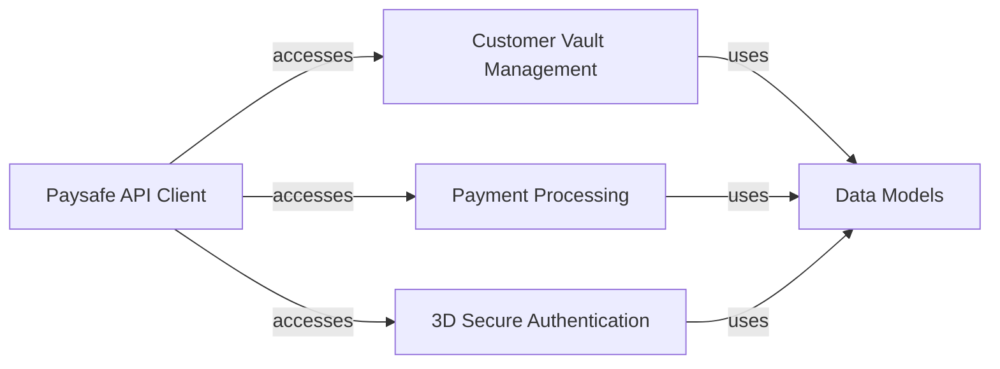

## Component Details

The Paysafe SDK for Python provides a convenient way to interact with Paysafe's various payment processing services. The SDK is structured around a central API client that manages authentication and provides access to service-specific handlers. These handlers encapsulate the logic for interacting with different Paysafe APIs, such as customer vault management, card payments, direct debit, and 3D Secure authentication. Data models are used to represent the entities exchanged with the Paysafe API, ensuring a consistent and structured approach to data handling.

### Paysafe API Client
The central client for interacting with the Paysafe API. It handles authentication, environment configuration, and provides access to various service handlers. It acts as the entry point for all API requests and manages the overall communication with Paysafe's servers.
- **Related Classes/Methods**: `paysafe_sdk_python.src.PythonPaysafeSDK.PaysafeApiClient.PaysafeApiClient`

### Customer Vault Management
Handles operations related to customer vault management, including creating, retrieving, updating, and deleting customer profiles, cards, addresses, and bank accounts. It provides a secure and convenient way to store customer payment information for future transactions.
- **Related Classes/Methods**: `paysafe_sdk_python.src.PythonPaysafeSDK.CustomerVault.CustomerVaultService.CustomerVaultService`, `paysafe_sdk_python.src.PythonPaysafeSDK.CustomerVault.Profile.Profile`, `paysafe_sdk_python.src.PythonPaysafeSDK.CustomerVault.Addresses.Address`, `paysafe_sdk_python.src.PythonPaysafeSDK.CustomerVault.Card.Card`, `paysafe_sdk_python.src.PythonPaysafeSDK.CustomerVault.ACHBankAccount.ACHBankAccount`, `paysafe_sdk_python.src.PythonPaysafeSDK.CustomerVault.BACSBankAccount.BACSBankAccount`, `paysafe_sdk_python.src.PythonPaysafeSDK.CustomerVault.EFTBankAccount.EFTBankAccount`, `paysafe_sdk_python.src.PythonPaysafeSDK.CustomerVault.SEPABankAccount.SEPABankAccount`

### Payment Processing
Provides functionalities for processing card payments, including authorizations, settlements, refunds, and verifications. It also handles direct debit payments, including submitting and canceling purchases and standalone credits. This component is responsible for executing financial transactions and managing the payment lifecycle.
- **Related Classes/Methods**: `paysafe_sdk_python.src.PythonPaysafeSDK.CardPayments.CardPaymentsService.CardPaymentsService`, `paysafe_sdk_python.src.PythonPaysafeSDK.CardPayments.Authorization.Authorization`, `paysafe_sdk_python.src.PythonPaysafeSDK.CardPayments.Refund.Refund`, `paysafe_sdk_python.src.PythonPaysafeSDK.CardPayments.Settlement.Settlement`, `paysafe_sdk_python.src.PythonPaysafeSDK.CardPayments.Card.Card`, `paysafe_sdk_python.src.PythonPaysafeSDK.CardPayments.BillingDetails.BillingDetails`, `paysafe_sdk_python.src.PythonPaysafeSDK.DirectDebit.DirectDebitService.DirectDebitService`, `paysafe_sdk_python.src.PythonPaysafeSDK.DirectDebit.Purchase.Purchase`, `paysafe_sdk_python.src.PythonPaysafeSDK.DirectDebit.StandaloneCredits.StandaloneCredits`

### 3D Secure Authentication
Handles 3D Secure authentication for card payments, including enrollment checks and authentication submissions for both versions 1 and 2. It ensures secure transactions by verifying the cardholder's identity during the payment process.
- **Related Classes/Methods**: `paysafe_sdk_python.src.PythonPaysafeSDK.ThreeDSecure.ThreeDSecureService.ThreeDSecureService`, `paysafe_sdk_python.src.PythonPaysafeSDK.ThreeDSecure.Authentications.Authentications`, `paysafe_sdk_python.src.PythonPaysafeSDK.ThreeDSecure.EnrollmentChecks.EnrollmentChecks`, `paysafe_sdk_python.src.PythonPaysafeSDK.ThreeDSecureV2.ThreeDSecureV2Service.ThreeDSecureV2Service`, `paysafe_sdk_python.src.PythonPaysafeSDK.ThreeDSecureV2.Authentications.Authentications`, `paysafe_sdk_python.src.PythonPaysafeSDK.ThreeDSecureV2.BillingDetails.BillingDetails`, `paysafe_sdk_python.src.PythonPaysafeSDK.ThreeDSecureV2.BrowserDetails.BrowserDetails`, `paysafe_sdk_python.src.PythonPaysafeSDK.ThreeDSecureV2.Card.Card`

### Data Models
Common data models used across the SDK, such as Error, Link and CardExpiry. These models provide a consistent structure for representing data exchanged with the Paysafe API.
- **Related Classes/Methods**: `paysafe_sdk_python.src.PythonPaysafeSDK.common.Error.Error`, `paysafe_sdk_python.src.PythonPaysafeSDK.common.Link.Link`, `paysafe_sdk_python.src.PythonPaysafeSDK.common.CardExpiry.CardExpiry`