```mermaid
graph LR
    Client_API["Client API"]
    PDC_Core_Services["PDC Core Services"]
    Data_Management_Services["Data Management Services"]
    Metadata_Management_Services["Metadata Management Services"]
    Distributed_Communication_Layer["Distributed Communication Layer"]
    Storage_Interface["Storage Interface"]
    Common_Utilities["Common Utilities"]
    Tools["Tools"]
    Client_API -- "sends requests to" --> PDC_Core_Services
    PDC_Core_Services -- "sends results and status to" --> Client_API
    PDC_Core_Services -- "dispatches data operations to" --> Data_Management_Services
    PDC_Core_Services -- "dispatches metadata operations to" --> Metadata_Management_Services
    PDC_Core_Services -- "utilizes" --> Distributed_Communication_Layer
    Data_Management_Services -- "interacts with" --> Storage_Interface
    Data_Management_Services -- "updates" --> Metadata_Management_Services
    Metadata_Management_Services -- "provides queries to" --> Data_Management_Services
    Distributed_Communication_Layer -- "provides primitives for" --> PDC_Core_Services
    Distributed_Communication_Layer -- "enables inter-node communication for" --> Data_Management_Services
    Storage_Interface -- "provides access to" --> Data_Management_Services
    Client_API -- "uses" --> Common_Utilities
    PDC_Core_Services -- "uses" --> Common_Utilities
    Data_Management_Services -- "uses" --> Common_Utilities
    Metadata_Management_Services -- "uses" --> Common_Utilities
    Tools -- "interacts with" --> Client_API
    click Client_API href "https://github.com/CodeBoarding/GeneratedOnBoardings/blob/main/pdc/Client_API.md" "Details"
```

## Details

This section synthesizes the core components of the PDC (Parallel Data Container) system, an HPC Data Management System and Distributed Middleware, based on the provided project context and analysis. The architecture emphasizes clear API contracts, scalable core services, and robust data/metadata management.

### Client API [[Expand]](./Client_API.md)
Provides the public, high-performance interface for external applications and higher-level services (e.g., Python bindings, C/C++ libraries) to interact with the PDC system. It handles user requests for data and metadata operations, translating these into internal system calls. As the primary entry point, it defines the stable contract for interacting with the distributed PDC data management system, abstracting the underlying complexity of data storage and metadata management in an HPC environment.

**Related Classes/Methods**:

- `pdc_client_api` (1:1)
- `pdc_client_api` (1:1)
- `Python binding modules` (1:1)

### PDC Core Services
The central processing unit of the PDC system, responsible for orchestrating data and metadata operations, managing distributed resources, and ensuring system consistency. It receives requests from the Client API, dispatches them to appropriate internal services (Data Management, Metadata Management), and coordinates their execution across the distributed environment.

**Related Classes/Methods**:

- `pdc_core_manager` (1:1)
- `pdc_core_manager` (1:1)
- `service_orchestrators` (1:1)

### Data Management Services
Manages the lifecycle of scientific data objects within the PDC system, including data placement, retrieval, replication, and migration across various storage tiers. It interacts with the Storage Interface to perform actual I/O operations and ensures data integrity and availability.

**Related Classes/Methods**:

- `data_manager` (1:1)
- `data_manager` (1:1)
- `data_placement_algorithms` (1:1)

### Metadata Management Services
Responsible for storing, indexing, querying, and managing all metadata associated with data objects and the system's internal state. It provides efficient access to metadata, enabling data discovery, policy enforcement, and system introspection.

**Related Classes/Methods**:

- `metadata_manager` (1:1)
- `metadata_manager` (1:1)
- `metadata_index` (1:1)

### Distributed Communication Layer
Handles all inter-component and inter-node communication within the distributed PDC system. It provides reliable, high-performance messaging primitives for components to exchange control messages, data, and metadata across the network, crucial for distributed middleware.

**Related Classes/Methods**:

- `comm_layer` (1:1)
- `comm_layer_mpi` (1:1)
- `comm_layer_sockets` (1:1)

### Storage Interface
Provides an abstract interface for interacting with various underlying storage technologies (e.g., parallel file systems, object storage, burst buffers). It encapsulates storage-specific details, allowing Data Management Services to operate uniformly regardless of the physical storage backend.

**Related Classes/Methods**:

- `storage_interface` (1:1)
- `posix_storage_driver` (1:1)
- `hdf5_storage_driver` (1:1)

### Common Utilities
A collection of reusable, generic functionalities and helper modules used across various components of the PDC system. This includes logging, error handling, memory management, data structures, and configuration parsing, ensuring consistency and efficiency.

**Related Classes/Methods**:

- `utils` (1:1)
- `logger` (1:1)
- `memory_pool` (1:1)

### Tools
External applications and scripts that interact with the PDC system, primarily through the Client API, for administrative tasks, monitoring, debugging, and specialized data operations. These tools enhance system usability and manageability.

**Related Classes/Methods**:

- `pdc_admin_tool` (1:1)
- `pdc_monitor` (1:1)

### [FAQ](https://github.com/CodeBoarding/GeneratedOnBoardings/tree/main?tab=readme-ov-file#faq)