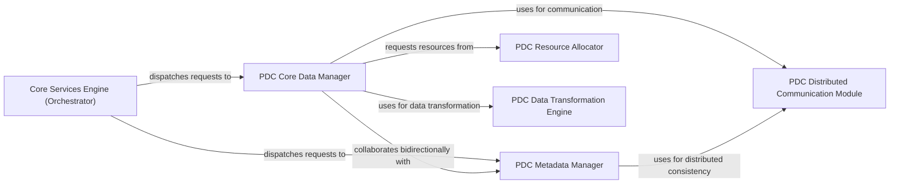

## Details

One paragraph explaining the functionality which is represented by this graph. What the main flow is and what is its purpose.

### Core Services Engine (Orchestrator)
The central orchestrator within the subsystem, responsible for receiving requests from the PDC Public API and intelligently dispatching them to the appropriate internal managers and modules. It ensures overall system consistency and coordinates complex workflows involving data and metadata operations.

**Related Classes/Methods**: _None_

### PDC Core Data Manager
Manages the complete lifecycle of data objects within the PDC system, including creation, reading, updating, and deletion. It is the primary component for all data-centric operations, interacting with other modules for communication, resource allocation, and data transformation.

**Related Classes/Methods**: _None_

### PDC Metadata Manager
Handles the storage, indexing, and retrieval of all metadata associated with data objects. It supports complex queries for data discovery and ensures metadata consistency, especially in a distributed environment.

**Related Classes/Methods**: _None_

### PDC Distributed Communication Module
Facilitates reliable and high-performance communication and data transfer between different PDC instances or nodes in a distributed HPC environment. It provides the underlying communication fabric for distributed operations.

**Related Classes/Methods**: _None_

### PDC Resource Allocator
Manages and optimizes the allocation of system resources (e.g., memory, I/O, CPU) to ensure efficient and contention-free data operations. It is critical for maintaining high performance and resource efficiency in an HPC context.

**Related Classes/Methods**: _None_

### PDC Data Transformation Engine
Performs on-the-fly data transformations such as compression, encryption, and format conversions during data ingress or egress. This optimizes storage utilization, ensures data security, and maintains compatibility across diverse data formats.

**Related Classes/Methods**: _None_

### [FAQ](https://github.com/CodeBoarding/GeneratedOnBoardings/tree/main?tab=readme-ov-file#faq)