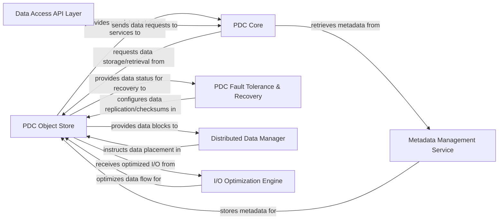

## Details

One paragraph explaining the functionality which is represented by this graph. What the main flow is and what is its purpose.

### PDC Object Store
The foundational layer for persistent data storage. It directly manages physical storage, retrieval, manipulation, data partitioning, distribution, and efficient I/O operations, abstracting underlying storage systems (e.g., parallel file systems, object storage solutions).

**Related Classes/Methods**: _None_

### PDC Core
The central orchestration component responsible for coordinating data management operations. It acts as the primary interface for higher-level services, initiating requests for data storage and retrieval from the PDC Object Store.

**Related Classes/Methods**: _None_

### PDC Fault Tolerance & Recovery
Manages data integrity and availability within the distributed system. It configures data replication, checksums, and provides mechanisms for data recovery, interacting closely with the PDC Object Store to ensure data resilience.

**Related Classes/Methods**: _None_

### Metadata Management Service
Responsible for storing, retrieving, and managing metadata associated with scientific data objects. This includes schema definitions, data provenance, access control lists, and indexing information, enabling efficient data discovery and organization.

**Related Classes/Methods**: _None_

### Data Access API Layer
Provides a high-level, abstract interface for external applications and users to interact with the HPC data management system. It translates user requests into operations on the underlying data storage and metadata services.

**Related Classes/Methods**: _None_

### Distributed Data Manager
Handles the logical partitioning and physical distribution of data across multiple storage nodes. It ensures data locality, load balancing, and efficient access patterns in a distributed environment, directly supporting the `Data Storage & Access Layer`'s distributed nature.

**Related Classes/Methods**: _None_

### I/O Optimization Engine
Focuses on enhancing the performance of data input/output operations. This includes techniques like caching, prefetching, asynchronous I/O, and data compression/decompression to maximize throughput and minimize latency for the `PDC Object Store`.

**Related Classes/Methods**: _None_

### [FAQ](https://github.com/CodeBoarding/GeneratedOnBoardings/tree/main?tab=readme-ov-file#faq)