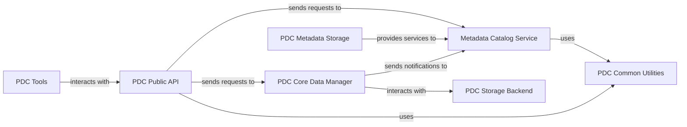

## Details

The Metadata Catalog Service is a pivotal component within the PDC system, serving as the central hub for all metadata operations. It is designed to provide robust capabilities for data discovery, provenance tracking, and efficient data access by managing the lifecycle of metadata associated with scientific data objects. This service is integral to the system's ability to organize, search, and understand the vast amounts of data generated and managed in an HPC environment.

### Metadata Catalog Service [[Expand]](./Metadata_Catalog_Service.md)
A dedicated service for storing, indexing, and querying all metadata associated with the scientific data objects managed by PDC. This component is critical for data discovery, provenance tracking, and enabling efficient data access. It acts as the authoritative source for metadata within the system.

**Related Classes/Methods**:

- `pdc_metadata_core.cpp`
- `pdc_metadata_api.h`
- `pdc_metadata_logic.py`

### PDC Public API
The primary external interface for users and other system components to interact with the PDC system. It exposes functionalities for both data and metadata operations, ensuring secure and controlled access.

**Related Classes/Methods**:

- `pdc_api_gateway.cpp`
- `pdc_api_bindings.py`

### PDC Core Data Manager
Responsible for the lifecycle management of the actual scientific data objects, including their storage, retrieval, and integrity. It orchestrates data movement and ensures consistency between data and its associated metadata.

**Related Classes/Methods**:

- `pdc_data_manager.cpp`
- `pdc_data_orchestrator.py`

### PDC Storage Backend
The underlying persistent storage system for scientific data. This component provides high-performance, scalable, and fault-tolerant storage capabilities essential for HPC environments.

**Related Classes/Methods**:

- `pdc_storage_interface.h`
- `pdc_storage_driver.cpp`

### PDC Metadata Storage
A dedicated persistence layer specifically optimized for storing, indexing, and querying metadata. This component ensures the high availability and performance of metadata operations for the Metadata Catalog Service.

**Related Classes/Methods**:

- `pdc_metadata_db.cpp`
- `pdc_metadata_index.h`

### PDC Common Utilities
A collection of shared libraries and helper functions that provide common services such as logging, configuration management, error handling, and data serialization/deserialization across all PDC components.

**Related Classes/Methods**:

- `pdc_utils.h`
- `pdc_common_lib.cpp`
- `pdc_config.py`

### PDC Tools
A suite of command-line utilities and scripts designed for system administration, data ingestion, monitoring, and diagnostic purposes. These tools facilitate the management and operation of the PDC system.

**Related Classes/Methods**:

- `pdc_admin_cli.py`
- `pdc_ingest_tool.py`

### [FAQ](https://github.com/CodeBoarding/GeneratedOnBoardings/tree/main?tab=readme-ov-file#faq)