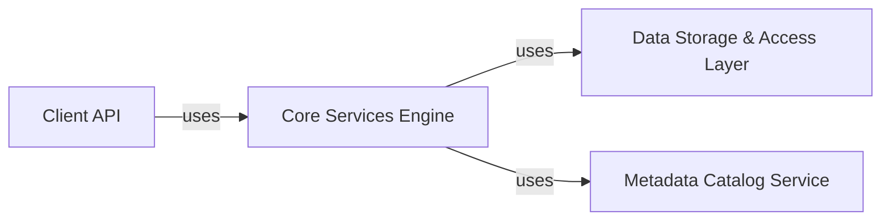

## Details

One paragraph explaining the functionality which is represented by this graph. What the main flow is and what is its purpose.

### Client API [[Expand]](./Client_API.md)
Provides the public interface for applications to interact with the PDC system, handling user requests for data and metadata operations. It translates these requests into internal system calls, serving as the primary entry point for client applications.

**Related Classes/Methods**: _None_

### Core Services Engine [[Expand]](./Core_Services_Engine.md)
The central processing unit and orchestrator of the PDC system. It manages distributed interactions, dispatches requests from the Client API, coordinates data and metadata operations, and ensures overall system consistency and performance.

**Related Classes/Methods**: _None_

### Data Storage & Access Layer [[Expand]](./Data_Storage_Access_Layer.md)
Manages the physical storage, retrieval, and manipulation of scientific data. This component handles data partitioning, distribution across nodes, and efficient I/O operations, abstracting the complexities of underlying storage mechanisms.

**Related Classes/Methods**: _None_

### Metadata Catalog Service [[Expand]](./Metadata_Catalog_Service.md)
A dedicated service for storing, indexing, and querying all metadata associated with the scientific data objects managed by PDC. This component is critical for data discovery, provenance tracking, and enabling efficient data access.

**Related Classes/Methods**: _None_

### [FAQ](https://github.com/CodeBoarding/GeneratedOnBoardings/tree/main?tab=readme-ov-file#faq)