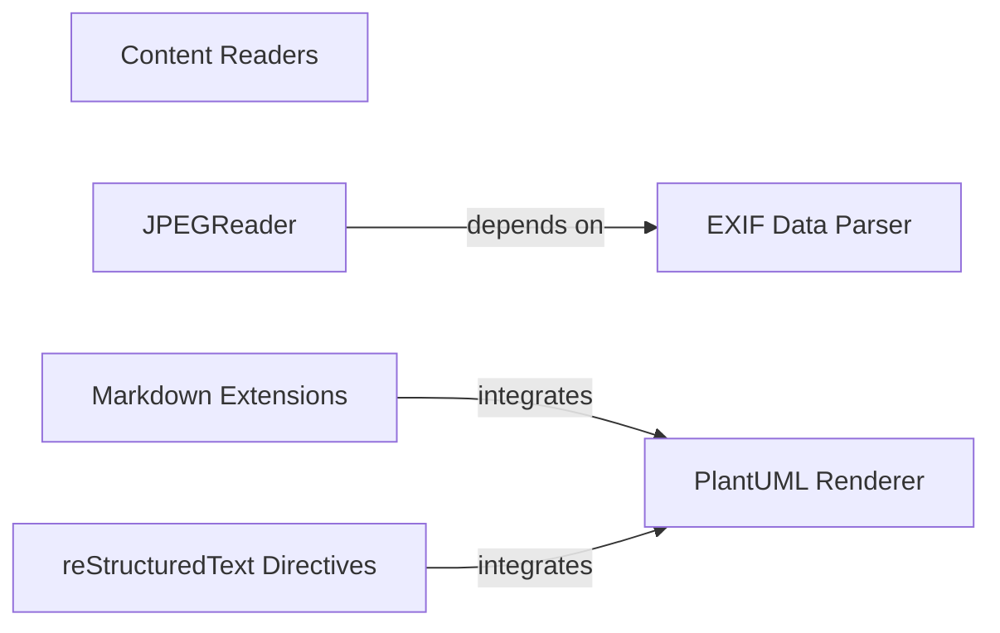

## Details

The pelican-plugins subsystem extends Pelican's core functionality by providing a diverse set of content processing and enhancement capabilities. At its core, a suite of Content Readers (e.g., AsciidocReader, CreoleReader, RMDReader) acts as the primary entry point for various document formats, transforming raw content into a structured representation. The JPEGReader is a specialized content reader that relies on the EXIF Data Parser to extract rich metadata from image files. Complementing the basic content parsing, Markdown Extensions and reStructuredText Directives offer advanced formatting and embedding options, allowing authors to include dynamic elements and external content. Notably, both Markdown and reStructuredText extensions can leverage the PlantUML Renderer to generate diagrams directly from textual descriptions, enriching the visual content of the generated static site. This modular design allows Pelican to support a wide array of input formats and advanced content features through a pluggable architecture.

### Content Readers
These components are specialized plugins designed to parse and convert various document formats (AsciiDoc, Creole Wiki Markup, Emacs Org-mode, Textile, R Markdown) into a structured format that Pelican can process. Each reader is responsible for handling the syntax and metadata extraction specific to its format.

**Related Classes/Methods**:

- <a href="https://github.com/getpelican/pelican-plugins/blob/master/asciidoc_reader/asciidoc_reader.py#L48-L114" target="_blank" rel="noopener noreferrer">`asciidoc_reader.asciidoc_reader.AsciiDocReader`:48-114</a>
- <a href="https://github.com/getpelican/pelican-plugins/blob/master/creole_reader/creole_reader.py#L32-L95" target="_blank" rel="noopener noreferrer">`creole_reader.creole_reader.CreoleReader`:32-95</a>
- <a href="https://github.com/getpelican/pelican-plugins/blob/master/org_python_reader/org_python_reader.py" target="_blank" rel="noopener noreferrer">`org_python_reader.org_python_reader.OrgPythonReader`</a>
- <a href="https://github.com/getpelican/pelican-plugins/blob/master/textile_reader/textile_reader.py#L14-L65" target="_blank" rel="noopener noreferrer">`textile_reader.textile_reader.TextileReader`:14-65</a>
- <a href="https://github.com/getpelican/pelican-plugins/blob/master/rmd_reader/rmd_reader.py#L61-L119" target="_blank" rel="noopener noreferrer">`rmd_reader.rmd_reader.RmdReader`:61-119</a>

### JPEGReader
A specialized content reader for JPEG files, responsible for handling the syntax and metadata extraction specific to its format.

**Related Classes/Methods**:

- <a href="https://github.com/getpelican/pelican-plugins/blob/master/jpeg_reader/jpeg_reader.py#L23-L120" target="_blank" rel="noopener noreferrer">`jpeg_reader.jpeg_reader.JpegReader`:23-120</a>

### Markdown Extensions
This component represents a suite of plugins that enhance Pelican's default Markdown processing. It includes functionalities for custom inline Markdown, dynamic content insertion via liquid tags, and rendering of mathematical expressions.

**Related Classes/Methods**:

- <a href="https://github.com/getpelican/pelican-plugins/blob/master/md_inline_extension/pelican_inline_markdown_extension.py#L44-L69" target="_blank" rel="noopener noreferrer">`md_inline_extension.pelican_inline_markdown_extension.PelicanInlineMarkdownExtension`:44-69</a>
- <a href="https://github.com/getpelican/pelican-plugins/blob/master/liquid_tags/mdx_liquid_tags.py" target="_blank" rel="noopener noreferrer">`liquid_tags.mdx_liquid_tags.LiquidTagsExtension`</a>
- <a href="https://github.com/getpelican/pelican-plugins/blob/master/render_math/pelican_mathjax_markdown_extension.py" target="_blank" rel="noopener noreferrer">`render_math.pelican_mathjax_markdown_extension.MathJaxExtension`</a>

### reStructuredText Directives
This component provides custom directives to extend reStructuredText parsing within Pelican, allowing for the embedding of external content and styling elements like Bootstrap, Gist snippets, and Twitter content.

**Related Classes/Methods**:

- <a href="https://github.com/getpelican/pelican-plugins/blob/master/bootstrap-rst/directives.py" target="_blank" rel="noopener noreferrer">`bootstrap-rst.directives.BootstrapDirective`</a>
- <a href="https://github.com/getpelican/pelican-plugins/blob/master/gist_directive/gist_directive.py" target="_blank" rel="noopener noreferrer">`gist_directive.gist_directive.Gist`</a>
- <a href="https://github.com/getpelican/pelican-plugins/blob/master/twitter_bootstrap_rst_directives/bootstrap_rst_directives.py" target="_blank" rel="noopener noreferrer">`twitter_bootstrap_rst_directives.bootstrap_rst_directives.TwitterBootstrapRstDirective`</a>

### PlantUML Renderer
A utility component specifically designed for rendering PlantUML diagrams embedded within content. It processes PlantUML syntax and generates visual diagrams.

**Related Classes/Methods**:

- <a href="https://github.com/getpelican/pelican-plugins/blob/master/plantuml/plantuml_md.py#L77-L92" target="_blank" rel="noopener noreferrer">`plantuml.plantuml_md.PlantUMLMarkdownExtension`:77-92</a>

### EXIF Data Parser
A utility for extracting EXIF metadata from image files, primarily used by the JPEGReader to enrich content with image-specific information.

**Related Classes/Methods**:

- <a href="https://github.com/getpelican/pelican-plugins/blob/master/jpeg_reader/exiv2_parser.py#L15-L53" target="_blank" rel="noopener noreferrer">`jpeg_reader.exiv2_parser.Exiv2Parser`:15-53</a>

### [FAQ](https://github.com/CodeBoarding/GeneratedOnBoardings/tree/main?tab=readme-ov-file#faq)