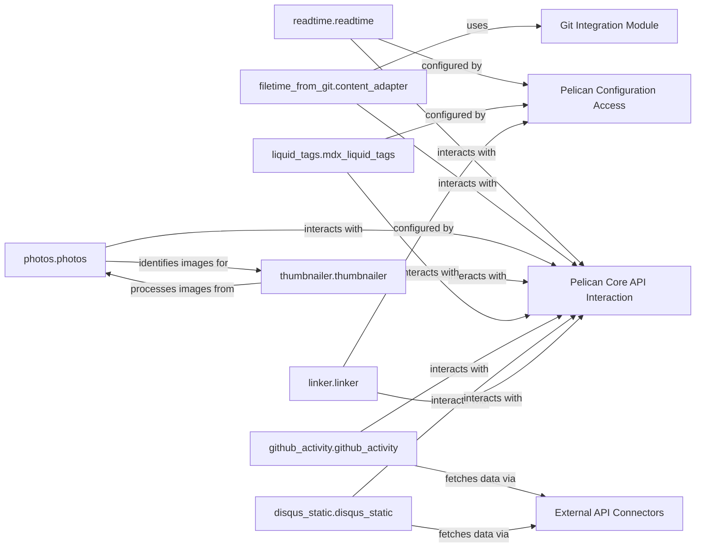

## Details

The `pelican-plugins` subsystem significantly extends the capabilities of the Pelican static site generator through a collection of independent, modular plugins. Each plugin, such as `readtime.readtime` for content metadata enrichment or `filetime_from_git.content_adapter` for integrating version control data, operates as a distinct functional unit. These plugins primarily interact with the **Pelican Core API Interaction** layer, which represents their collective engagement with Pelican's internal processing pipeline and event system. Configuration for these plugins is dynamically managed through the **Pelican Configuration Access** component, abstracting the `settings.py` file. Specialized plugins like `github_activity.github_activity` and `disqus_static.disqus_static` leverage **External API Connectors** to seamlessly integrate dynamic content from external web services. Concurrently, `filetime_from_git.content_adapter` utilizes a dedicated **Git Integration Module** for retrieving historical file information. The subsystem also features an internal media processing workflow where `photos.photos` identifies images for subsequent optimization by `thumbnailer.thumbnailer`. This architectural design promotes extensibility, clear separation of concerns, and efficient integration of diverse functionalities into the static site generation process.

### readtime.readtime
Calculates and injects an estimated reading time into the metadata of content objects (articles, pages). This enhances the user experience by providing a quick overview of content length.

**Related Classes/Methods**:

- <a href="https://github.com/getpelican/pelican-plugins/blob/master/readtime/readtime.py" target="_blank" rel="noopener noreferrer">`readtime.readtime`</a>

### filetime_from_git.content_adapter
Integrates version control metadata, specifically commit dates from Git, into content objects. This allows for displaying creation or last modification times based on source control history.

**Related Classes/Methods**:

- <a href="https://github.com/getpelican/pelican-plugins/blob/master/filetime_from_git/content_adapter.py" target="_blank" rel="noopener noreferrer">`filetime_from_git.content_adapter`</a>

### photos.photos
Scans content for image references and gallery definitions, preparing them for further media processing. It acts as an initial stage for media-related enhancements.

**Related Classes/Methods**:

- <a href="https://github.com/getpelican/pelican-plugins/blob/master/photos/photos.py" target="_blank" rel="noopener noreferrer">`photos.photos`</a>

### thumbnailer.thumbnailer
Processes detected images by resizing them and generating thumbnails. This optimizes image delivery and presentation on the static site.

**Related Classes/Methods**:

- <a href="https://github.com/getpelican/pelican-plugins/blob/master/thumbnailer/thumbnailer.py" target="_blank" rel="noopener noreferrer">`thumbnailer.thumbnailer`</a>

### liquid_tags.mdx_liquid_tags
Extends the content parsing capabilities to recognize and process custom "liquid tags" within Markdown or reStructuredText. This enables dynamic content embedding, conditional logic, or complex transformations directly within the content source.

**Related Classes/Methods**:

- <a href="https://github.com/getpelican/pelican-plugins/blob/master/liquid_tags/mdx_liquid_tags.py" target="_blank" rel="noopener noreferrer">`liquid_tags.mdx_liquid_tags`</a>

### github_activity.github_activity
Fetches and embeds external activity feeds from GitHub (e.g., recent commits, repository stars) into generated pages, providing dynamic external content integration.

**Related Classes/Methods**:

- <a href="https://github.com/getpelican/pelican-plugins/blob/master/github_activity/github_activity.py" target="_blank" rel="noopener noreferrer">`github_activity.github_activity`</a>

### disqus_static.disqus_static
Generates static versions of Disqus comments, embedding them directly into content pages. This enhances site performance and reduces reliance on external JavaScript for comments.

**Related Classes/Methods**:

- <a href="https://github.com/getpelican/pelican-plugins/blob/master/disqus_static/disqus_static.py#L21-L55" target="_blank" rel="noopener noreferrer">`disqus_static.disqus_static`:21-55</a>

### linker.linker
Facilitates robust internal content linking and transforms special link types (e.g., mailto, internal references) into correct, relative or absolute URLs within the generated site.

**Related Classes/Methods**:

- <a href="https://github.com/getpelican/pelican-plugins/blob/master/linker/linker.py" target="_blank" rel="noopener noreferrer">`linker.linker`</a>

### Pelican Core API Interaction
Represents the internal mechanisms within the plugins that interact with the external Pelican core framework's APIs. This component encapsulates how plugins register themselves and manipulate content within the Pelican ecosystem.

**Related Classes/Methods**:

- <a href="https://github.com/getpelican/pelican-plugins/blob/master/readtime/readtime.py" target="_blank" rel="noopener noreferrer">`readtime.readtime`</a>

### Pelican Configuration Access
Represents the internal mechanisms within plugins for reading and interpreting configuration settings from the external `settings.py` file.

**Related Classes/Methods**:

- <a href="https://github.com/getpelican/pelican-plugins/blob/master/liquid_tags/mdx_liquid_tags.py" target="_blank" rel="noopener noreferrer">`liquid_tags.mdx_liquid_tags`</a>

### Git Integration Module
Represents the specific module responsible for interacting with the external Git version control system to retrieve file metadata.

**Related Classes/Methods**:

- <a href="https://github.com/getpelican/pelican-plugins/blob/master/filetime_from_git/content_adapter.py" target="_blank" rel="noopener noreferrer">`filetime_from_git.content_adapter`</a>

### External API Connectors
Represents the modules responsible for making requests to and processing responses from external web services like GitHub and Disqus.

**Related Classes/Methods**:

- <a href="https://github.com/getpelican/pelican-plugins/blob/master/github_activity/github_activity.py" target="_blank" rel="noopener noreferrer">`github_activity.github_activity`</a>

### [FAQ](https://github.com/CodeBoarding/GeneratedOnBoardings/tree/main?tab=readme-ov-file#faq)