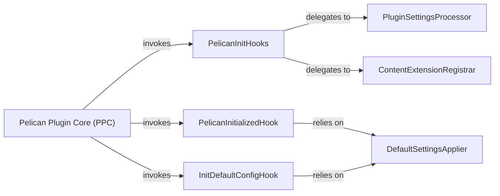

## Details

The Pelican Plugin Core (PPC) acts as the central hub for managing plugins, orchestrating their lifecycle from initialization to post-processing. During startup, the PPC invokes PelicanInitHooks to allow plugins to process their settings via the PluginSettingsProcessor and register content extensions through the ContentExtensionRegistrar. After core initialization, the PelicanInitializedHook is triggered, enabling plugins to finalize configurations, often relying on the DefaultSettingsApplier to ensure all necessary default values are in place. Similarly, the InitDefaultConfigHook also utilizes the DefaultSettingsApplier to establish baseline configurations. This structured interaction ensures that plugins are properly configured and integrated into Pelican's content processing pipeline.

### Pelican Plugin Core (PPC) [[Expand]](./Pelican_Plugin_Core_PPC_.md)
The central orchestrator responsible for initializing, registering, and managing the lifecycle of all plugins within the Pelican framework. It handles global settings and hooks into Pelican's build process events, acting as the primary integration point for extensions.

**Related Classes/Methods**:

- <a href="https://github.com/getpelican/pelican-plugins/blob/master/md_inline_extension/inline.py" target="_blank" rel="noopener noreferrer">`md_inline_extension.inline:pelican_init`</a>
- <a href="https://github.com/getpelican/pelican-plugins/blob/master/render_math/math.py" target="_blank" rel="noopener noreferrer">`render_math.math:pelican_init`</a>
- <a href="https://github.com/getpelican/pelican-plugins/blob/master/plantuml/plantuml_rst.py" target="_blank" rel="noopener noreferrer">`plantuml.plantuml_rst:pelican_init`</a>
- <a href="https://github.com/getpelican/pelican-plugins/blob/master/pelican_comment_system/pelican_comment_system.py" target="_blank" rel="noopener noreferrer">`pelican_comment_system.pelican_comment_system:pelican_initialized`</a>
- <a href="https://github.com/getpelican/pelican-plugins/blob/master/tag_cloud/tag_cloud.py" target="_blank" rel="noopener noreferrer">`tag_cloud.tag_cloud:init_default_config`</a>

### PelicanInitHooks
Serves as the initial entry point for plugins during Pelican's startup. It registers content extensions and processes plugin-specific settings.

**Related Classes/Methods**:

- <a href="https://github.com/getpelican/pelican-plugins/blob/master/md_inline_extension/inline.py" target="_blank" rel="noopener noreferrer">`md_inline_extension.inline:pelican_init`</a>
- <a href="https://github.com/getpelican/pelican-plugins/blob/master/render_math/math.py" target="_blank" rel="noopener noreferrer">`render_math.math:pelican_init`</a>
- <a href="https://github.com/getpelican/pelican-plugins/blob/master/plantuml/plantuml_rst.py" target="_blank" rel="noopener noreferrer">`plantuml.plantuml_rst:pelican_init`</a>

### PelicanInitializedHook
Allows plugins to perform actions or finalize configurations after Pelican's core initialization is complete, ensuring a fully set up environment.

**Related Classes/Methods**:

- <a href="https://github.com/getpelican/pelican-plugins/blob/master/pelican_comment_system/pelican_comment_system.py" target="_blank" rel="noopener noreferrer">`pelican_comment_system.pelican_comment_system:pelican_initialized`</a>

### InitDefaultConfigHook
Establishes default configuration values for a plugin, providing a baseline set of options even if not explicitly defined by the user.

**Related Classes/Methods**:

- <a href="https://github.com/getpelican/pelican-plugins/blob/master/tag_cloud/tag_cloud.py" target="_blank" rel="noopener noreferrer">`tag_cloud.tag_cloud:init_default_config`</a>

### PluginSettingsProcessor
Extracts and interprets plugin-specific configuration settings from Pelican's overall settings dictionary.

**Related Classes/Methods**:

- <a href="https://github.com/getpelican/pelican-plugins/blob/master/md_inline_extension/inline.py" target="_blank" rel="noopener noreferrer">`md_inline_extension.inline:process_settings`</a>

### ContentExtensionRegistrar
Registers custom extensions or processors with Pelican's content parsing mechanisms (e.g., Markdown, reStructuredText).

**Related Classes/Methods**:

- <a href="https://github.com/getpelican/pelican-plugins/blob/master/render_math/math.py" target="_blank" rel="noopener noreferrer">`render_math.math:pelican_init`</a>
- <a href="https://github.com/getpelican/pelican-plugins/blob/master/plantuml/plantuml_rst.py" target="_blank" rel="noopener noreferrer">`plantuml.plantuml_rst:pelican_init`</a>

### DefaultSettingsApplier
Applies default values to plugin configurations, ensuring robustness and completeness of settings.

**Related Classes/Methods**:

- <a href="https://github.com/getpelican/pelican-plugins/blob/master/tag_cloud/tag_cloud.py" target="_blank" rel="noopener noreferrer">`tag_cloud.tag_cloud:init_default_config`</a>

### [FAQ](https://github.com/CodeBoarding/GeneratedOnBoardings/tree/main?tab=readme-ov-file#faq)