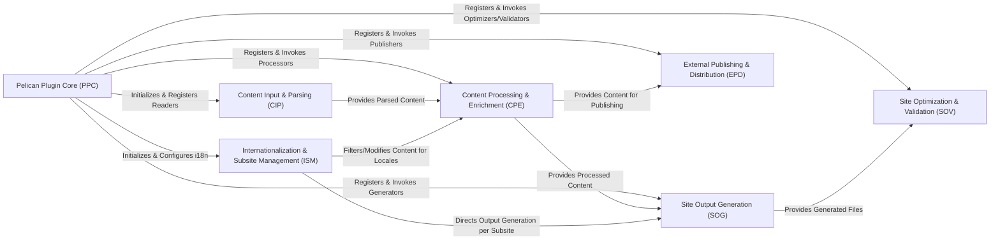

## Details

The Pelican plugin ecosystem operates as a modular, event-driven architecture centered around the **Pelican Plugin Core (PPC)**. This core component acts as the central orchestrator, responsible for initializing, registering, and managing the lifecycle of all plugins. It establishes the primary integration points by hooking into Pelican's build process events, allowing other components to extend and modify the static site generation workflow.

The data flow begins with the **Content Input & Parsing (CIP)** component, which handles the initial ingestion and parsing of raw content files (e.g., Markdown, reStructuredText). Once content is parsed, it is passed to the **Content Processing & Enrichment (CPE)** component. This component is a hub for various transformations, enriching the content with dynamic data, processing embedded media, and integrating external feeds.

For multi-language sites, the **Internationalization & Subsite Management (ISM)** component plays a crucial role, filtering and modifying content for specific locales and directing the output generation for localized subsites. After content is fully processed and enriched, the **Site Output Generation (SOG)** component takes over, producing the final static site files, including HTML pages, RSS/Atom feeds, and sitemaps.

Finally, the generated output is handed off to the **Site Optimization & Validation (SOV)** component for performance enhancements like Gzip caching and image optimization, as well as integrity checks such as W3C validation. Concurrently, the **External Publishing & Distribution (EPD)** component handles the automated dissemination of content to external platforms and social media, completing the content lifecycle. This structured flow ensures a robust and extensible static site generation process.

### Pelican Plugin Core (PPC) [[Expand]](./Pelican_Plugin_Core_PPC_.md)
The central orchestrator responsible for initializing, registering, and managing the lifecycle of all plugins within the Pelican framework. It handles global settings and hooks into Pelican's build process events, acting as the primary integration point for extensions.

**Related Classes/Methods**:

- <a href="https://github.com/getpelican/pelican-plugins/blob/master/md_inline_extension/inline.py#L1-L100" target="_blank" rel="noopener noreferrer">`md_inline_extension.inline:pelican_init`:1-100</a>
- <a href="https://github.com/getpelican/pelican-plugins/blob/master/render_math/math.py#L1-L100" target="_blank" rel="noopener noreferrer">`render_math.math:pelican_init`:1-100</a>
- <a href="https://github.com/getpelican/pelican-plugins/blob/master/plantuml/plantuml_rst.py#L1-L100" target="_blank" rel="noopener noreferrer">`plantuml.plantuml_rst:pelican_init`:1-100</a>
- <a href="https://github.com/getpelican/pelican-plugins/blob/master/pelican_comment_system/pelican_comment_system.py#L1-L100" target="_blank" rel="noopener noreferrer">`pelican_comment_system.pelican_comment_system:pelican_initialized`:1-100</a>
- <a href="https://github.com/getpelican/pelican-plugins/blob/master/tag_cloud/tag_cloud.py#L1-L100" target="_blank" rel="noopener noreferrer">`tag_cloud.tag_cloud:init_default_config`:1-100</a>

### Content Input & Parsing (CIP) [[Expand]](./Content_Input_Parsing_CIP_.md)
Handles the initial phase of content processing, including reading raw source files (e.g., Markdown, reStructuredText, AsciiDoc) and parsing them into Pelican's internal content objects. This component also incorporates extensions that enhance the parsing capabilities, such as custom directives or inline markdown extensions.

**Related Classes/Methods**:

- <a href="https://github.com/getpelican/pelican-plugins/blob/master/asciidoc_reader/asciidoc_reader.py#L1-L100" target="_blank" rel="noopener noreferrer">`asciidoc_reader.asciidoc_reader:read`:1-100</a>
- <a href="https://github.com/getpelican/pelican-plugins/blob/master/creole_reader/creole_reader.py#L1-L100" target="_blank" rel="noopener noreferrer">`creole_reader.creole_reader:read`:1-100</a>
- <a href="https://github.com/getpelican/pelican-plugins/blob/master/org_python_reader/org_python_reader.py#L1-L100" target="_blank" rel="noopener noreferrer">`org_python_reader.org_python_reader:read`:1-100</a>
- <a href="https://github.com/getpelican/pelican-plugins/blob/master/jpeg_reader/jpeg_reader.py#L1-L100" target="_blank" rel="noopener noreferrer">`jpeg_reader.jpeg_reader`:1-100</a>
- <a href="https://github.com/getpelican/pelican-plugins/blob/master/textile_reader/textile_reader.py#L1-L100" target="_blank" rel="noopener noreferrer">`textile_reader.textile_reader`:1-100</a>
- <a href="https://github.com/getpelican/pelican-plugins/blob/master/rmd_reader/rmd_reader.py#L1-L100" target="_blank" rel="noopener noreferrer">`rmd_reader.rmd_reader`:1-100</a>
- <a href="https://github.com/getpelican/pelican-plugins/blob/master/bootstrap-rst/bootstrap-rst.py#L1-L100" target="_blank" rel="noopener noreferrer">`bootstrap-rst.bootstrap-rst`:1-100</a>
- <a href="https://github.com/getpelican/pelican-plugins/blob/master/gist_directive/gist_directive.py#L1-L100" target="_blank" rel="noopener noreferrer">`gist_directive.gist_directive`:1-100</a>
- <a href="https://github.com/getpelican/pelican-plugins/blob/master/liquid_tags/mdx_liquid_tags.py#L1-L100" target="_blank" rel="noopener noreferrer">`liquid_tags.mdx_liquid_tags`:1-100</a>
- <a href="https://github.com/getpelican/pelican-plugins/blob/master/md_inline_extension/pelican_inline_markdown_extension.py#L1-L100" target="_blank" rel="noopener noreferrer">`md_inline_extension.pelican_inline_markdown_extension:extendMarkdown`:1-100</a>
- <a href="https://github.com/getpelican/pelican-plugins/blob/master/plantuml/plantuml_md.py#L1-L100" target="_blank" rel="noopener noreferrer">`plantuml.plantuml_md`:1-100</a>
- <a href="https://github.com/getpelican/pelican-plugins/blob/master/render_math/pelican_mathjax_markdown_extension.py#L1-L100" target="_blank" rel="noopener noreferrer">`render_math.pelican_mathjax_markdown_extension`:1-100</a>
- <a href="https://github.com/getpelican/pelican-plugins/blob/master/twitter_bootstrap_rst_directives/twitter_bootstrap_rst_directives.py#L1-L100" target="_blank" rel="noopener noreferrer">`twitter_bootstrap_rst_directives.twitter_bootstrap_rst_directives`:1-100</a>

### Content Processing & Enrichment (CPE) [[Expand]](./Content_Processing_Enrichment_CPE_.md)
Applies a wide range of modifications, enhancements, and data injections to content objects after initial parsing. This includes adding dynamic data (e.g., author images, read times, VCS metadata), processing embedded media (images, audio, video), integrating external content feeds (e.g., GitHub activity, Goodreads), and managing static comments.

**Related Classes/Methods**:

- <a href="https://github.com/getpelican/pelican-plugins/blob/master/author_images/author_images.py#L1-L100" target="_blank" rel="noopener noreferrer">`author_images.author_images:add_author_images`:1-100</a>
- <a href="https://github.com/getpelican/pelican-plugins/blob/master/clean_summary/clean_summary.py#L22-L35" target="_blank" rel="noopener noreferrer">`clean_summary.clean_summary`:22-35</a>
- <a href="https://github.com/getpelican/pelican-plugins/blob/master/collate_content/collate_content.py#L1-L100" target="_blank" rel="noopener noreferrer">`collate_content.collate_content`:1-100</a>
- <a href="https://github.com/getpelican/pelican-plugins/blob/master/glossary/glossary.py#L1-L100" target="_blank" rel="noopener noreferrer">`glossary.glossary`:1-100</a>
- <a href="https://github.com/getpelican/pelican-plugins/blob/master/linker/linker.py#L1-L100" target="_blank" rel="noopener noreferrer">`linker.linker`:1-100</a>
- <a href="https://github.com/getpelican/pelican-plugins/blob/master/more_categories/more_categories.py#L1-L100" target="_blank" rel="noopener noreferrer">`more_categories.more_categories`:1-100</a>
- <a href="https://github.com/getpelican/pelican-plugins/blob/master/neighbors/neighbors.py#L45-L59" target="_blank" rel="noopener noreferrer">`neighbors.neighbors`:45-59</a>
- <a href="https://github.com/getpelican/pelican-plugins/blob/master/post_stats/post_stats.py#L1-L100" target="_blank" rel="noopener noreferrer">`post_stats.post_stats`:1-100</a>
- <a href="https://github.com/getpelican/pelican-plugins/blob/master/readtime/readtime.py#L1-L100" target="_blank" rel="noopener noreferrer">`readtime.readtime:calculate_readtime`:1-100</a>
- <a href="https://github.com/getpelican/pelican-plugins/blob/master/read_more_link/read_more_link.py" target="_blank" rel="noopener noreferrer">`read_more_link.read_more_link`</a>
- <a href="https://github.com/getpelican/pelican-plugins/blob/master/representative_image/representative_image.py#L1-L100" target="_blank" rel="noopener noreferrer">`representative_image.representative_image`:1-100</a>
- <a href="https://github.com/getpelican/pelican-plugins/blob/master/section_number/section_number.py#L1-L100" target="_blank" rel="noopener noreferrer">`section_number.section_number`:1-100</a>
- <a href="https://github.com/getpelican/pelican-plugins/blob/master/shortcodes/shortcodes.py" target="_blank" rel="noopener noreferrer">`shortcodes.shortcodes`</a>
- <a href="https://github.com/getpelican/pelican-plugins/blob/master/clean_summary/clean_summary.py" target="_blank" rel="noopener noreferrer">`summary.summary`</a>
- <a href="https://github.com/getpelican/pelican-plugins/blob/master/subcategory/subcategory.py" target="_blank" rel="noopener noreferrer">`subcategory.subcategory`</a>
- <a href="https://github.com/getpelican/pelican-plugins/blob/master/filetime_from_git/content_adapter.py#L1-L100" target="_blank" rel="noopener noreferrer">`filetime_from_git.content_adapter:get_oldest_commit_date`:1-100</a>
- <a href="https://github.com/getpelican/pelican-plugins/blob/master/filetime_from_hg/filetime_from_hg.py#L29-L77" target="_blank" rel="noopener noreferrer">`filetime_from_hg.filetime_from_hg`:29-77</a>
- <a href="https://github.com/getpelican/pelican-plugins/blob/master/photos/photos.py#L1-L100" target="_blank" rel="noopener noreferrer">`photos.photos:detect_images_and_galleries`:1-100</a>
- <a href="https://github.com/getpelican/pelican-plugins/blob/master/thumbnailer/thumbnailer.py#L1-L100" target="_blank" rel="noopener noreferrer">`thumbnailer.thumbnailer`:1-100</a>
- <a href="https://github.com/getpelican/pelican-plugins/blob/master/liquid_tags/mdx_liquid_tags.py" target="_blank" rel="noopener noreferrer">`liquid_tags.liquid_tags`</a>
- <a href="https://github.com/getpelican/pelican-plugins/blob/master/video_privacy_enhancer/video_privacy_enhancer.py#L1-L100" target="_blank" rel="noopener noreferrer">`video_privacy_enhancer.video_privacy_enhancer`:1-100</a>
- <a href="https://github.com/getpelican/pelican-plugins/blob/master/disqus_static/disqus_static.py#L1-L100" target="_blank" rel="noopener noreferrer">`disqus_static.disqus_static:disqus_static`:1-100</a>
- <a href="https://github.com/getpelican/pelican-plugins/blob/master/github_activity/github_activity.py#L1-L100" target="_blank" rel="noopener noreferrer">`github_activity.github_activity`:1-100</a>
- <a href="https://github.com/getpelican/pelican-plugins/blob/master/goodreads_activity/goodreads_activity.py" target="_blank" rel="noopener noreferrer">`goodreads_activity.goodreads_activity`</a>
- <a href="https://github.com/getpelican/pelican-plugins/blob/master/webring/webring.py#L1-L100" target="_blank" rel="noopener noreferrer">`webring.webring`:1-100</a>
- <a href="https://github.com/getpelican/pelican-plugins/blob/master/pelican_comment_system/pelican_comment_system.py" target="_blank" rel="noopener noreferrer">`pelican_comment_system.comments`</a>

### Internationalization & Subsite Management (ISM)
Dedicated to managing multi-language content and generating localized subsites. This component ensures proper content filtering, translation handling, and interlinking across different language versions of the site.

**Related Classes/Methods**:

- <a href="https://github.com/getpelican/pelican-plugins/blob/master/i18n_subsites/i18n_subsites.py#L1-L100" target="_blank" rel="noopener noreferrer">`i18n_subsites.i18n_subsites:filter_contents_translations`:1-100</a>
- <a href="https://github.com/getpelican/pelican-plugins/blob/master/i18n_subsites/i18n_subsites.py#L1-L100" target="_blank" rel="noopener noreferrer">`i18n_subsites.i18n_subsites:interlink_translated_content`:1-100</a>
- <a href="https://github.com/getpelican/pelican-plugins/blob/master/i18n_subsites/i18n_subsites.py#L1-L100" target="_blank" rel="noopener noreferrer">`i18n_subsites.i18n_subsites:update_generators`:1-100</a>

### Site Output Generation (SOG)
Responsible for taking the fully processed content and generating the final static site files in various formats. This includes HTML pages, RSS/Atom feeds, sitemaps, PDFs, and RDF metadata, preparing them for deployment.

**Related Classes/Methods**:

- <a href="https://github.com/getpelican/pelican-plugins/blob/master/feed_summary/feed_summary.py#L1-L100" target="_blank" rel="noopener noreferrer">`feed_summary.feed_summary`:1-100</a>
- <a href="https://github.com/getpelican/pelican-plugins/blob/master/pdf/pdf.py#L1-L100" target="_blank" rel="noopener noreferrer">`pdf.pdf:generate_output`:1-100</a>
- <a href="https://github.com/getpelican/pelican-plugins/blob/master/permalinks/permalinks.py#L1-L100" target="_blank" rel="noopener noreferrer">`permalinks.permalinks`:1-100</a>
- <a href="https://github.com/getpelican/pelican-plugins/blob/master/sitemap/sitemap.py#L1-L100" target="_blank" rel="noopener noreferrer">`sitemap.sitemap:generate_output`:1-100</a>
- <a href="https://github.com/getpelican/pelican-plugins/blob/master/tipue_search/pelican/plugins/tipue_search/tipue_search.py#L1-L100" target="_blank" rel="noopener noreferrer">`tipue_search.pelican.plugins.tipue_search.tipue_search`:1-100</a>
- <a href="https://github.com/getpelican/pelican-plugins/blob/master/pelican-rdf/pelican_rdf.py#L1-L100" target="_blank" rel="noopener noreferrer">`pelican-rdf.pelican_rdf:generate_context`:1-100</a>

### Site Optimization & Validation (SOV)
Focuses on enhancing the performance and validating the integrity of the generated static site files. This includes tasks like Gzip caching, image optimization, and W3C validation to ensure the site is efficient and standards-compliant.

**Related Classes/Methods**:

- <a href="https://github.com/getpelican/pelican-plugins/blob/master/gzip_cache/gzip_cache.py#L1-L100" target="_blank" rel="noopener noreferrer">`gzip_cache.gzip_cache`:1-100</a>
- <a href="https://github.com/getpelican/pelican-plugins/blob/master/optimize_images/optimize_images.py#L31-L40" target="_blank" rel="noopener noreferrer">`optimize_images.optimize_images`:31-40</a>
- <a href="https://github.com/getpelican/pelican-plugins/blob/master/w3c_validate/w3c_validate.py#L1-L100" target="_blank" rel="noopener noreferrer">`w3c_validate.w3c_validate`:1-100</a>

### External Publishing & Distribution (EPD)
Manages automated publishing of generated content to external platforms and social media services. This component facilitates seamless content distribution beyond the static site itself.

**Related Classes/Methods**:

- <a href="https://github.com/getpelican/pelican-plugins/blob/master/reddit_poster/__init__.py#L1-L100" target="_blank" rel="noopener noreferrer">`reddit_poster.__init__:content_written`:1-100</a>
- <a href="https://github.com/getpelican/pelican-plugins/blob/master/shaarli_poster/shaarli_poster.py#L1-L100" target="_blank" rel="noopener noreferrer">`shaarli_poster.shaarli_poster:upload_new_articles`:1-100</a>
- <a href="https://github.com/getpelican/pelican-plugins/blob/master/share_post/share_post.py#L47-L79" target="_blank" rel="noopener noreferrer">`share_post.share_post`:47-79</a>

### [FAQ](https://github.com/CodeBoarding/GeneratedOnBoardings/tree/main?tab=readme-ov-file#faq)