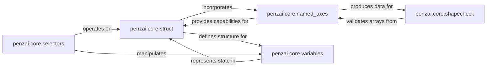

## Details

The penzai.core subsystem provides foundational abstractions for building and manipulating JAX-compatible neural network models and data structures. At its core, penzai.core.struct defines the base Struct dataclass, enabling seamless integration with JAX's pytree system, which is crucial for JAX transformations. Building upon this, penzai.core.named_axes introduces named dimensions for arrays, enhancing readability and robustness in tensor operations, and is often incorporated into Struct instances. penzai.core.shapecheck leverages named axes to provide a declarative system for validating and inferring array shapes, ensuring dimensional consistency. For dynamic model state, penzai.core.variables offers a structured approach to manage mutable parameters and state variables within the immutable JAX functional paradigm, with these variables often being represented within Struct objects. Finally, penzai.core.selectors provides a powerful API for navigating and transforming these Struct-based pytrees, allowing fine-grained manipulation of model components and data. This interconnected set of components forms a robust framework for defining, manipulating, and validating complex JAX-based models.

### penzai.core.struct
Defines the base for Penzai's custom data structures (dataclasses) to seamlessly integrate with JAX's pytree system. This enables Penzai objects to be treated as first-class JAX pytrees, allowing JAX transformations and Penzai's own tree manipulation tools to operate on them. It acts as the foundational layer for all Penzai-specific data structures.

**Related Classes/Methods**:

- <a href="https://github.com/google-deepmind/penzai/blob/main/penzai/core/struct.py#L69-L374" target="_blank" rel="noopener noreferrer">`penzai.core.struct.pytree_dataclass`:69-374</a>

### penzai.core.selectors
Provides a powerful API for navigating, selecting, and transforming arbitrary parts of JAX pytrees. It acts as the primary mechanism for fine-grained manipulation of model structures and data, enabling operations like patching, querying, and replacing sub-structures.

**Related Classes/Methods**:

- <a href="https://github.com/google-deepmind/penzai/blob/main/penzai/core/selectors.py" target="_blank" rel="noopener noreferrer">`penzai.core.selectors.Selection`</a>

### penzai.core.named_axes
Manages arrays with named dimensions, providing a robust way to handle array operations that are independent of axis order. This is crucial for building flexible, readable, and less error-prone neural network architectures by making array dimensions explicit and self-documenting.

**Related Classes/Methods**:

- <a href="https://github.com/google-deepmind/penzai/blob/main/penzai/core/named_axes.py#L120-L169" target="_blank" rel="noopener noreferrer">`penzai.core.named_axes.nmap`:120-169</a>

### penzai.core.shapecheck
Offers a declarative system for validating and inferring the shapes of arrays, especially those with named axes. It ensures dimensional consistency across operations and helps in debugging shape-related issues in complex models, enhancing the robustness of computations.

**Related Classes/Methods**:

- <a href="https://github.com/google-deepmind/penzai/blob/main/penzai/core/shapecheck.py#L264-L365" target="_blank" rel="noopener noreferrer">`penzai.core.shapecheck.ArraySpec`:264-365</a>

### penzai.core.variables
Provides a structured way to define, manage, and manipulate model parameters and state variables within the JAX pytree context. It handles binding, unbinding, and freezing of these variables, which is essential for managing mutable state in functional JAX programs, particularly during training and inference workflows.

**Related Classes/Methods**:

- <a href="https://github.com/google-deepmind/penzai/blob/main/penzai/core/variables.py#L99-L132" target="_blank" rel="noopener noreferrer">`penzai.core.variables.AbstractVariable`:99-132</a>

### [FAQ](https://github.com/CodeBoarding/GeneratedOnBoardings/tree/main?tab=readme-ov-file#faq)