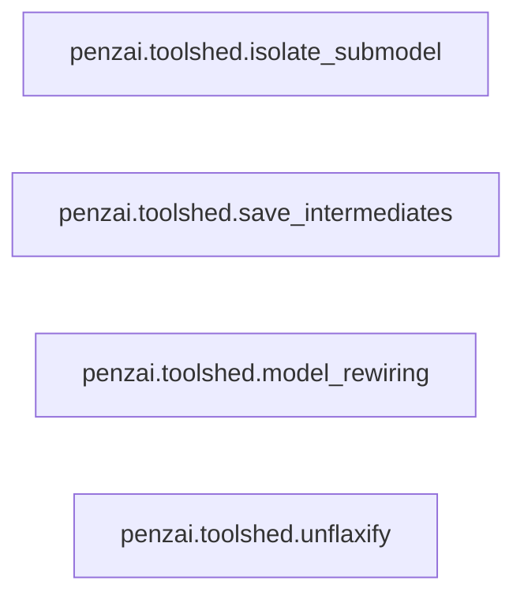

## Details

Model Analysis & Transformation Tools

### penzai.toolshed.isolate_submodel
Provides the core functionality for extracting and isolating specific sub-components or computational graphs from a larger model. This is crucial for focused analysis and debugging of complex models by allowing users to inspect parts of a model in isolation.

**Related Classes/Methods**:

- <a href="https://github.com/google-deepmind/penzai/blob/main/penzai/toolshed/isolate_submodel.py#L75-L117" target="_blank" rel="noopener noreferrer">`penzai.toolshed.isolate_submodel.IsolationCapturer`:75-117</a>
- <a href="https://github.com/google-deepmind/penzai/blob/main/penzai/toolshed/isolate_submodel.py#L34-L72" target="_blank" rel="noopener noreferrer">`penzai.toolshed.isolate_submodel.IsolatedSubmodel`:34-72</a>

### penzai.toolshed.save_intermediates
Enables the interception and saving of intermediate values during a model's forward pass or computation. This is vital for understanding internal model behavior, debugging, and interpretability by providing visibility into the data flow at various stages.

**Related Classes/Methods**:

- <a href="https://github.com/google-deepmind/penzai/blob/main/penzai/toolshed/save_intermediates.py#L116-L141" target="_blank" rel="noopener noreferrer">`penzai.toolshed.save_intermediates.add_intercept_values_around`:116-141</a>

### penzai.toolshed.model_rewiring
Facilitates the programmatic modification and restructuring of existing models. This includes changing connections, replacing layers, or altering the flow of data, supporting architectural experimentation and optimization without manual code changes.

**Related Classes/Methods**:

- <a href="https://github.com/google-deepmind/penzai/blob/main/penzai/toolshed/model_rewiring.py#L161-L175" target="_blank" rel="noopener noreferrer">`penzai.toolshed.model_rewiring.path_matrix`:161-175</a>

### penzai.toolshed.unflaxify
Provides tools for integrating and interacting with models originally defined in the Flax machine learning framework. This ensures interoperability and allows PenZai to leverage existing Flax models or components, bridging the gap between different JAX-based ecosystems.

**Related Classes/Methods**:

- <a href="https://github.com/google-deepmind/penzai/blob/main/penzai/toolshed/unflaxify.py#L54-L80" target="_blank" rel="noopener noreferrer">`penzai.toolshed.unflaxify.InterceptedFlaxScopeData`:54-80</a>
- <a href="https://github.com/google-deepmind/penzai/blob/main/penzai/toolshed/unflaxify.py#L317-L441" target="_blank" rel="noopener noreferrer">`penzai.toolshed.unflaxify.reifying_interceptor`:317-441</a>

### [FAQ](https://github.com/CodeBoarding/GeneratedOnBoardings/tree/main?tab=readme-ov-file#faq)