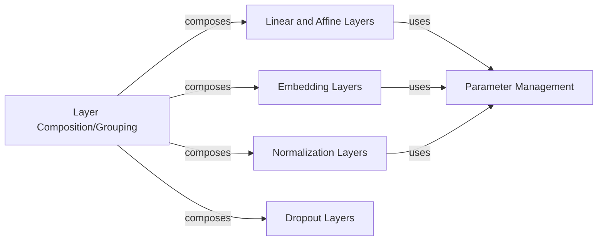

## Details

The `Neural Network Building Blocks` subsystem in `penzai` provides a modular and extensible foundation for constructing neural networks using JAX and Penzai's named arrays.

### Linear and Affine Layers
Implements fundamental linear and affine transformations, including input/output structuring and core contract operations. Supports flexible instantiation (e.g., `RenameAxes`, `LinearInPlace`). These are basic mathematical operations essential for any neural network.

**Related Classes/Methods**:

- <a href="https://github.com/google-deepmind/penzai/blob/main/penzai/nn/linear_and_affine.py" target="_blank" rel="noopener noreferrer">`penzai.nn.linear_and_affine`</a>

### Embedding Layers
Converts discrete inputs (like token IDs) into continuous vector representations, including applying positional encodings such as RoPE. Essential for handling categorical or sequential data in neural networks.

**Related Classes/Methods**:

- <a href="https://github.com/google-deepmind/penzai/blob/main/penzai/nn/embeddings.py" target="_blank" rel="noopener noreferrer">`penzai.nn.embeddings`</a>

### Normalization Layers
Applies various normalization techniques (e.g., RMS normalization) to stabilize neural network activations and improve training convergence. Supports different normalization types (`RMSStandardize`, `Standardize`). Crucial for deep learning stability.

**Related Classes/Methods**:

- <a href="https://github.com/google-deepmind/penzai/blob/main/penzai/nn/standardization.py" target="_blank" rel="noopener noreferrer">`penzai.nn.standardization`</a>

### Parameter Management
Provides core utilities for creating, deriving unique keys for, and managing learnable parameters (weights, biases, embedding tables, etc.) across various layers. This component is foundational as all learnable layers depend on it for their trainable state.

**Related Classes/Methods**:

- <a href="https://github.com/google-deepmind/penzai/blob/main/penzai/nn/parameters.py" target="_blank" rel="noopener noreferrer">`penzai.nn.parameters`</a>

### Dropout Layers
Implements dropout regularization to prevent overfitting by randomly setting a fraction of inputs to zero during training. Provides mechanisms to enable/disable dropout. A standard regularization technique in neural networks.

**Related Classes/Methods**:

- <a href="https://github.com/google-deepmind/penzai/blob/main/penzai/nn/dropout.py" target="_blank" rel="noopener noreferrer">`penzai.nn.dropout`</a>

### Layer Composition/Grouping
Facilitates the modular composition and structuring of individual neural network layers into larger, more complex models. Manages the arrangement and sequencing of layers (e.g., `inline_groups`, `inline_anonymous_sequentials`). This component is critical for building complex architectures from the basic blocks.

**Related Classes/Methods**:

- <a href="https://github.com/google-deepmind/penzai/blob/main/penzai/nn/combinators.py" target="_blank" rel="noopener noreferrer">`penzai.nn.combinators`</a>

### [FAQ](https://github.com/CodeBoarding/GeneratedOnBoardings/tree/main?tab=readme-ov-file#faq)