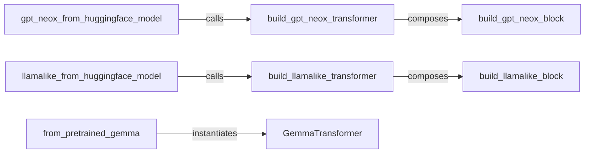

## Details

This subsystem, penzai.models.transformer.variants, provides concrete, ready-to-use implementations of popular transformer architectures. It leverages Penzai's modular Neural Network Building Blocks to construct these models, treating them as inspectable and manipulable JAX pytrees, aligning with the project's "model as data" paradigm.

### build_gpt_neox_transformer
Orchestrates the assembly of a complete GPT-NeoX model by stacking multiple transformer blocks. This component is crucial for defining the overall structure of the GPT-NeoX variant within Penzai.

**Related Classes/Methods**:

- <a href="https://github.com/google-deepmind/penzai/blob/main/penzai/models/transformer/variants/gpt_neox.py#L274-L348" target="_blank" rel="noopener noreferrer">`build_gpt_neox_transformer`:274-348</a>

### gpt_neox_from_huggingface_model
Provides an external interface to load and convert GPT-NeoX model configurations and weights from the Hugging Face ecosystem into Penzai's internal representation. This enables interoperability with widely used pre-trained models.

**Related Classes/Methods**:

- <a href="https://github.com/google-deepmind/penzai/blob/main/penzai/models/transformer/variants/gpt_neox.py#L354-L587" target="_blank" rel="noopener noreferrer">`gpt_neox_from_huggingface_model`:354-587</a>

### build_llamalike_transformer
Orchestrates the assembly of a complete Llama-like model by stacking multiple transformer blocks, leveraging common Llama-like architectural patterns. This component generalizes the construction of various Llama-derived models.

**Related Classes/Methods**:

- <a href="https://github.com/google-deepmind/penzai/blob/main/penzai/models/transformer/variants/llamalike_common.py#L489-L596" target="_blank" rel="noopener noreferrer">`build_llamalike_transformer`:489-596</a>

### llamalike_from_huggingface_model
Provides an external interface to load and convert Llama-like model configurations from the Hugging Face ecosystem into Penzai's internal representation, handling various attention types. This is key for integrating Llama-family models.

**Related Classes/Methods**:

- <a href="https://github.com/google-deepmind/penzai/blob/main/penzai/models/transformer/variants/llamalike_common.py#L599-L810" target="_blank" rel="noopener noreferrer">`llamalike_from_huggingface_model`:599-810</a>

### GemmaTransformer
Defines the core structural representation of the Gemma transformer model. Designed as a JAX pytree, it embodies the "model as data" paradigm, allowing for inspectability and manipulation.

**Related Classes/Methods**:

- <a href="https://github.com/google-deepmind/penzai/blob/main/penzai/deprecated/v1/example_models/gemma/model_core.py#L408-L629" target="_blank" rel="noopener noreferrer">`GemmaTransformer`:408-629</a>

### from_pretrained_gemma
Facilitates the loading of pre-trained Gemma models, initializing the `GemmaTransformer` based on a provided configuration. This component provides a convenient entry point for using Gemma models.

**Related Classes/Methods**:

- <a href="https://github.com/google-deepmind/penzai/blob/main/penzai/models/transformer/variants/gemma.py" target="_blank" rel="noopener noreferrer">`from_pretrained_gemma`</a>

### build_gpt_neox_block
Constructs a single, self-contained GPT-NeoX transformer block, including its attention and feedforward components. These are fundamental "Neural Network Building Blocks" that promote modularity and reusability.

**Related Classes/Methods**:

- <a href="https://github.com/google-deepmind/penzai/blob/main/penzai/models/transformer/variants/gpt_neox.py#L220-L271" target="_blank" rel="noopener noreferrer">`build_gpt_neox_block`:220-271</a>

### build_llamalike_block
Constructs a single, self-contained Llama-like transformer block, including its attention and feedforward components. Similar to the GPT-NeoX block, this is a reusable building block for Llama-family models.

**Related Classes/Methods**:

- <a href="https://github.com/google-deepmind/penzai/blob/main/penzai/models/transformer/variants/llamalike_common.py#L418-L486" target="_blank" rel="noopener noreferrer">`build_llamalike_block`:418-486</a>

### [FAQ](https://github.com/CodeBoarding/GeneratedOnBoardings/tree/main?tab=readme-ov-file#faq)