```mermaid
graph LR
    Core_Data_Structures_Utilities["Core Data Structures & Utilities"]
    Neural_Network_Building_Blocks["Neural Network Building Blocks"]
    Pre_built_Transformer_Models["Pre-built Transformer Models"]
    Model_Analysis_Transformation_Tools["Model Analysis & Transformation Tools"]
    Basic_Training_Utilities["Basic Training Utilities"]
    Visualization_Debugging["Visualization & Debugging"]
    Core_Data_Structures_Utilities -- "Defines & Manages" --> Neural_Network_Building_Blocks
    Core_Data_Structures_Utilities -- "Provides Data For" --> Visualization_Debugging
    Neural_Network_Building_Blocks -- "Are Composed To Form" --> Pre_built_Transformer_Models
    Neural_Network_Building_Blocks -- "Relies On" --> Core_Data_Structures_Utilities
    Pre_built_Transformer_Models -- "Can Be Analyzed By" --> Model_Analysis_Transformation_Tools
    Pre_built_Transformer_Models -- "Can Be Visualized By" --> Visualization_Debugging
    Model_Analysis_Transformation_Tools -- "Manipulates" --> Core_Data_Structures_Utilities
    Model_Analysis_Transformation_Tools -- "Provides Output To" --> Visualization_Debugging
    Basic_Training_Utilities -- "Interacts With" --> Core_Data_Structures_Utilities
    Basic_Training_Utilities -- "Invokes" --> Neural_Network_Building_Blocks
    Visualization_Debugging -- "Visualizes Data From" --> Core_Data_Structures_Utilities
    Visualization_Debugging -- "Displays Structures Of" --> Neural_Network_Building_Blocks
    Visualization_Debugging -- "Displays Structures Of" --> Pre_built_Transformer_Models
    click Core_Data_Structures_Utilities href "https://github.com/CodeBoarding/GeneratedOnBoardings/blob/main/penzai/Core_Data_Structures_Utilities.md" "Details"
    click Neural_Network_Building_Blocks href "https://github.com/CodeBoarding/GeneratedOnBoardings/blob/main/penzai/Neural_Network_Building_Blocks.md" "Details"
    click Pre_built_Transformer_Models href "https://github.com/CodeBoarding/GeneratedOnBoardings/blob/main/penzai/Pre_built_Transformer_Models.md" "Details"
    click Model_Analysis_Transformation_Tools href "https://github.com/CodeBoarding/GeneratedOnBoardings/blob/main/penzai/Model_Analysis_Transformation_Tools.md" "Details"
    click Visualization_Debugging href "https://github.com/CodeBoarding/GeneratedOnBoardings/blob/main/penzai/Visualization_Debugging.md" "Details"
```

## Details

Penzai is an ML toolkit designed around the principle of treating machine learning models as manipulable JAX pytrees. At its core, the Core Data Structures & Utilities component provides the foundational elements for this paradigm, enabling the definition, manipulation, and validation of complex model structures and named array data. Building upon this foundation, the Neural Network Building Blocks offer a modular set of JAX-based primitives that can be composed to construct diverse neural architectures. These blocks are then utilized by the Pre-built Transformer Models component to provide ready-to-use implementations of popular transformer models. For deeper understanding and experimentation, the Model Analysis & Transformation Tools allow users to introspect, modify, and extract information from these models, leveraging the core data structures. The Basic Training Utilities facilitate the training process by interacting with the model's state and parameters. Finally, the Visualization & Debugging component, powered by `treescope`, provides rich, interactive visual representations of the models and their internal data, completing the interpretability loop and offering crucial insights into model behavior. This architecture emphasizes modularity, composability, and data-centricity, making Penzai a powerful tool for advanced ML research and interpretability.

### Core Data Structures & Utilities [[Expand]](./Core_Data_Structures_Utilities.md)
Provides the fundamental tools for manipulating JAX pytrees, including selection, modification, structural definition, named array management, shape validation, and state/variable binding. This is the bedrock for Penzai's data-centric approach, enabling models to be treated as inspectable and manipulable data structures.

**Related Classes/Methods**:

- <a href="https://github.com/google-deepmind/penzai/blob/main/penzai/core/selectors.py" target="_blank" rel="noopener noreferrer">`penzai.core.selectors`</a>
- <a href="https://github.com/google-deepmind/penzai/blob/main/penzai/core/struct.py" target="_blank" rel="noopener noreferrer">`penzai.core.struct`</a>
- <a href="https://github.com/google-deepmind/penzai/blob/main/penzai/core/named_axes.py" target="_blank" rel="noopener noreferrer">`penzai.core.named_axes`</a>
- <a href="https://github.com/google-deepmind/penzai/blob/main/penzai/core/shapecheck.py" target="_blank" rel="noopener noreferrer">`penzai.core.shapecheck`</a>
- <a href="https://github.com/google-deepmind/penzai/blob/main/penzai/core/variables.py" target="_blank" rel="noopener noreferrer">`penzai.core.variables`</a>

### Neural Network Building Blocks [[Expand]](./Neural_Network_Building_Blocks.md)
Offers a modular collection of JAX-based neural network primitives (e.g., linear layers, embeddings, attention, normalization), parameter initialization routines, and mechanisms for composing individual layers into larger, structured models. These blocks are designed to operate seamlessly with Penzai's named arrays.

**Related Classes/Methods**:

- <a href="https://github.com/google-deepmind/penzai/blob/main/penzai/nn/linear_and_affine.py" target="_blank" rel="noopener noreferrer">`penzai.nn.linear_and_affine`</a>
- <a href="https://github.com/google-deepmind/penzai/blob/main/penzai/nn/embeddings.py" target="_blank" rel="noopener noreferrer">`penzai.nn.embeddings`</a>
- <a href="https://github.com/google-deepmind/penzai/blob/main/penzai/nn/standardization.py" target="_blank" rel="noopener noreferrer">`penzai.nn.standardization`</a>
- <a href="https://github.com/google-deepmind/penzai/blob/main/penzai/nn/parameters.py" target="_blank" rel="noopener noreferrer">`penzai.nn.parameters`</a>
- <a href="https://github.com/google-deepmind/penzai/blob/main/penzai/nn/dropout.py" target="_blank" rel="noopener noreferrer">`penzai.nn.dropout`</a>
- <a href="https://github.com/google-deepmind/penzai/blob/main/penzai/nn/combinators.py" target="_blank" rel="noopener noreferrer">`penzai.nn.combinators`</a>

### Pre-built Transformer Models [[Expand]](./Pre_built_Transformer_Models.md)
Provides concrete implementations of popular transformer architectures (e.g., GPT-NeoX, Llama-like, Mistral, Gemma) constructed using Penzai's modular `Neural Network Building Blocks`. These models serve as ready-to-use examples and reference points.

**Related Classes/Methods**:

- <a href="https://github.com/google-deepmind/penzai/blob/main/penzai/models/transformer/variants/gpt_neox.py" target="_blank" rel="noopener noreferrer">`penzai.models.transformer.variants.gpt_neox`</a>
- <a href="https://github.com/google-deepmind/penzai/blob/main/penzai/models/transformer/variants/llamalike_common.py" target="_blank" rel="noopener noreferrer">`penzai.models.transformer.variants.llamalike_common`</a>
- <a href="https://github.com/google-deepmind/penzai/blob/main/penzai/models/transformer/variants/gemma.py" target="_blank" rel="noopener noreferrer">`penzai.models.transformer.variants.gemma`</a>
- <a href="https://github.com/google-deepmind/penzai/blob/main/penzai/models/transformer/variants/llama.py" target="_blank" rel="noopener noreferrer">`penzai.models.transformer.variants.llama`</a>
- <a href="https://github.com/google-deepmind/penzai/blob/main/penzai/models/transformer/variants/mistral.py" target="_blank" rel="noopener noreferrer">`penzai.models.transformer.variants.mistral`</a>

### Model Analysis & Transformation Tools [[Expand]](./Model_Analysis_Transformation_Tools.md)
A suite of utilities for introspecting, extracting sub-components, programmatically rewiring, and transforming existing models. It includes functionalities for saving intermediate values, isolating sub-models, and integrating models defined in other frameworks (like Flax).

**Related Classes/Methods**:

- <a href="https://github.com/google-deepmind/penzai/blob/main/penzai/toolshed/isolate_submodel.py" target="_blank" rel="noopener noreferrer">`penzai.toolshed.isolate_submodel`</a>
- <a href="https://github.com/google-deepmind/penzai/blob/main/penzai/toolshed/save_intermediates.py" target="_blank" rel="noopener noreferrer">`penzai.toolshed.save_intermediates`</a>
- <a href="https://github.com/google-deepmind/penzai/blob/main/penzai/toolshed/model_rewiring.py" target="_blank" rel="noopener noreferrer">`penzai.toolshed.model_rewiring`</a>
- <a href="https://github.com/google-deepmind/penzai/blob/main/penzai/toolshed/unflaxify.py" target="_blank" rel="noopener noreferrer">`penzai.toolshed.unflaxify`</a>

### Basic Training Utilities
Provides foundational elements for setting up and executing training loops within the Penzai ecosystem, handling interaction with model state and parameters.

**Related Classes/Methods**:

- <a href="https://github.com/google-deepmind/penzai/blob/main/penzai/toolshed/basic_training.py" target="_blank" rel="noopener noreferrer">`penzai.toolshed.basic_training`</a>

### Visualization & Debugging [[Expand]](./Visualization_Debugging.md)
Offers specialized tools for visualizing model components, intermediate data, and debugging model behavior, heavily leveraging the `treescope` library for rich, interactive displays of JAX PyTrees.

**Related Classes/Methods**:

- <a href="https://github.com/google-deepmind/penzai/blob/main/penzai/toolshed/token_visualization.py" target="_blank" rel="noopener noreferrer">`penzai.toolshed.token_visualization`</a>
- <a href="https://github.com/google-deepmind/penzai/blob/main/penzai/treescope/_compatibility_setup.py" target="_blank" rel="noopener noreferrer">`penzai.treescope._compatibility_setup`</a>

### [FAQ](https://github.com/CodeBoarding/GeneratedOnBoardings/tree/main?tab=readme-ov-file#faq)