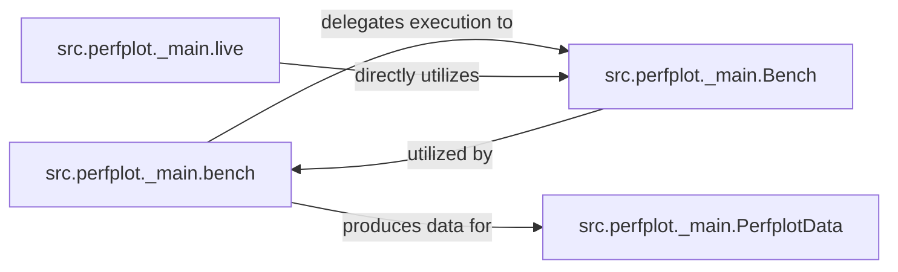

## Details

The `perfplot` benchmarking subsystem is centered around the `bench` function, which serves as the primary entry point for initiating performance measurements. This function orchestrates the benchmarking process by delegating the actual timing and execution of user-defined kernels to the `Bench` class. The `Bench` class encapsulates the core logic for running benchmarks across various input sizes and managing setup/teardown. Upon completion, the `bench` function produces raw benchmark data, which is then consumed by `PerfplotData` for storage and subsequent analysis or visualization. Additionally, the `live` function provides an interactive interface, directly leveraging the `Bench` class to perform real-time benchmarking and display results. This architecture ensures a clear separation of concerns, with `bench` managing the overall flow, `Bench` handling execution details, `PerfplotData` managing results, and `live` providing an interactive user experience.

### src.perfplot._main.bench
Acts as the primary facade for initiating benchmarking. It orchestrates the overall benchmarking process, handling initial configuration and delegating the actual timing execution to the `Bench` class. It also manages the collection of results, which are then made available for data processing.

**Related Classes/Methods**:

- <a href="https://github.com/nschloe/perfplot/blob/main/src/perfplot/_main.py#L472-L535" target="_blank" rel="noopener noreferrer">`src.perfplot._main.bench`:472-535</a>

### src.perfplot._main.Bench
Encapsulates the precise execution and timing logic. This class is responsible for running user-provided kernels across different input sizes, managing the setup and teardown phases for each individual benchmark. It represents the fundamental "how code is timed" mechanism.

**Related Classes/Methods**:

- <a href="https://github.com/nschloe/perfplot/blob/main/src/perfplot/_main.py#L472-L535" target="_blank" rel="noopener noreferrer">`src.perfplot._main.Bench`:472-535</a>

### src.perfplot._main.PerfplotData
Manages the flow of raw and processed benchmark results. It serves as the data container for the output generated by the benchmarking process, making it crucial for subsequent analysis and visualization.

**Related Classes/Methods**:

- <a href="https://github.com/nschloe/perfplot/blob/main/src/perfplot/_main.py#L64-L177" target="_blank" rel="noopener noreferrer">`src.perfplot._main.PerfplotData`:64-177</a>

### src.perfplot._main.live
Provides an interface for real-time or interactive benchmarking. It directly utilizes the `src.perfplot._main.Bench` class to perform live timing and display results, indicating a direct dependency on the core execution logic.

**Related Classes/Methods**:

- <a href="https://github.com/nschloe/perfplot/blob/main/src/perfplot/_main.py#L353-L469" target="_blank" rel="noopener noreferrer">`src.perfplot._main.live`:353-469</a>

### [FAQ](https://github.com/CodeBoarding/GeneratedOnBoardings/tree/main?tab=readme-ov-file#faq)