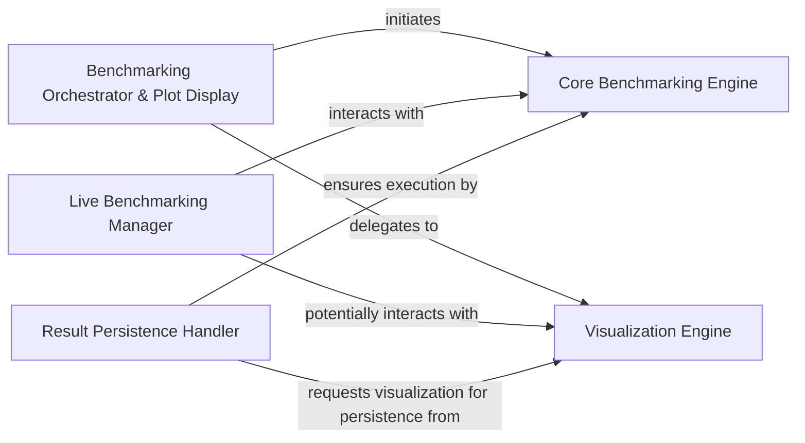

## Details

The `perfplot` benchmarking subsystem is structured around a clear separation of concerns, with a central `Core Benchmarking Engine` responsible for executing performance measurements. User-facing components like the `Benchmarking Orchestrator & Plot Display`, `Live Benchmarking Manager`, and `Result Persistence Handler` serve as entry points, each orchestrating specific benchmarking workflows. These components interact with the `Core Benchmarking Engine` to perform the actual benchmarks and then delegate to the `Visualization Engine` for presenting or persisting the results. The `Visualization Engine` handles all aspects of plot generation and display, whether for live, interactive sessions or for static output and saving. This architecture ensures modularity, allowing for independent development and maintenance of benchmarking logic, visualization capabilities, and various user interaction modes.

### Core Benchmarking Engine
This component is responsible for executing the actual performance benchmarks. It takes kernels (functions to be benchmarked) and a range of input sizes, then measures their execution time. It's the central computational unit for performance measurement.

**Related Classes/Methods**:

- <a href="https://github.com/nschloe/perfplot/blob/main/src/perfplot/_main.py#L472-L535" target="_blank" rel="noopener noreferrer">`src.perfplot._main.bench`:472-535</a>

### Visualization Engine [[Expand]](./Visualization_Engine.md)
This component handles the generation and display of plots from benchmarking results. It provides functionalities to visualize performance data, including live updates and static plot generation, often leveraging `matplotlib` for rendering.

**Related Classes/Methods**:

- <a href="https://github.com/nschloe/perfplot/blob/main/src/perfplot/_main.py#L353-L469" target="_blank" rel="noopener noreferrer">`src.perfplot._main.live`:353-469</a>

### Benchmarking Orchestrator & Plot Display
This component acts as the primary facade for initiating a complete benchmarking workflow. It orchestrates the execution of benchmarks via the `Core Benchmarking Engine` and then delegates to the `Visualization Engine` for displaying the generated plots. It represents the typical "run and show" user experience.

**Related Classes/Methods**:

- <a href="https://github.com/nschloe/perfplot/blob/main/src/perfplot/_main.py#L556-L570" target="_blank" rel="noopener noreferrer">`src.perfplot._main.show`:556-570</a>

### Live Benchmarking Manager
This component handles interactive and real-time benchmarking sessions. It continuously executes benchmarks and updates results, leveraging the `Core Benchmarking Engine` for measurements and the `Visualization Engine` for dynamic plot updates.

**Related Classes/Methods**:

- <a href="https://github.com/nschloe/perfplot/blob/main/src/perfplot/_main.py#L353-L469" target="_blank" rel="noopener noreferrer">`src.perfplot._main.live`:353-469</a>

### Result Persistence Handler
This component is responsible for managing the saving of benchmarking results, including generated plots and raw data. It interacts with the `Core Benchmarking Engine` to get results and requests visualization from the `Visualization Engine` for persistence.

**Related Classes/Methods**:

- <a href="https://github.com/nschloe/perfplot/blob/main/src/perfplot/_main.py#L573-L591" target="_blank" rel="noopener noreferrer">`src.perfplot._main.save`:573-591</a>

### [FAQ](https://github.com/CodeBoarding/GeneratedOnBoardings/tree/main?tab=readme-ov-file#faq)