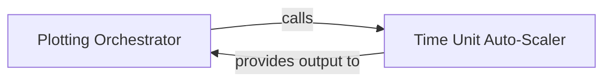

## Details

The `Visualization Engine` subsystem is dedicated to the transformation of processed benchmark data into visual representations, primarily line plots. Its boundaries encompass all logic related to plot generation, including rendering, aesthetic configuration, and intelligent scaling of plot axes to ensure optimal readability. It acts as the presentation layer for the benchmark results.

### Plotting Orchestrator
Serves as the primary user-facing entry point (Facade pattern) for generating performance plots within the `Visualization Engine`. It orchestrates the entire plotting workflow, taking processed benchmark data, configuring plot aesthetics (labels, titles, legends), and initiating the rendering process. It acts as the bridge between the processed data and the underlying plotting library (e.g., `matplotlib`).

**Related Classes/Methods**:

- <a href="https://github.com/nschloe/perfplot/blob/main/src/perfplot/_main.py#L539-L553" target="_blank" rel="noopener noreferrer">`src.perfplot._main.plot`:539-553</a>

### Time Unit Auto-Scaler
A utility component within the `Visualization Engine` responsible for analyzing collected performance data to automatically determine and return the most appropriate and human-readable time unit (e.g., nanoseconds, microseconds, milliseconds, seconds) for display on the plot's axes. This ensures optimal readability and scaling of the performance results.

**Related Classes/Methods**:

- <a href="https://github.com/nschloe/perfplot/blob/main/src/perfplot/_main.py#L43-L61" target="_blank" rel="noopener noreferrer">`src.perfplot._main._auto_time_unit`:43-61</a>

### [FAQ](https://github.com/CodeBoarding/GeneratedOnBoardings/tree/main?tab=readme-ov-file#faq)