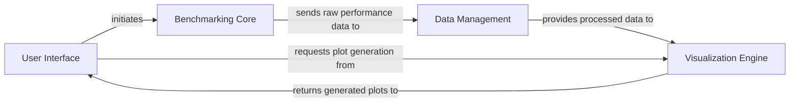

## Details

The `perfplot` library implements a clear pipeline architecture for performance benchmarking and visualization. The **User Interface** acts as the system's facade, initiating the benchmarking process by engaging the **Benchmarking Core**. This core component executes and times user-defined code, forwarding the raw performance metrics to **Data Management** for structured storage. Subsequently, the **Visualization Engine** retrieves this organized data to generate insightful plots, which are then presented back to the **User Interface** for display or saving. This design ensures a modular and efficient flow, from code execution and data collection to processing and final visual output, making it ideal for diagrammatic representation where each component's distinct role and interaction pathways are clearly delineated.

### User Interface [[Expand]](./User_Interface.md)
Serves as the public API and orchestrates the entire benchmarking workflow, handling user input and managing the final output (displaying plots, saving files).

**Related Classes/Methods**:

- <a href="https://github.com/nschloe/perfplot/blob/main/src/perfplot/_main.py#L556-L570" target="_blank" rel="noopener noreferrer">`src.perfplot._main.show`:556-570</a>
- <a href="https://github.com/nschloe/perfplot/blob/main/src/perfplot/_main.py#L353-L469" target="_blank" rel="noopener noreferrer">`src.perfplot._main.live`:353-469</a>
- <a href="https://github.com/nschloe/perfplot/blob/main/src/perfplot/_main.py#L573-L591" target="_blank" rel="noopener noreferrer">`src.perfplot._main.save`:573-591</a>

### Benchmarking Core [[Expand]](./Benchmarking_Core.md)
Responsible for the precise execution and timing of user-provided functions (kernels) across different input sizes, managing the setup and execution phases.

**Related Classes/Methods**:

- <a href="https://github.com/nschloe/perfplot/blob/main/src/perfplot/_main.py#L472-L535" target="_blank" rel="noopener noreferrer">`src.perfplot._main.bench`:472-535</a>
- <a href="https://github.com/nschloe/perfplot/blob/main/src/perfplot/_main.py#L472-L535" target="_blank" rel="noopener noreferrer">`src.perfplot._main.Bench`:472-535</a>

### Data Management
Collects, structures, and manages the raw performance data generated by the Benchmarking Core, storing results in an organized manner for subsequent analysis and visualization.

**Related Classes/Methods**:

- <a href="https://github.com/nschloe/perfplot/blob/main/src/perfplot/_main.py#L64-L177" target="_blank" rel="noopener noreferrer">`src.perfplot._main.PerfplotData`:64-177</a>

### Visualization Engine [[Expand]](./Visualization_Engine.md)
Transforms the processed benchmark data into meaningful visual representations, primarily line plots, handling rendering logic, axis scaling, and plot aesthetics.

**Related Classes/Methods**:

- <a href="https://github.com/nschloe/perfplot/blob/main/src/perfplot/_main.py#L539-L553" target="_blank" rel="noopener noreferrer">`src.perfplot._main.plot`:539-553</a>
- <a href="https://github.com/nschloe/perfplot/blob/main/src/perfplot/_main.py#L43-L61" target="_blank" rel="noopener noreferrer">`src.perfplot._main._auto_time_unit`:43-61</a>

### [FAQ](https://github.com/CodeBoarding/GeneratedOnBoardings/tree/main?tab=readme-ov-file#faq)