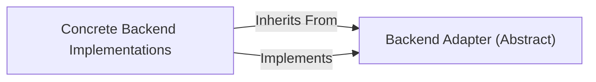

## Details

The `phonemizer.backend` subsystem is structured around an Abstract Adapter pattern, with `Backend Adapter (Abstract)` (`BaseBackend`) defining the core contract for phonemization. This abstract class establishes a consistent interface and a template for the phonemization workflow, including pre- and post-processing steps. `Concrete Backend Implementations` extend and implement this abstract adapter, providing the specific phonemization logic for various underlying engines (e.g., Espeak, Festival). This design ensures a highly modular and extensible system where different phonemization backends can be seamlessly integrated and swapped, all adhering to the common interface defined by the abstract adapter.

### Backend Adapter (Abstract) [[Expand]](./Backend_Adapter_Abstract_.md)
The `phonemizer.backend.base.BaseBackend` class serves as the central abstract interface for all concrete phonemization backends. It defines the common contract and core abstract logic, ensuring a highly pluggable and extensible system. It orchestrates the general flow of phonemization, including pre-processing, the core phonemization step (delegated to concrete implementations), and post-processing, acting as the core of the pluggable backend system. It defines the abstract API (methods) that all concrete phonemization backends must implement (e.g., `_phonemize_word`, `_phonemize_sentence`), manages common phonemization parameters and configurations, and provides a template for the phonemization process, including pre-processing and post-processing steps that wrap the core backend-specific phonemization logic. It ensures a standardized interface for the `Phonemizer` component to interact with any chosen backend.

**Related Classes/Methods**:

- <a href="https://github.com/bootphon/phonemizer/blob/master/phonemizer/backend/base.py#L31-L255" target="_blank" rel="noopener noreferrer">`phonemizer.backend.base.BaseBackend`:31-255</a>
- <a href="https://github.com/bootphon/phonemizer/blob/master/" target="_blank" rel="noopener noreferrer">`phonemizer.backend.base.BaseBackend:_phonemize_word`</a>
- <a href="https://github.com/bootphon/phonemizer/blob/master/" target="_blank" rel="noopener noreferrer">`phonemizer.backend.base.BaseBackend:_phonemize_sentence`</a>

### Concrete Backend Implementations
These are the specific implementations of the `Backend Adapter (Abstract)` (i.e., `phonemizer.backend.base.BaseBackend`). They provide the concrete logic for phonemizing words and sentences, overriding the abstract methods defined in `BaseBackend`. Examples include `EspeakBackend`, `FestivalBackend`, `LarynxBackend`, etc. They are responsible for the actual phonemization process using their respective underlying libraries or services.

**Related Classes/Methods**:

- <a href="https://github.com/bootphon/phonemizer/blob/master/" target="_blank" rel="noopener noreferrer">`phonemizer.backend.espeak.EspeakBackend`</a>
- <a href="https://github.com/bootphon/phonemizer/blob/master/" target="_blank" rel="noopener noreferrer">`phonemizer.backend.festival.FestivalBackend`</a>
- <a href="https://github.com/bootphon/phonemizer/blob/master/" target="_blank" rel="noopener noreferrer">`phonemizer.backend.larynx.LarynxBackend`</a>

### [FAQ](https://github.com/CodeBoarding/GeneratedOnBoardings/tree/main?tab=readme-ov-file#faq)