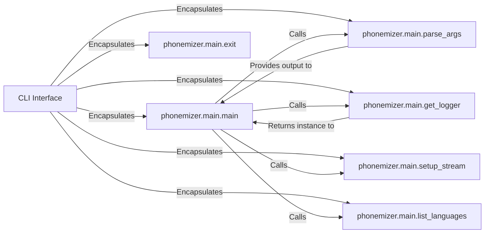

## Details

The `CLI Interface` subsystem is defined by the `phonemizer.main` module, serving as the primary user interface for command-line interactions. It handles input parsing, output display, and orchestrates the execution of phonemization tasks and related utilities.

### CLI Interface [[Expand]](./CLI_Interface.md)
The overarching component that encapsulates all command-line interaction logic. It acts as the entry point for users to interact with the phonemizer library via the terminal.

**Related Classes/Methods**:

- <a href="https://github.com/bootphon/phonemizer/blob/master/phonemizer/main.py#L333-L424" target="_blank" rel="noopener noreferrer">`phonemizer.main.main`:333-424</a>
- <a href="https://github.com/bootphon/phonemizer/blob/master/phonemizer/main.py#L64-L303" target="_blank" rel="noopener noreferrer">`phonemizer.main.parse_args`:64-303</a>
- <a href="https://github.com/bootphon/phonemizer/blob/master/phonemizer/main.py#L325-L330" target="_blank" rel="noopener noreferrer">`phonemizer.main.setup_stream`:325-330</a>
- <a href="https://github.com/bootphon/phonemizer/blob/master/phonemizer/main.py#L306-L312" target="_blank" rel="noopener noreferrer">`phonemizer.main.list_languages`:306-312</a>
- <a href="https://github.com/bootphon/phonemizer/blob/master/phonemizer/main.py#L315-L322" target="_blank" rel="noopener noreferrer">`phonemizer.main.get_logger`:315-322</a>
- <a href="https://github.com/bootphon/phonemizer/blob/master/phonemizer/main.py#L57-L61" target="_blank" rel="noopener noreferrer">`phonemizer.main.exit`:57-61</a>

### phonemizer.main.main
The central orchestrator of the CLI application. It coordinates the sequence of operations from argument parsing to executing the core phonemization logic or utility functions.

**Related Classes/Methods**:

- <a href="https://github.com/bootphon/phonemizer/blob/master/phonemizer/main.py#L333-L424" target="_blank" rel="noopener noreferrer">`phonemizer.main.main`:333-424</a>

### phonemizer.main.parse_args
Responsible for interpreting and validating command-line arguments provided by the user. It translates raw input into a structured format for the main application logic.

**Related Classes/Methods**:

- <a href="https://github.com/bootphon/phonemizer/blob/master/phonemizer/main.py#L64-L303" target="_blank" rel="noopener noreferrer">`phonemizer.main.parse_args`:64-303</a>

### phonemizer.main.setup_stream
Manages the configuration of standard input and output streams, including handling encoding and redirection to/from files. Ensures correct data flow for the CLI.

**Related Classes/Methods**:

- <a href="https://github.com/bootphon/phonemizer/blob/master/phonemizer/main.py#L325-L330" target="_blank" rel="noopener noreferrer">`phonemizer.main.setup_stream`:325-330</a>

### phonemizer.main.list_languages
A utility function exposed via the CLI that queries and displays the list of supported languages by the phonemizer backends.

**Related Classes/Methods**:

- <a href="https://github.com/bootphon/phonemizer/blob/master/phonemizer/main.py#L306-L312" target="_blank" rel="noopener noreferrer">`phonemizer.main.list_languages`:306-312</a>

### phonemizer.main.get_logger
Sets up and configures the application's logging mechanism, enabling structured output of informational messages, warnings, and errors to the console.

**Related Classes/Methods**:

- <a href="https://github.com/bootphon/phonemizer/blob/master/phonemizer/main.py#L315-L322" target="_blank" rel="noopener noreferrer">`phonemizer.main.get_logger`:315-322</a>

### phonemizer.main.exit
Handles the graceful termination of the CLI application, ensuring any necessary cleanup or finalization steps are performed before the program exits.

**Related Classes/Methods**:

- <a href="https://github.com/bootphon/phonemizer/blob/master/phonemizer/main.py#L57-L61" target="_blank" rel="noopener noreferrer">`phonemizer.main.exit`:57-61</a>

### [FAQ](https://github.com/CodeBoarding/GeneratedOnBoardings/tree/main?tab=readme-ov-file#faq)