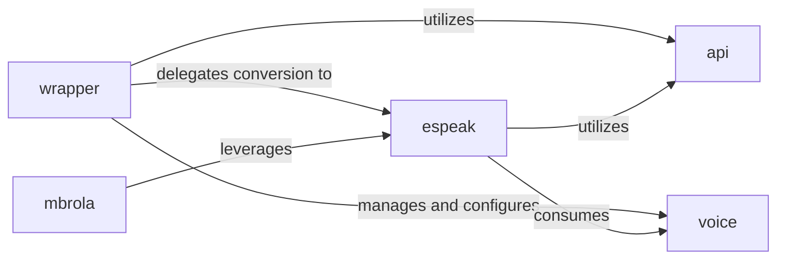

## Details

The `espeak` backend subsystem is orchestrated by the `wrapper` component, which serves as the high-level Pythonic interface, abstracting the complexities of the `espeak-ng` C library. The `wrapper` delegates the core text-to-phoneme conversion to the `espeak` component and manages the selection and configuration of `voice` properties. Both `wrapper` and `espeak` components utilize the `api` component, which is responsible for managing the low-level interface and lifecycle of the `espeak-ng` shared library. The `espeak` component, embodying the core phonemization strategy, consumes `voice` data for accurate conversion. Additionally, the `mbrola` component extends the core phonemization by leveraging `espeak`'s foundational logic for specialized MBROLA voice handling.

### wrapper
Acts as the primary high-level Pythonic interface for the Espeak Backend. It abstracts away the complexities of the underlying `espeak-ng` C library, providing a clean API for phonemization. It orchestrates the overall phonemization process within this backend. This component serves as an Adapter, standardizing interaction with the `espeak-ng` specific logic.

**Related Classes/Methods**:

- <a href="https://github.com/bootphon/phonemizer/blob/master/phonemizer/backend/espeak/wrapper.py" target="_blank" rel="noopener noreferrer">`phonemizer.backend.espeak.wrapper:__init__`</a>
- <a href="https://github.com/bootphon/phonemizer/blob/master/phonemizer/backend/espeak/wrapper.py" target="_blank" rel="noopener noreferrer">`phonemizer.backend.espeak.wrapper:text_to_phonemes`</a>

### espeak
Contains the core concrete phonemization logic. This component directly interacts with the `espeak-ng` library to perform the actual text-to-phoneme conversion and handles post-processing of the raw output. It embodies the core "Strategy" for `espeak-ng` phonemization.

**Related Classes/Methods**:

- <a href="https://github.com/bootphon/phonemizer/blob/master/phonemizer/backend/espeak/espeak.py" target="_blank" rel="noopener noreferrer">`phonemizer.backend.espeak.espeak:_phonemize_aux`</a>
- <a href="https://github.com/bootphon/phonemizer/blob/master/phonemizer/backend/espeak/espeak.py" target="_blank" rel="noopener noreferrer">`phonemizer.backend.espeak.espeak:_postprocess_line`</a>

### api
Manages the low-level interface and lifecycle of the `espeak-ng` shared library. This includes loading, unloading, and resolving the library's path, ensuring proper initialization and cleanup. This component is crucial for bridging Python with the native `espeak-ng` library.

**Related Classes/Methods**:

- <a href="https://github.com/bootphon/phonemizer/blob/master/phonemizer/backend/espeak/api.py" target="_blank" rel="noopener noreferrer">`phonemizer.backend.espeak.api:__init__`</a>
- <a href="https://github.com/bootphon/phonemizer/blob/master/phonemizer/backend/espeak/api.py" target="_blank" rel="noopener noreferrer">`phonemizer.backend.espeak.api:_delete_win32`</a>

### voice
Represents and manages properties of `espeak-ng` voices. It facilitates the selection and configuration of voices, which is crucial for accurate phonemization. This component handles configuration and data management specific to `espeak-ng` voices.

**Related Classes/Methods**:

- <a href="https://github.com/bootphon/phonemizer/blob/master/phonemizer/backend/espeak/voice.py" target="_blank" rel="noopener noreferrer">`phonemizer.backend.espeak.voice:__eq__`</a>
- <a href="https://github.com/bootphon/phonemizer/blob/master/phonemizer/backend/espeak/voice.py" target="_blank" rel="noopener noreferrer">`phonemizer.backend.espeak.voice:to_ctypes`</a>

### mbrola
Handles specific integration and phonemization logic for MBROLA voices, often used in conjunction with `espeak-ng` for higher quality speech synthesis. It leverages shared post-processing logic from `espeak`. This component represents a specialized variant or extension of the core phonemization strategy.

**Related Classes/Methods**:

- <a href="https://github.com/bootphon/phonemizer/blob/master/phonemizer/backend/espeak/mbrola.py" target="_blank" rel="noopener noreferrer">`phonemizer.backend.espeak.mbrola`</a>

### [FAQ](https://github.com/CodeBoarding/GeneratedOnBoardings/tree/main?tab=readme-ov-file#faq)