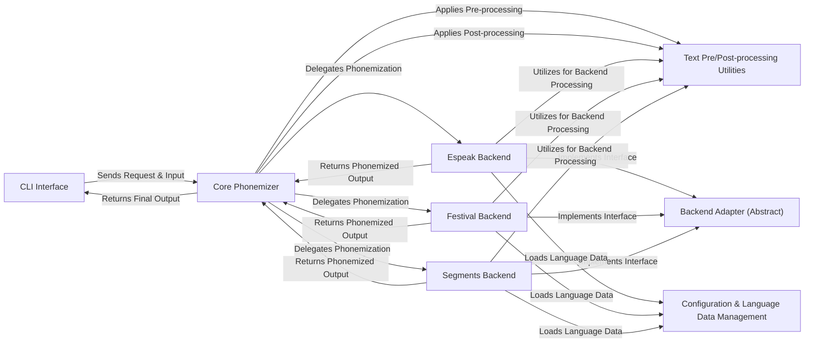

## Details

The phonemizer project employs a modular architecture centered around a Core Phonemizer that orchestrates the phonemization process. User interaction is managed by the CLI Interface, which initiates requests and provides input to the Core Phonemizer. The Core Phonemizer leverages Text Pre/Post-processing Utilities for data preparation and delegates the core phonemization task to specific Backend implementations (e.g., Espeak Backend, Festival Backend, Segments Backend). These backends adhere to a Backend Adapter (Abstract) interface, ensuring a pluggable system. Each backend may interact with Configuration & Language Data Management to load necessary linguistic resources and utilize Text Pre/Post-processing Utilities for internal processing. Upon completion, phonemized output flows back from the chosen backend to the Core Phonemizer, and finally to the CLI Interface for presentation.

### CLI Interface [[Expand]](./CLI_Interface.md)
The primary user interface for command-line interactions, handling input parsing and output display.

**Related Classes/Methods**:

- <a href="https://github.com/bootphon/phonemizer/blob/master/phonemizer/main.py" target="_blank" rel="noopener noreferrer">`phonemizer.main`</a>

### Core Phonemizer
The central orchestration component, managing the overall phonemization workflow, including backend selection and pre/post-processing.

**Related Classes/Methods**:

- <a href="https://github.com/bootphon/phonemizer/blob/master/phonemizer/phonemize.py" target="_blank" rel="noopener noreferrer">`phonemizer.phonemize`</a>

### Backend Adapter (Abstract) [[Expand]](./Backend_Adapter_Abstract_.md)
Defines the standardized abstract interface (BaseBackend) that all concrete phonemization backends must implement, ensuring a pluggable system.

**Related Classes/Methods**:

- <a href="https://github.com/bootphon/phonemizer/blob/master/phonemizer/backend/base.py#L31-L255" target="_blank" rel="noopener noreferrer">`phonemizer.backend.base.BaseBackend`:31-255</a>

### Espeak Backend [[Expand]](./Espeak_Backend.md)
A concrete phonemization backend implementing the BaseBackend interface, specifically integrating with the espeak-ng library.

**Related Classes/Methods**:

- <a href="https://github.com/bootphon/phonemizer/blob/master/phonemizer/backend/espeak" target="_blank" rel="noopener noreferrer">`phonemizer.backend.espeak`</a>

### Festival Backend [[Expand]](./Festival_Backend.md)
A concrete phonemization backend implementing the BaseBackend interface, integrating with the Festival speech synthesis system.

**Related Classes/Methods**:

- <a href="https://github.com/bootphon/phonemizer/blob/master/phonemizer/backend/festival" target="_blank" rel="noopener noreferrer">`phonemizer.backend.festival`</a>

### Segments Backend
A concrete phonemization backend implementing the BaseBackend interface, utilizing the segments library for G2P phonemization.

**Related Classes/Methods**:

- <a href="https://github.com/bootphon/phonemizer/blob/master/phonemizer/backend/segments.py" target="_blank" rel="noopener noreferrer">`phonemizer.backend.segments`</a>

### Text Pre/Post-processing Utilities
A collection of utility functions for text normalization, punctuation handling, and word/syllable/phone separation, used throughout the phonemization process.

**Related Classes/Methods**:

- <a href="https://github.com/bootphon/phonemizer/blob/master/phonemizer/punctuation.py" target="_blank" rel="noopener noreferrer">`phonemizer.punctuation`</a>
- <a href="https://github.com/bootphon/phonemizer/blob/master/phonemizer/separator.py" target="_blank" rel="noopener noreferrer">`phonemizer.separator`</a>
- <a href="https://github.com/bootphon/phonemizer/blob/master/phonemizer/utils.py" target="_blank" rel="noopener noreferrer">`phonemizer.utils`</a>

### Configuration & Language Data Management
Manages language-specific settings, backend availability, and the loading of necessary linguistic data (e.g., G2P profiles, voice data).

**Related Classes/Methods**:

- <a href="https://github.com/bootphon/phonemizer/blob/master/phonemizer/share" target="_blank" rel="noopener noreferrer">`phonemizer.share`</a>
- <a href="https://github.com/bootphon/phonemizer/blob/master/phonemizer/backend/base.py" target="_blank" rel="noopener noreferrer">`phonemizer.backend.base`</a>

### [FAQ](https://github.com/CodeBoarding/GeneratedOnBoardings/tree/main?tab=readme-ov-file#faq)