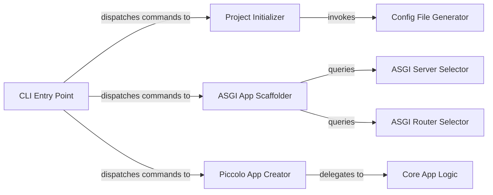

## Details

The CLI & Project Management subsystem in Piccolo is defined by `piccolo/main.py`, `piccolo/apps/project/commands/new.py`, and `piccolo/apps/asgi/commands/new.py`. It handles user interaction, project setup, and command dispatching. The identified components are crucial for Piccolo's core functionalities as an ORM and an ASGI application scaffolder, enabling users to initiate, configure, and extend their Piccolo-based applications through project initialization, configuration file generation, ASGI application scaffolding, and modular Piccolo app creation.

### CLI Entry Point
The primary command-line interface for Piccolo. It parses user commands and dispatches control to the appropriate command handler. This component is fundamental as it's the user's initial interaction point with the framework.

**Related Classes/Methods**:

- <a href="https://github.com/piccolo-orm/piccolo/blob/master/piccolo/main.py#L37-L145" target="_blank" rel="noopener noreferrer">`piccolo.main.main`:37-145</a>

### Project Initializer
Manages the setup of a new Piccolo project, including the creation of the initial directory structure and the essential piccolo_conf.py configuration file. This is crucial for establishing the foundation of any Piccolo-based application.

**Related Classes/Methods**:

- <a href="https://github.com/piccolo-orm/piccolo/blob/master/piccolo/apps/project/commands/new.py#L38-L53" target="_blank" rel="noopener noreferrer">`piccolo.apps.project.commands.new.new`:38-53</a>

### Config File Generator
Specifically handles the generation of the piccolo_conf.py file, which is critical for defining database connections, ORM applications, and other core configurations for Piccolo. This component directly supports Piccolo's role as an ORM by setting up its core configuration.

**Related Classes/Methods**:

- <a href="https://github.com/piccolo-orm/piccolo/blob/master/piccolo/apps/project/commands/new.py#L20-L35" target="_blank" rel="noopener noreferrer">`piccolo.apps.project.commands.new.new_piccolo_conf`:20-35</a>

### ASGI App Scaffolder
Automates the scaffolding of new ASGI web applications within a Piccolo project, guiding the user through choices for the ASGI server and routing framework, and generating the necessary boilerplate code. This component highlights Piccolo's integration capabilities with web frameworks, a key aspect of its architectural bias.

**Related Classes/Methods**:

- <a href="https://github.com/piccolo-orm/piccolo/blob/master/piccolo/apps/asgi/commands/new.py#L46-L134" target="_blank" rel="noopener noreferrer">`piccolo.apps.asgi.commands.new.new`:46-134</a>

### ASGI Server Selector
Interacts with the user to prompt for and capture their preferred ASGI server choice during the ASGI application scaffolding process. This component ensures user-driven customization of the scaffolded application.

**Related Classes/Methods**:

- <a href="https://github.com/piccolo-orm/piccolo/blob/master/piccolo/apps/asgi/commands/new.py#L40-L43" target="_blank" rel="noopener noreferrer">`piccolo.apps.asgi.commands.new.get_server`:40-43</a>

### ASGI Router Selector
Interacts with the user to prompt for and capture their preferred routing framework for the ASGI application being scaffolded. Similar to the server selector, this allows for tailored application generation.

**Related Classes/Methods**:

- <a href="https://github.com/piccolo-orm/piccolo/blob/master/piccolo/apps/asgi/commands/new.py#L34-L37" target="_blank" rel="noopener noreferrer">`piccolo.apps.asgi.commands.new.get_routing_framework`:34-37</a>

### Piccolo App Creator
Orchestrates the creation of new, modular Piccolo applications, including setting up their dedicated directories and initial files, and ensuring valid naming conventions. These "Piccolo apps" represent distinct, reusable modules within a larger project, aligning with the modularity architectural pattern.

**Related Classes/Methods**:

- <a href="https://github.com/piccolo-orm/piccolo/blob/master/piccolo/apps/app/commands/new.py#L109-L122" target="_blank" rel="noopener noreferrer">`piccolo.apps.app.commands.new.new`:109-122</a>

### Core App Logic
Encapsulates the fundamental logic for creating a new Piccolo application, including validation of the application name and checking for existing modules. This ensures the integrity and correctness of newly created Piccolo apps.

**Related Classes/Methods**:

- <a href="https://github.com/piccolo-orm/piccolo/blob/master/piccolo/apps/app/commands/new.py#L60-L106" target="_blank" rel="noopener noreferrer">`piccolo.apps.app.commands.new.new_app`:60-106</a>
- <a href="https://github.com/piccolo-orm/piccolo/blob/master/piccolo/apps/app/commands/new.py#L40-L53" target="_blank" rel="noopener noreferrer">`piccolo.apps.app.commands.new.validate_app_name`:40-53</a>
- <a href="https://github.com/piccolo-orm/piccolo/blob/master/piccolo/apps/app/commands/new.py#L24-L34" target="_blank" rel="noopener noreferrer">`piccolo.apps.app.commands.new.module_exists`:24-34</a>

### [FAQ](https://github.com/CodeBoarding/GeneratedOnBoardings/tree/main?tab=readme-ov-file#faq)