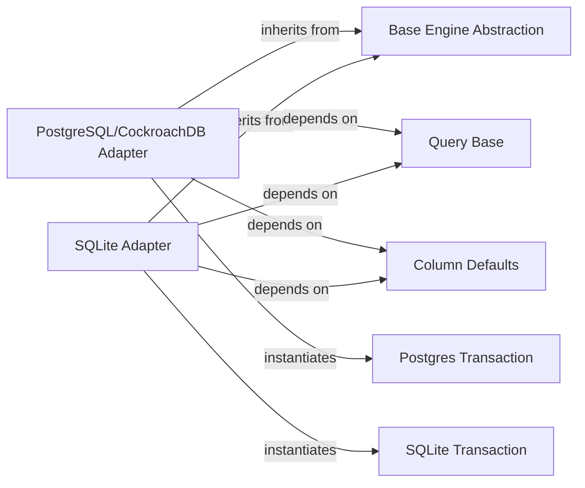

## Details

The `Database Adapters` subsystem provides a standardized interface for connecting to and interacting with various relational database systems (e.g., PostgreSQL, SQLite, CockroachDB). Its primary function is to abstract away database-specific details, allowing the ORM core and query engine to interact with different backends uniformly.

### Base Engine Abstraction
Defines the common interface and abstract methods for all database engines. It handles fundamental operations like connection pool management, database version checks, and general database preparation, ensuring a consistent contract for concrete adapters.

**Related Classes/Methods**:

- <a href="https://github.com/piccolo-orm/piccolo/blob/master/piccolo/engine/base.py#L82-L229" target="_blank" rel="noopener noreferrer">`piccolo.engine.base.Engine`:82-229</a>

### PostgreSQL/CockroachDB Adapter
Manages database-specific interactions for PostgreSQL and CockroachDB. This includes executing SQL queries (DDL and DML), handling transactions, managing connections, and adapting data types between Python and the database.

**Related Classes/Methods**:

- <a href="https://github.com/piccolo-orm/piccolo/blob/master/piccolo/engine/postgres.py#L288-L594" target="_blank" rel="noopener noreferrer">`piccolo.engine.postgres.PostgresEngine`:288-594</a>
- <a href="https://github.com/piccolo-orm/piccolo/blob/master/piccolo/engine/cockroach.py#L14-L49" target="_blank" rel="noopener noreferrer">`piccolo.engine.cockroach.CockroachEngine`:14-49</a>

### SQLite Adapter
Handles database-specific interactions for SQLite, including query execution, transaction management, connection handling, and operations specific to file-based databases.

**Related Classes/Methods**:

- <a href="https://github.com/piccolo-orm/piccolo/blob/master/piccolo/engine/sqlite.py#L584-L851" target="_blank" rel="noopener noreferrer">`piccolo.engine.sqlite.SQLiteEngine`:584-851</a>

### Postgres Transaction
Manages the lifecycle of database transactions specifically for PostgreSQL and CockroachDB. It ensures atomicity, consistency, isolation, and durability (ACID properties) for database operations.

**Related Classes/Methods**:

- <a href="https://github.com/piccolo-orm/piccolo/blob/master/piccolo/engine/postgres.py#L159-L282" target="_blank" rel="noopener noreferrer">`piccolo.engine.postgres.PostgresTransaction`:159-282</a>

### SQLite Transaction
Manages the lifecycle of database transactions specifically for SQLite. It ensures ACID properties for database operations within the SQLite environment.

**Related Classes/Methods**:

- <a href="https://github.com/piccolo-orm/piccolo/blob/master/piccolo/engine/sqlite.py#L458-L574" target="_blank" rel="noopener noreferrer">`piccolo.engine.sqlite.SQLiteTransaction`:458-574</a>

### Query Base
Provides foundational methods and utilities for obtaining database-agnostic SQL queries. It acts as a bridge between the ORM's high-level query definitions and the database-specific SQL generation.

**Related Classes/Methods**:

- <a href="https://github.com/piccolo-orm/piccolo/blob/master/piccolo/query/base.py" target="_blank" rel="noopener noreferrer">`piccolo.query.base`</a>

### Column Defaults
Handles data type conversions and manages default values for columns when interacting with the database. It ensures that Python data types are correctly mapped to database types and vice-versa.

**Related Classes/Methods**:

- <a href="https://github.com/piccolo-orm/piccolo/blob/master/piccolo/columns/defaults" target="_blank" rel="noopener noreferrer">`piccolo.columns.defaults`</a>

### [FAQ](https://github.com/CodeBoarding/GeneratedOnBoardings/tree/main?tab=readme-ov-file#faq)